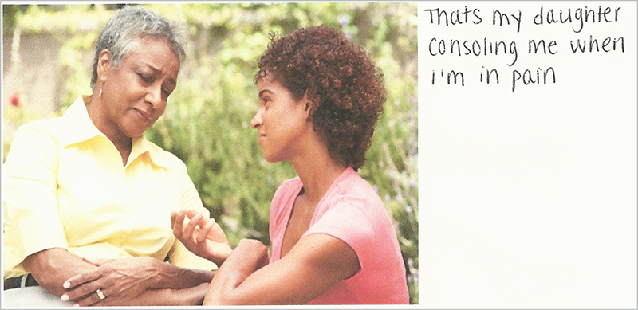

“If you want your users to fall in love with your design, fall in love with your users.”

—DANA CHISNELL, *researcher for the* *United States Digital* *Service* 
*and cofounder of the Center for Civic* *Design*

WHEN WE LOVE, we see people as whole: dynamic, multifaceted, and individual. We don’t question how they can be angry and yet hopeful at the same time. We understand those responses as human. We accept them, acknowledge them, and work with them.

So how can we learn to love each of our users—users who are in a million contexts and circumstances, many of which we’ll never know about? The answer is in going to where they are, physically *and* emotionally: meeting them in person whenever we can (and remotely when we cannot), and seeking to understand their lives in real, empathetic ways.

We do that through user research.

We’re not experts in every type of user research out there (and there are many). Instead, this chapter shares a few types of qualitative research—some of which you might already practice—and explains how to use them to better understand your audiences’ challenges and touchy subjects, and ultimately design for real people.

## MEET YOUR USERS

The first step to better understanding your users is simple: listen to them. You don’t have to recruit people in crisis to hear valuable information, either. You just need to go beyond asking what users think about your product’s features or the tasks they need to complete on your site, and instead start “embracing how other people see the world,” as Steve Portigal, author of *Interviewing Users,* puts it.

This will prepare you to ask questions that create a window into your users’ lives, interests, anxieties, and feelings—and when you do that, you’ll start to see them not as market segments, personas, or tasks, but as *people*. Once you’re in the interview, Portigal’s advice includes:

* Remember that being interviewed isn’t easy. It’s unnatural to have someone record what you say and do.
* Open the interview. Say something like, “So, to start out,” and ask the participant to tell you about themselves or their job. This gets them into the mode of answering questions.
* Ask basic questions, even when you already know the answer. When you present yourself as the novice, it invites the interviewee to be the expert—making it less likely they’ll skip over information or make assumptions about what you need to know.
* Be careful about talking about yourself. While connecting with an interviewee is a wonderful thing, avoid sharing your own opinions and experiences. The interview isn’t about you.
* Let silence happen. It’s tempting to jump in too quickly when a user doesn’t answer right away, or answers but doesn’t go into detail. The extra pause can give them enough time to open up or flesh out an answer.

When it comes to questions, Portigal arranges his into three categories:

* **Questions that gather context and collect details,** such as asking about sequence (“Can you describe a typical workday?”) or specific examples (“What was the last movie you streamed?”).
* **Questions that probe what’s been unsaid,** such as asking for clarification, asking “why,” or asking the interviewee to explain a system as if they were teaching it to a new person.
* **Questions that create contrasts in order to uncover frameworks and mental models,** such as comparing processes or approaches (“What’s the difference between sending your response by fax, mail, or email?”).

Critically, you want your interview questions to lead to what Portigal calls the *tipping point:* the moment when the conversation changes from question-answer, question-answer to question-story, where the participant uses your question as a launching point.

## FIND THE FRACTURES

If you’re trying to hear about ways your product could go wrong, we’ve found the tipping point to be even more important. When people move from giving pat answers to telling personal stories, they tend to edit themselves less, and leave in the emotional details that can show the way toward your product’s weaknesses.

You can’t force a user over the tipping point, but you can nudge the conversation there by asking questions that get them thinking and talking about their feelings, their history, and their lives. Here are a few questions we like, and when we like to use them.

### “Can you think of a time when…”

You probably can’t and shouldn’t interview users in the middle of a crisis, but you can ask questions that uncover how they view stressful situations. One method is to ask them to recall a time when they had to complete a task or make a decision in a moment of panic.

If you were researching a travel-related product, you might ask people if they’ve ever had to book a trip during a family emergency or similar panic period. What was that like? What was most difficult about making choices when they were stressed? How did it differ from their typical process?

When you ask about the past, the key is to get at a *specific* instance—like, “Last year, my mom was rushed to the emergency room and I hopped on a flight home to Salt Lake City that night...” not, “When I feel panicked, I tend to…” The more specific the user’s story, the more likely they are to report actual feelings and challenges instead of generalized ideas of what they *think* they’d want or expect. For example, the user who rushed to their mother’s bedside might recall how they were so frantic that they kept worrying they’d selected the wrong date for their flights, which could help you remember to make flight dates, times, and locations extremely prominent right before a user selects that final purchase button.

### “How did you make that decision?”

Another tool for getting people to open up about their history is to ask them to break down choices they’ve made and explain their thinking.

Say you’re interested in learning about potential users of a grocery delivery service, and an interviewee says:

> I’ve been on a tight budget since I went back to grad school, so about nine months ago I started packing a lunch every day. I hate bringing lunch, and I hate grocery shopping, but I feel like I have to.

You might think it’s time to talk about your product—after all, your user has already moved on to groceries, and that’s what you’re here to research! But if you want to dig deeper, this is a great moment to pause and better understand their history and connection to the topic.

Try asking something like, “How did you decide to start packing lunch? Walk me through what you were thinking.” This is when the door opens to a more personal story—such as a user telling you how he was made fun of for his brown-bag lunches as a kid, because his family couldn’t afford name-brand snacks and his mom always packed carrots instead of pudding cups. As an adult, he felt eating out every day was a tiny treat: a way to know that he’d made it. But when he looked at how much he was spending, he realized he could easily save $150 a month by sucking it up and packing a lunch. It’s boring, and he’s tired of it, but he’s not sure what else to do.

A story like this could help you ensure the messaging in your grocery delivery app doesn’t assume people are using the service solely to save time, or that everyone using it loves to cook—messages that might leave out someone who hates shopping, but needs to keep their fridge stocked so they skip eating out.

### “What does that mean to you?”

Imagine interviewing a potential user of a new period-tracking application that seeks to offer a better experience than the one we learned about in Chapter 2. At some point, the participant says, “My periods have always been really irregular; it makes me feel like I’m a weirdo.” She has just presented a barrier to using your service: her own sense of shame. But why does she feel that way, and could your service help her, instead of alienate her? One way to find out is to ask about the meaning behind her words. You might respond:

> You said your period makes you feel “like a weirdo” just there. Can you tell me what “being a weirdo” means to you?

Why do this? Because homing in on a specific word can help the interviewee focus on the emotions and expectations she associates with your product. For example, what if she typically gets her period every three weeks—or five weeks? Now you can see the cracks in messaging that focuses on the “monthly” angle. You might also realize that your design system only works for cycles that are, say, 22–34 days long, and that you need to make sure the interface can handle people whose needs are different.

### “What would you like to see happen?”

You’ll often hear advice not to ask people what they *want*, because they won’t be able to imagine anything other than what they’ve already seen. We disagree—at least, sort of. While asking people to describe the nonexistent product of their dreams won’t work, you *can* ask people to tell you about their vision for the future.

Sara learned this question when she worked at a rape crisis center giving educational presentations on sexual abuse to middle school kids. At nearly every school, at least one child would disclose that they’d experienced abuse, and Sara or her teammate would take them aside and talk. Asking “What would you like to see happen?” was a powerful tool to get kids to see that their thoughts and feelings mattered. She couldn’t promise that whatever they said would come true, but she could acknowledge they were humans whose feelings deserved to be considered, and she could do her best to honor the spirit of their answers.

User interviews are the perfect opportunity to create the same feeling: to let your audience know that you’re listening, and that their preferences, opinions, and feelings count, even though they probably won’t be implemented verbatim. We recommend asking this question when you’re talking with a user about something that frustrates them today, whether with the site or product you’re working on, or beyond it.

Notice the question isn’t worded to get them to describe a *thing* they want; it’s worded to get them to describe an *action*—a situation they want to change, or a feeling they’d like to have. This is intentional. People might be bad at describing specific products on the fly, but they’re excellent at communicating what they wish their lives felt like.

### “Tell me more about that.”

When you ask someone directly what they want, it is very possible the answer you receive will be what they think you want to hear.”

—ERIKA HALL, *Just Enough* *Research*

Many times, interviewees will assume you only want a quick answer. They’ll worry about wasting your time on stuff that “doesn’t really matter,” so they’ll cut themselves off just as they get to the juiciest bits: motivations, fears, frustrations, and anxieties.

Your job is to make them feel comfortable slowing down, and confident that you want to hear all the details—even the ones they don’t think are relevant.

That’s why “tell me more about that” is such a magical phrase. It doesn’t lead the interviewee in a specific direction, other than toward more depth, which leaves a door open for them to go wherever they’d like with their answer. It also shows that you’ve been listening, because you’re looping back to something they said earlier.

For example, Sara recently interviewed young women about their involvement in and opinions about gender equality issues. Here’s an excerpt from one conversation:

> Interviewee: We need to look at women’s issues as all women’s issues, not this one group of women and how we can help them. We need to change the framework of what a woman voter is, and there’s a lot of ways to break that down. We have to speak to them.
> Sara: You mentioned “changing the framework of what a woman voter is.” Can you tell me more about that?
>
> Interviewee: Right now it is segmented two ways: the married woman with kids who is voting based on different issues than the single woman who is in her twenties or thirties. That person is portrayed as a white, straight, middle-class woman...
>
> The Hillary \[Clinton] campaign video was a good way to change how we see what a voter looks like. They present all of these different groups… If we are looking at what a woman voter looks like, it isn’t capture-able by one person anymore.

The interviewee hadn’t planned on explaining what she meant about women voters. But Sara could tell by the urgency in her voice, the call for change, that she was frustrated by this “framework.” So instead of moving on, Sara asked for more. And she got it: a clear description of the limited way the interviewee sees women voters being categorized now, and a specific example of a more inclusive way of looking at them.

This technique takes both time and experience. Make sure you’re building enough time into your interviews to go off script and follow up on an interesting comment. And interview more often: the more you do it, the better you’ll be at identifying the threads you want to pull on a bit harder.

## GO TO THEM

One of the most valuable ways to ensure your interviews present a realistic, nuanced look at your users’ lives is to go to them: visit them at home, work, or wherever they might use your product or service. What does their day look like? Are they sitting quietly in a spacious office, or are they trying to cram online tasks in between chasing a toddler, answering customer phone calls, or running from appointment to appointment? Is their home a Pinterest-ready retreat of calm, or is it messy, run-down, cramped, or dated? Do they have the latest devices and a fast connection, or a PC far past its prime connected to rural satellite internet?

Researchers call this technique *contextual inquiry:* you visit a member of your target audience wherever they’re likely to use your service. Then, through a combination of observation and interview, you have the user share their process for completing a task, using the equipment they typically would. That task could be something general, like “Show me how you manage your finances,” or more specific, like “How do you register for this event?”

We’ve been in contextual sessions at workspaces, where users showed us the series of sticky notes on their monitors listing all the passwords they need to log into a site, expressing frustration at how difficult it was to remember anything in the context of their extremely busy days. We’ve had users show us around their office’s manufacturing floor, with loud noises punctuating the conversation every few seconds. They weren’t interested in reading long-form educational articles in that environment. And we’ve had people show us their luggage setups and travel itineraries, describing the exhaustion and loneliness of being on the road during a busy sales season.

We’ve also spoken with researchers who visit users at home—including users who are elderly or disabled and rarely leave their bedrooms, or those who live in a chaotic apartment filled with extended family.

Moments like these are powerful because they immerse us in another human’s world: they help us to internalize what they’re saying, because we can see and feel it. They remind us that no one is using our services in a truly ideal state: distraction-free, on the latest equipment, while emotionally content, and with as much time as it takes.

## BROADEN YOUR VISION

Do we care enough to find out what the experience is of people who are not like us?”

—WHITNEY QUESENBERY

When researchers Dana Chisnell and Whitney Quesenbery partnered to launch the Center for Civic Design in 2013, they recognized something: the most powerful, valuable research they could do wasn’t with users who were the most average, but those who were most at the fringes. In this case, that meant people with low literacy skills and low income. Because these users lack resources and security, Chisnell says, they tend to be under more stress at all times, which also makes them more likely to be sick than those who are highly literate and earning a living wage.

As we’ve talked about throughout this book, those users would have been easy to write off as “edge cases.” Instead, Chisnell and Quesenbery decided to focus on low-income, low-literacy participants for a study about electronic ballots. If they could make a voting system that worked for these users, they felt confident it would work for people without those stressors in their lives.

What they found in the process was illuminating. Low-literacy users tended to skip copy sections that looked too long, so instructions were much more likely to be read when they were inline with the form, rather than in a section to the side. Many of these users weren’t familiar with touchscreen devices, so conventions like tapping and swiping—things we often call “intuitive”—needed to be made explicit. Interface messages, such as a confirmation that you wanted to change your vote, needed to be clear and explanatory, yet also short enough for a low-literacy user to read instead of dismissing them.

Through interviews, paper prototypes, digital prototypes, and eventually testing the final product with this audience, Chisnell became committed to a new way of researching. She told us:

> I came away from that study thinking, why are we testing with anyone with high literacy? Designing for people with low literacy would make it easier for people who are distressed, distracted, sleep-deprived, on medication, whatever. If I could build this into everything, I would.

Now, this precise approach might not work for *everything*. Civic design needs to work for the broadest audience possible, but if you’re trying to reach a specific group—such as “law students” or “people who are shopping for a new car”—it may not make sense to only do research with low-income, low-literacy users. What *does* make sense is to get beyond what your team first perceives as “ideal” or “average.”

One way to do so is to adjust our recruiting process for research. Chisnell recommends skipping traditional “screeners,” where potential participants are filtered based on fixed criteria, such as age or income level, and performing a mini-interview or open-ended survey instead.

For example, when Sara interviewed young women about gender issues, she used social media to ask prospective participants to take a short survey. But rather than asking for fixed data, she asked a couple open questions like, “Which political issues are most important to you right now?”—without defining what users’ answers could be.

This prevented her from filtering out people who weren’t quite what she pictured, but from whom she could learn a lot. And it gave her a rich set of answers in respondents’ own words, helping her to uncover themes and connections she’d never have seen if she’d dismissed participants based on their backgrounds, rather than listening to their voices. Finally, it gave her access to real people’s stories from day one—which added more depth to her understanding of the audience.

## EXPLORE TOUCHY SUBJECTS

We’ve found interviews to be potent tools for understanding a broader range of user needs and concerns, but some topics are still difficult for people to talk about. When words alone won’t work, researcher Kyle Soucy recommends an unconventional technique: collaging.

According to Soucy, collaging can either supplement or replace traditional interviews. To do it, Soucy recommends gathering a random set of 150–200 stock photos and magazine cutouts depicting things like nature scenes, people, and everyday objects. From there, you’ll need just a few crafting supplies: paper, scissors, glue or tape, and pens.

To create the collage, give the participant a specific prompt, such as, “Describe what your commute is like,” or “Tell a story about what it’s like to manage your condition.” Then have them compile their collage by selecting from the collection of images. For each image, ask them to write a caption that explains why they chose it. Once they’re finished, have the participant walk you through their collage, and ask deeper questions as they describe each part of it.

The benefit of this technique, Soucy says, is that it opens up space for unknowns: the things you’d never think to ask, and your participant might never think to explain, but are crucial to delivering a more compassionate user experience. In a 2012 *Smashing Magazine* article, she writes:

> Sometimes the most valuable answer is not in response to a direct question, but one that’s elicited. An image can be a powerful stimulus that evokes a strong response, triggers a memory, and draws out feelings that exist below a person’s own level of awareness. (<http://www.smashingmagazine.com/2012/02/collaging-getting-answers-questions-you-dont-know-ask/>)

For example, Soucy once visited a woman’s home while researching a medical device. In addition to having the condition the device was designed to help, the woman was depressed and seemed to be hoarding. When she shared her collage with Soucy, she began crying—because the collage had allowed her, finally, to describe not only her condition, but also her life, and what was going on in her day. None of these topics would have come up in a traditional interview, but they all played a role in Soucy’s recommendations.

So how can you incorporate collage results into your work? For Soucy, the answer is in “painting a picture” for her clients. She shows her clients the collages themselves, paired with audio clips of users describing them—a powerful way to get stakeholders to see the emotion and, at times, distress, behind everyday scenarios. She also brings small details about emotional responses and triggers into her personas, a technique we’ll talk about more in Chapter 7.

### “We can stop anytime.”

Yep, we borrowed that phrase from counseling, but it definitely works in research. As Soucy saw in her collaging sessions, it’s not unusual for participants to get emotional. Our job is to accept that while we may be the ones asking questions, our users are still in charge. We need to give them space to decide how much they want to give, and make sure they don’t feel pushed too far.

After all, opening up to a stranger isn’t easy. When we go beyond shallow conversation about product preferences and dig into the things that make our users human, we always run the risk of causing them harm: making them feel uncomfortable, vulnerable, stressed, anxious, or triggered.

As ethical researchers, we must also be “present” in the interview—sensitive to interviewees who seem exhausted, tense, or terse. We must be willing to stop and say, as Dana Chisnell does, “This person is done. I have taxed them emotionally,” even when that means leaving some of our questions unanswered.

## THE VALUE OF OPEN

What these methods share is that they help us think beyond our own comfort zone and expand our perspective. We don’t do open-ended research to get The Answers. We do it to see just how incomplete our questions were in the first place.

We’ll never gather every single perspective; we can’t interview the universe every time we build a website. But even with a handful of diverse people, we can learn a tremendous amount about where our product might break, and how we can avoid that. And, perhaps most of all, we are reminded that humans are more varied than we could have imagined before we talked to them.

The qualitative insights gleaned from interviews can power every bit of your product process—especially the way you work with your team, the topic of our next chapter.
