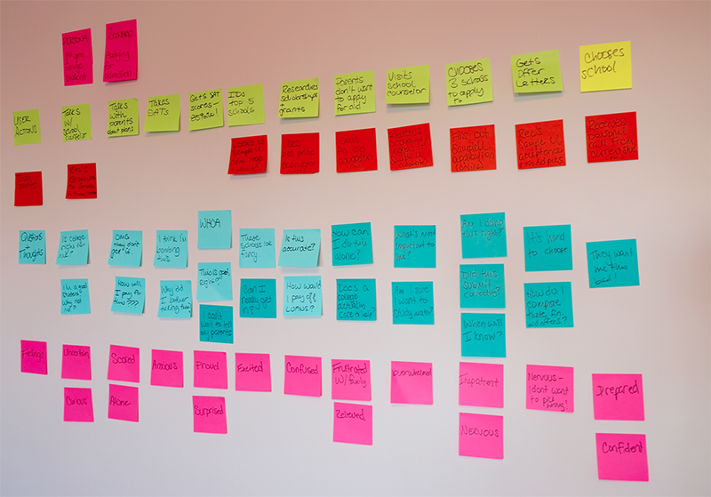

YOU’VE SEEN THE FALLOUT when digital products aren’t designed for real people. You understand the importance of compassion. And you’ve learned how to talk with users to uncover their deepest feelings and needs. But even with the best intentions, it’s still easy for thoughtful design teams to get lost along the way.

What you and your team need is a design process that incorporates compassionate practices at every stage—a process where real people and their needs are reinforced and recentered from early explorations through design iterations through launch.

## CREATE REALISTIC ARTIFACTS

In Chapter 3, we talked about the importance of designing for worst-case scenarios, and how bringing stress cases into audience artifacts like personas and user-journey maps can help. Now let’s talk about creating those materials.

### Imperfect personas

The more users have opened up to you in the research phase, the more likely you are to have a wealth of real, human emotion in your data to draw from: marriage difficulties or bad breakups, accidents, a friend who committed suicide, or a past of being bullied. The point isn’t to use your interviewees’ stories directly, but to allow them to get you thinking about the spectrum of touchy subjects and difficult experiences people have. This will help you include realistic details about your personas’ emotional states, triggers, and needs—and lend them far more depth than relying solely on typical stats like age, income, location, and education.

These diverse inputs will also help you select better persona images. Look for, or shoot your own, images of people who don’t fit the mold of a cheerful stock photo. Vary their expressions and clothing styles. If you can imagine these personas saying the kinds of things you heard in your user interviews, you’re on the right track.

More realistic personas make it much easier to imagine moments of crisis, and to test scenarios that might trigger a user’s stressors. Remember that “crisis” doesn’t have to mean a natural disaster or severe medical emergency. It can be a situation where an order has gone horribly wrong, or where a user needs information while rushing to the airport.

As you write your personas and scenarios, don’t drain the life from them: be raw, bringing in snippets of users’ anecdotes, language, and emotion wherever you can. Whoever picks these personas up down the line should feel as compelled to help them as you do.

### User-journey maps

In Chapter 3, we mentioned a technique Sara used with a home-improvement chain: user-journey mapping. Also referred to as customer-experience mapping, this technique is well established in many design practices, such as Adaptive Path, the San Francisco-based design consultancy (recently acquired by Capital One).

In 2013, Adaptive Path turned its expertise into a detailed guide, available free at [mappingexperiences.com](http://mappingexperiences.com/). The guide focuses on how to research the customer experience, facilitate a mapping workshop, and apply your insights. The process includes documenting:

* **The lens:** which persona(s) you’re mapping, and what their scenario is
* **Touchpoints:** moments where your user interacts with your organization
* **Channels:** where those interactions happen—online, over the phone, or elsewhere
* **Actions:** what people are doing to meet their needs
* **Thoughts:** how people frame their experience and define their expectations
* **Feelings:** the emotions people have along their journey—including both highs and lows

Constructing a journey map usually starts, as so many UX processes do, with sticky notes. Working as a team, you map out a user’s journey over time, with the steps extending horizontally. Below each step, use a different-colored sticky note to document touchpoints and channels, as well as what a user is doing, thinking, and feeling. The result will be a big (and messy) grid with bands of color, stretching across the wall (FIG 7.1).

Journey mapping brims with benefits. It helps a team to better think from a user’s point of view when evaluating content, identify gaps or disconnects across touchpoints or channels, and provide a framework for making iterative improvements to a major system over time. But we’ve found this technique can also be a powerful window into identifying previously unrealized, or unexamined, stress cases—if you think carefully about whose journey you’re mapping.

Make sure you use personas and scenarios that are realistic, not idealized. For example, an airline might map out experiences for someone whose flight has been canceled, or who is traveling with a disabled relative, or who needs to book last-minute tickets to attend a funeral. A bank might map out a longtime customer who applies for a mortgage and is declined. A university might map out a user who’s a first-generation college student from a low-income family. The list goes on.  

In our experience, it’s also important to do this work with as many people from your organization as possible—not only other web folk like developers or writers, but also groups like marketing, customer service, sales, and business or product units. This collaboration across departments brings diverse viewpoints to your journey, which will help you better understand all the different touchpoints a user might have and prevent any one group from making unrealistic assumptions. The hands-on nature of the activity—physically plotting out a user’s path—forces everyone to truly get into the user’s mindset, preventing participants from reverting back to organization-centric thinking, and increasing the odds you’ll get support for fixing the problems you find.  

In addition to determining an ideal experience, also take time to document where the real-life experience doesn’t stack up. This might include:

* **Pain points:** places where you know from research or analytics that users are currently getting hung up and have to ask questions, or are likely to abandon the site or app.
* **Broken flows:** places where the transition between touchpoints, or through a specific interaction on a site (like a form), isn’t working correctly.
* **Content gaps:** places where a user needs a specific piece of content, but you don’t have it—or it’s not in the right place at the right time.

Just as you can map many things in your journey—channels, questions, feelings, actions, content needs and gaps, catalysts, and more—you can also visualize your journey in many different ways. Sometimes, you might need nothing more than sticky notes on a conference room wall (and a few photos to refer back to later). Other times, you’ll want to spend a couple of days collaborating, and create a more polished document after the fact. It all depends on the complexity of the experience you’re mapping, the fidelity you need in the final artifact, and, of course, how much time you can dedicate to the process.

If journey maps are new to your team, a great way to introduce them is to spend an hour or two during a kickoff or brainstorm session working in small groups, with each group roughing out the path of a different user. If they’re already part of your UX process, you might just need to start working from a wider range of personas and scenarios. Either way, building journey maps that highlight stress cases will help you see:

* How to prioritize content to meet the needs of urgent use cases, without weakening the experience for others. That’s what the home-improvement store did: walking through stress cases made it easier for the team to prioritize plain language and determine what should be included in visually prominent, at-a-glance sections.
* Places where copy or imagery could feel alienating or out of sync with what a user might be thinking and feeling at that moment. For example, imagine if Glow, the period-tracking app, had mapped out a user journey for a single woman who simply has trouble remembering to buy tampons. The designers would have seen how, at each touchpoint, the app’s copy assumed something about this woman’s needs and feelings that wasn’t true—and they could have adjusted their messaging to fit a much broader range of potential users.
* Whether any gaps exist in content for stress-case users. For example, if the Children’s Hospital of Philadelphia had created a journey map for a user in crisis, it might have prevented the content gap Eric experienced: no information about rushing to the hospital in an emergency existed online.

## STRENGTHEN YOUR PROCESS

With more realistic representations of your audience in hand, it’s time to build checks and balances into your process that remind the team of these humans, and ward against accidentally awful outcomes. Here are some techniques to get you started.

### The WWAHD test

In many cases, the easiest way to stress-test any design decision is to ask, “WWAHD?”—“What would a human do?” When you’re designing a form, try reading every question out loud to an imagined stranger, listening to how it sounds and imagining the questions they might have in response.

Kate Kiefer Lee of MailChimp recommends this for all copy, regardless of where and how it’s used, because it can help you catch errors, improve your flow, and soften your sentences. She says:

> As you read aloud, pretend you're talking to a real person and ask yourself "Would I say this to someone in real life?" Sometimes our writing makes us sound stodgier or colder than we'd like.

> Next time you publish something, take the time to read it out loud. It's also helpful to hear someone else read your work out loud. You can ask a friend or coworker to read it to you, or even use a text-to-speech tool. ([http://bkaprt.com/dfrl/07-01/](http://bkaprt.com/dfrl/07-01/))

That last point is an excellent tip as well, because you’ll gain a better sense of how your content might sound to a user who doesn’t have the benefit of hearing you speak. If a synthesized voice makes the words fall flat or says something that makes you wince, you’ll know you have more work to do to make your content come to life on the screen.

### The premortem

In design, we create biases toward our imagined outcomes: increased registrations or sales, higher visit frequency, more engaged users. Because we have a specific goal in mind, we become invested in it. This makes us more likely to forget about, or at least minimize, the possibility of other outcomes.

One way to outsmart those biases early on is to hold a project *premortem*. As the name suggests, a premortem evaluates the project *before* it happens—when it “can be improved rather than autopsied,” says Gary Klein, who first wrote about them in 2007 in *Harvard Business Review:*

> The leader starts the exercise by informing everyone that the project has failed spectacularly. Over the next few minutes those in the room independently write down every reason they can think of for the failure.

> ([http://bkaprt.com/dfrl/07-02/](http://bkaprt.com/dfrl/07-02/))

According to Klein, this process works because it creates “prospective hindsight”—a term researchers from Wharton, Cornell, and the University of Colorado used in a 1989 study, where they found that imagining “an event has already occurred increases a team’s ability to correctly identify reasons for future outcomes by 30%.”

For example, say you’re designing a signup process for an exercise- and activity-tracking app. During the premortem, you might ask: “Imagine that six months from now, our signup abandonment rates are up. Why is that?” Imagining answers that could explain the hypothetical—it’s too confusing, we’re asking for information that’s too personal, we accidentally created a dead end—will help guide your team away from those outcomes, and toward better solutions.

### The question protocol

Another technique for your toolkit is Caroline Jarrett’s question protocol, which we introduced in Chapter 4. To recap, the question protocol ensures every piece of information you ask of a user is intentional and appropriate by asking:

* Who within your organization uses the answer
* What they use them for
* Whether an answer is required or optional
* If an answer is required, what happens if a user enters any old thing just to get through the form

You can’t just create a protocol, though—you need to bring it to life within your organization. For example, Jarrett has worked the approach into the standard practices of the UK’s Government Digital Service. GDS then used its answers to create granular, tactical guidelines for designers and writers to use while embedded in a project—such as this advice for titles:

> We recommend against asking for people’s title.

> It’s extra work for users and you’re forcing them to potentially reveal their gender and marital status, which they may not want to do. There are appropriate ways of addressing people in correspondence without using titles.

> If you have to implement a title field, make it an optional free-text field, not a drop-down list. Predicting the range of titles your users will have is impossible, and you’ll always end up upsetting someone. ([http://bkaprt.com/dfrl/07-03/](http://bkaprt.com/dfrl/07-03/))

By making recommendations explicit—and explaining *why* GDS recommends against asking for titles—this guide puts teams on the right path from the start.

If user profiles are a primary part of your product’s experience, you might also want to adapt and extend the question protocol to account not just for how a *department* uses the data collected, but for how your product itself uses it. For example, a restaurant recommendation service can justify asking for users’ locations; the service needs it to prioritize results based on proximity. But we’ve seen countless sites that have no reason to collect location information: business magazines, recipe curators, even municipal airports. If these organizations completed a question protocol, it might be difficult for them to justify their actions.

You don’t even have to call it a “protocol”—in some organizations, that label sounds too formal, and trying to add it to an established design process will be challenging. Instead, you might roll these questions and tactics into your functional specs, or make them discussion points in meetings. However you do it, though, look for ways to make it a consistent, ingrained part of your process, not an ad hoc “nice to have.”

### The Designated Dissenter

Working in teams is a powerful force multiplier, enabling a group to accomplish things each individual could never have managed alone. But any team is prone to “groupthink”: the tendency to converge on a consensus, often without meaning to. This can lead teams to leave their assumptions unchallenged until it’s far too late. Giving one person the explicit job of questioning assumptions is a way to avoid this.

We call this the “Designated Dissenter”—assigning one person on every team the job of assessing every decision underlying the project, and asking how changes in context or assumptions might subvert those decisions. This becomes their primary role for the lifetime of the project. It is their *duty* to disagree, to point out unconsidered assumptions and possible failure states.

For example, back in Chapter 1 we talked about the assumptions that went into Facebook’s first Year in Review product. If the project had had a Designated Dissenter, they would have gone through a process much like we did there. They would ask, “What is the ideal user for this project?” The answer would be, “Someone who had an awesome year and wants to share memories with their friends.” That answer could lead to the initial questions, “What about people who had a terrible year? Or who have no interest in sharing? Or both?”

Beyond such high-level questions, the Designated Dissenter casts a critical eye on every aspect of the design. They look at copy and design elements and ask themselves, “In which contexts might this come off as ridiculous, insensitive, insulting, or just plain hurtful? What if the assumptions in this error message are wrong?” At every step, they find the assumptions and subvert them. (The tools we discussed in the previous sections can be very useful in this process.)

For the next project, however, *someone else* must become the Designated Dissenter. There are two reasons for this:

* By having every member of the team take on the role, every member of the team has a chance to learn and develop that skill.
* If one person is the Designated Dissenter for every project, the rest of the team will likely start to tune them out as a killjoy.

Every project gets a new Dissenter, until everyone’s had a turn at it. When a new member joins the team, make them the Designated Dissenter on their second or third project, so they can get used to the team dynamics first and see how things operate before taking on a more difficult role.

The goal of all these techniques is to create what bias researchers Jack B. Soll, Katherine L. Milkman, and John W. Payne call an “outside view,” which has tremendous benefits:

> An outside view also prevents the “planning fallacy”—spinning a narrative of total success and managing for that, even though your odds of failure are actually pretty high. ([http://bkaprt.com/dfrl/07-04/](http://bkaprt.com/dfrl/07-04/))

Our narratives are usually about total success—indeed, that’s the whole point of a design process. But that very aim makes us more likely to fall victim to planning fallacies in which we *only* envision the ideal case, and thus disregard other possibilities.

## STRESS-TEST YOUR WORK

Usability testing is, of course, important, and testing usability in stress cases even more so. The problem is that in many cases, it’s impossible to find testers who are actually in the midst of a crisis or other stressful event—and, even if you could, it’s ethically questionable whether you should be taxing them with a usability test at that moment. So how do we test for such cases?

We’ve identified two techniques others have employed that may be helpful here: creating more realistic contexts for your tests, and employing scenarios where users role-play dramatic situations.

### More realistic tests

In Chapter 3, we shared an experiment where more difficult mental exercises left participants with reduced cognitive resources, which affected their willpower—so they were more likely to choose cake over fruit.

Knowing this, we can make our usability tests more reflective of real-life cognitive drain by starting each test with an activity that expends cognitive resources—for example, asking participants to read an article, do some simple logic puzzles, play a few rounds of a casual video game like *Bejeweled,* or complete a routine task like replying to emails.

After the tester engages in these activities, you can move on to the usability test itself. Between the mental toll of the initial task and the shift of context, the testers will have fewer cognitive resources available—more like they would in a “real-life” use of the product.

In a sense, you’re moving a little bit of field testing into the lab. This can help identify potential problems earlier in the process—and, if you’re able to continue into actual field testing, make it that much more effective and useful.

Before you start adding stressors to your tests, though, make sure your users are informed. This means:

* Be clear and transparent about what they’ll be asked to do, and make sure participants give informed consent to participate.
* Remember, and communicate to participants, that you’re not evaluating them personally, and that they can call off the test at any time if it gets too difficult or draining.

After all, the goal is to test the product, not the person.

### Stress roleplays

Bollywood films are known for spectacular plot lines and fantastical situations— and, according to researcher Apala Lahiri Chavan, they’re also excellent inspiration for stress-focused usability testing.

In many Asian cultures, it’s culturally impolite to critique a design, and embarrassing to admit you can’t find something. To get valuable input despite these factors, Chavan replaced standard tasks in her tests with fantasy scenarios, such as asking participants to imagine they’d just found out their niece is about to marry a hit man who is already married. They need to book a plane ticket to stop the wedding immediately. These roleplays allowed participants to get out of their cultural norms and into the moment: they complained about button labels, confusing flows, and extra steps in the process. (For more on Chavan’s method and results, see Eric Schaffer’s 2004 book, *Institutionalization of Usability: A Step-by-Step Guide,* pages 129–130.)

This method isn’t just useful for reaching Asian markets. It can also help you see what happens when people from *any* background try to use your site or product in a moment of stress. After all, you can’t very well ask people who are in the midst of a real-life crisis to sit down with your prototype. But you can ask people to roleplay a crisis situation: needing to interact with your product or service during a medical emergency, or after having their wallet stolen, or when they’ve just been in an accident.

This process probably won’t address every possible crisis scenario, but it will help you identify places where your content is poorly prioritized, your user flows are unhelpful, or your messaging is too peppy—and if you’re already doing usability testing, adding in a crisis scenario or two won’t take much extra time.

## COMPASSION TAKES COLLABORATION

One thing you may have noticed about each of these techniques is that they’re fundamentally cross-discipline: design teams talking and critiquing one another’s work through the lens of compassion; content strategists and writers working with designers and developers to build better forms and interactions. Wherever we turn, we find that the best solutions come from situations where working together isn’t just encouraged, but is actively built into a team’s structure. Your organization might not be ready for that quite yet—but you can help them get there. Our next chapter will get you started.
