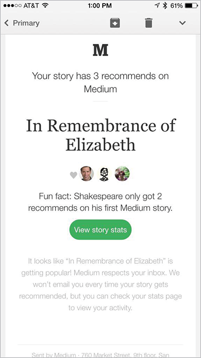

“IT IS NICE TO BE NICE.”

You’ll find this phrase everywhere at ThinkUp, a service that sends its users daily updates about their interactions on social media. By all accounts, ThinkUp cares deeply about its members. It doesn’t sell data. It doesn’t run advertising. And it has worked hard to develop more meaningful features than simply tracking faves and follower counts.

One such feature is “BFF,” which sends users an email alert about the social profile they’ve been interacting with most, accompanied by one of five or six programmed headlines: “Peas in a pod,” “Best buds,” “Get a room!”

That last one gave cofounder Anil Dash pause. “I dunno…” he remembers saying to the writer. But the team did a quick straw poll, and everyone decided it would be fine.

Until the email came in:

> You told me to “get a room” with somebody who’d been stalking me.

Suddenly that little phrase didn’t seem fine at all.

It wasn’t just that one complaint. “Get a room” is the most-criticized copy ThinkUp has ever published, despite the fact that the BFF insight only goes out to a fraction of users, and only a fraction of that fraction were served the offending message. Most users just found it a little off-putting—*icky,* if you will. But that email about stalking? It got the team’s attention.

Dash and his cofounder, Gina Trapani, pulled the snippet.

THINKUP IS FAR FROM ALONE. In apps and on websites and in our inboxes, we design countless messages optimized for the idealized user. We fill personas with smiling faces. We write use cases focused on simplicity and speed. We create flows that are ever more “seamless,” even in the face of lives that are full of rough edges.

Most of the time, we mean well: we talk about delight and satisfaction; we emphasize that our products are personal and relatable. But making digital products friendly isn’t enough to make them feel human.

Real life is complicated. It’s full of joy and excitement, sure, but also stress, anxiety, fear, shame, and crisis. We might experience harassment or abuse, lose a loved one, become chronically ill, get into an accident, have a financial emergency, or simply be vulnerable for not fitting into society’s expectations.

None of these circumstances is ideal, but all of them are part of life—and, odds are, your site or product has plenty of users in these moments, whether you’ve ever thought about them or not.

Our industry tends to call these *edge cases*—things that affect an insignificant number of users. But the term itself is telling, as information designer and programmer Evan Hensleigh puts it: “Edge cases define the boundaries of who \[and] what you care about” (<https://twitter.com/futuraprime/status/580810337391345664>). They demarcate the border between the people you’re willing to help and the ones you’re comfortable marginalizing.

That’s why we’ve chosen to look at these not as edge cases, but as stress cases: the moments that put our design and content choices to the test of real life.

It’s a test we haven’t passed yet. When faced with users in distress or crisis, too many of the experiences we build fall apart in ways large and small.

Sometimes, it’s a bit of microcopy that’s meant to be cute and playful—until it’s placed next to something that’s anything but, like this Medium post our friend Kevin Hoffman wrote mourning his friend’s death (FIG 1).

Medium clearly wanted users who only receive a few likes on a new post to feel more comfortable. But some moments simply aren’t right for “fun facts.” In fact, when Medium heard about this problem in late 2015, they told us they would remove the snippets immediately.

The problem isn’t just inappropriately peppy copy. It’s all kinds of things: the airline that pushes so many competing and confusing messages at users that buying a ticket in an emergency becomes an exercise in frustration and failure. The form that asks for information about sensitive subjects without explaining why the service needs it or how it will be used. The hospital interface that emphasizes its world-class doctors but doesn’t tell you how to find the emergency room.

It’s easy to miss these problems if you haven’t learned to look for them. There’s no checklist for the human experience, no easy way to ensure our products won’t cause harm. But as designers, writers, strategists, developers, and product people, we can train ourselves to seek out those stress cases, and vet our design choices against them.

That’s what this book will help you do.

### Bringing edge cases to the center

Instead of treating stress situations as fringe concerns, it’s time we move them to the center of our conversations—to start with our most vulnerable, distracted, and stressed-out users, and then work our way outward. The reasoning is simple: when we make things for people at their worst, they’ll work that much better when people are at their best.

It’s also critical we do this now, as writer and programmer Paul Ford explains:

> The things that you build in the next decade are going to cost people, likely millions of people, maybe a billion people depending on the networks where you hitch your respective wagons, they are going to cost a lot of people a lot of time. Trillions of heartbeats spent in interaction. \[…]
>
> I want you to ask yourself when you make things, when you prototype interactions, am I thinking about my own clock, or the user’s?

—PAUL FORD, “10 TIMEFRAMES” (<http://contentsmagazine.com/articles/10-timeframes/>)

Digital products touch every aspect of our lives: friendships, relationships, work, finances, health, grief, you name it. They’re how we share, how we express our thoughts and feelings.

They’re *us*—in all our messy complexity.

Failing to support this reality has a cost. These accidentally awful experiences are alienating. They reinforce a user’s feelings that a community or a service wasn’t designed for them, that their life isn’t one that matters. These reactions can create a ripple effect across their whole network and result in backlash and bad press.

We’re also limiting ourselves. When we, the people who make digital products, don’t take stress cases into account, we miss out on designing for people who aren’t like us, people whose fears and challenges are different from our own. This can mean failing to reach—or even driving away—people who want and need digital products that fit their lives. Whether we’re talking about low-income users, or those dealing with chronic illness, or those in developing nations, the world is full of people whose whole lives look nothing like the ones we, as an industry, typically design for.

There are products to be built that will work for them—if we can widen our perception of what it means to design for real life.

It won’t be easy. You will always encounter someone who wants to over-prioritize their marketing message or ask for more user data than they need. But examining your product from the point of view of someone in distress will clarify your true needs, and enable you to push back on those requests. Just like designing for mobile has helped us get rid of bloated pages and endless carousels for users on all kinds of devices, this approach will help us be more focused, understandable, and empathetic to users in every emotional state.

This book is a first step in that direction. You’ll find a range of techniques for working intentionally to understand the full range of people who might use your products, and the full range of emotions they may experience when they do.

In Chapters 1–5, you’ll learn about the principles behind designing for stress cases, and see examples where organizations have both failed and succeeded at this. Then, in Chapters 6–8, you’ll learn methods to strengthen your research and design process, and get buy-in from your organization.

When you’re finished, you’ll be prepared to:

* Incorporate a wider, more realistic range of people in your work.
* Lead a design process that vets new features, content, or interaction against less-than-ideal user scenarios.
* Look at your decisions through a lens of kindness, and strengthen them as a result.
* Convince others to invest in and support compassionate design processes.

Let’s get started.
