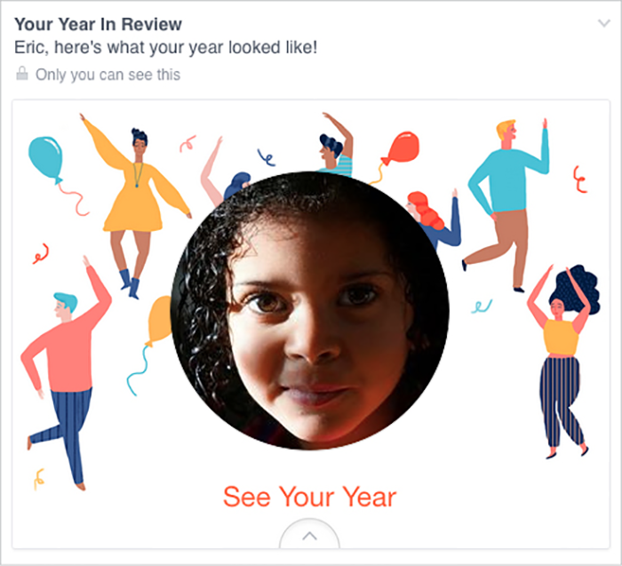
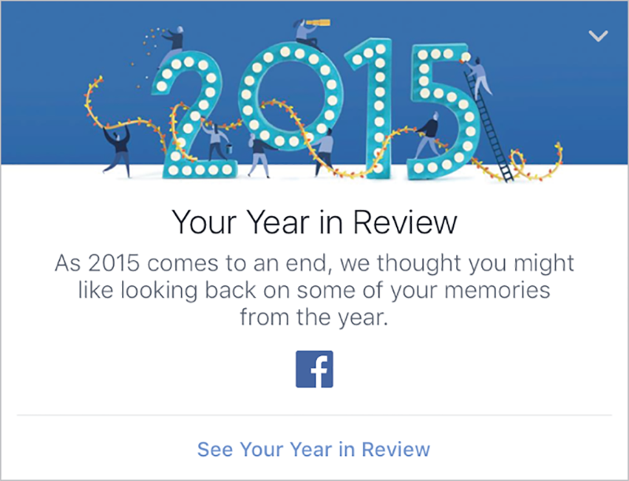
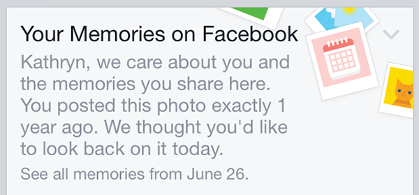

*On Christmas Eve 2014,* *I went to Facebook and was greeted by an ad promoting Year in Review, a feature I had been deliberately avoiding.*

*But there it was in my newsfeed. Staring out at me, framed by dancing clip-art partygoers: the face of my middle child, Rebecca, who had died of aggressive brain cancer on her sixth birthday, June 7th, 2014.*

*The dissonance between that profound personal tragedy and the party images created a visceral moment of shock. The copy, “Here’s what your year looked like!” added its own surreal layer of* *horror.*

**—Eric**

YEAR IN REVIEW is a Facebook feature that allows users to create an album of highlights—things like status updates, photos and videos shared, and places checked into. When it launched in December 2014, Facebook would prefill your album with content that had gotten a lot of reaction—that is, comments, shares, and likes. From there, you could add or remove items until you had a Year in Review you were happy with.

Once you were done, Facebook would post the album as a status update. The default text read, “I had a great year. Thanks for being a part of it!” Again, people could change this text, though many didn’t.

To see a clear picture of the designers’ intent, let’s break down Year in Review’s design and copy elements (FIG 1.1):

* The celebratory clip art framing the default cover photo.
* The upbeat, familiar tone of the copy: “Eric, here’s what your year looked like!”
* The default status text: “I had a great year. Thanks for being a part of it!”
* The project’s very nature: to collect and present memories from the past year.

Together, these point to a fundamental design direction, which we would articulate as something like:

> Create a product that will let people celebrate their awesome year and share it with their friends.

But not everyone had a great year.

One man had his Year in Review ad prefilled with a picture of his apartment on fire. Another got a picture of the urn containing his father’s ashes. A couple saw the sonogram of their third child, a pregnancy that later ended in miscarriage. Someone else got a photo of a friend’s gravestone, memorializing their death in the 9/11 attacks.

For every one of those people, it’s a safe bet that hundreds of thousands or even millions more—given Facebook’s 1.5 billion monthly active users in 2015 (<http://newsroom.fb.com/company-info/>)—were confronted with similar experiences.

Year in Review imagined users who wanted to look back at their year and share the result with their friends, and assumed this experience would bring them a nostalgic smile. Everything about Year in Review, and, more crucially, about the extra prominence of a timeline ad, was perfectly tuned to that use case. For anyone who fit that idealized persona, the experience probably worked just as intended. By every common measure, the designers at Facebook succeeded.

The failure wasn’t in their design, but in the narrowness of their vision. They didn’t look beyond that ideal persona, in that ideal circumstance, and ask, “How will someone in another context perceive this?” The same thing happens on design teams every day: we work from an imagined ideal, both in terms of the user and the user experience.

## PLAN FOR THE WORST

Humans are not very good at thinking about worst-case scenarios. This is probably for the best: you likely don’t dwell on what will happen if someone runs a red light and plows into you every time you get into a car. But the engineers who made that car *did* ask that question, and many like it. They worked to make the car fun to drive, reliable, fuel-efficient, comfortable, and as *safe* as possible.

Thus our cars have features like crumple zones to absorb impact, headrests to reduce whiplash, airbags to cushion occupants, and seat belts to prevent ejection. This doesn’t make cars perfectly safe, of course—occupying a half-ton machine moving at high speeds will always carry some risk—but they’re substantially less fatal than they were fifty years ago.

Engineers don’t have this skill naturally; they’ve been trained to consider worst-case scenarios. The same holds true for programmers. Most start out trying to write programs that will do cool stuff. Over time, they either see enough crashes and security exploits that they learn how to be careful, or they formally study computer engineering and are taught to be careful. Or both.

The ability to keep in mind the core vision (create a great-looking car; code a useful mobile app) while also mitigating worst-case scenarios (car hits a tree; mobile device joins an insecure network) is something designers and developers alike need to learn—particularly when it comes to human failures. It’s the ability to simultaneously work toward and *challenge* your vision—to ask yourself not only, How can I make this even better? but also, How can I keep this from inflicting pain?

## IDENTIFY ASSUMPTIONS

The first step to challenging your vision is to identify the assumptions you’ve built into it, and consider what might happen if people fall outside those parameters.

Let’s return to Facebook’s Year in Review and our inferred design direction:

> Create a product that will let people celebrate their awesome year and share it with their friends.

This is a fine vision, but to see where it might go wrong, look at its inherent assumptions:

* The user had a great year.
* The user wants to relive their year.
* The user wants to share their year.

Now, consider the new scenarios we create by subverting each of those assumptions:

* People who had a great year, but don’t want to relive or share it.
* People who had a great year and want to relive it, but not share it.
* People who had a horrible year, and don’t want to relive or share it.
* People who had a horrible year and want to relive it, but not share it.
* People who had a horrible year, and want to both relive and share it.

Some of these use cases might seem surprising, but remember that everyone is different. Many people share feelings or memories to ease emotional burdens. Others might not like to draw attention to themselves under any circumstances.

Moreover, whenever you tell yourself nobody would ever act a certain way or come to your site in certain situations, that moment should raise a huge red flag in your head. Written on that flag, in block letters, should be the words UNSUBSTANTIATED ASSUMPTION. Or, for a folksier spin: WHEN YOU ASSUME, YOU MAKE AN ASS OF U AND ME. (Our dads taught us that one.)

Once you have a list of potential user scenarios, look at the ways you might categorize or arrange those contexts, and see what each reveals about the design. For example, if you were working on Year in Review, you might organize users by whether they’re interested in sharing, and some reasons why they might feel as they do:

* People who want to share

  * Had a great year
  * Had a horrible year
* People who don’t want to share

  * But want to relive it

    * Great year
    * Horrible year
  * And don’t want to relive it

    * Great year
    * Horrible year

What do people who want to share have in common? How do they differ? You can repeat the process through other lenses, like whether they had a great year, and then whether they want to share those experiences. The more you look at your use cases in new ways, the easier it becomes to think differently about the possible outcomes.

## STRENGTHEN YOUR DESIGN

With these assumptions identified, we can now adjust our design to support people whose context falls outside those assumptions. To start, let’s focus on the scenarios we outlined above: organizing according to whether or not a user wants to share.

First, we have people who want to share their year. Awesome! They’re the people we’re already designing for. If they also had a great year, not much changes. However, for people who had a horrible year, even if they do want to share, we need to rethink some of the defaults.

Will a party theme dissuade them from completing the task, or make them angry? Would a more neutral or abstract design strike a friendly tone without imposing an assumption of celebration? For example, we could explore design elements that evoke time passing, like clock faces, hourglasses, or calendars.

What about the default text? Instead of “I had a great year. Thanks for being a part of it!” we might consider options that don’t assume a user’s feelings, or their relationship to the people they share with.

That’s what Facebook did when it updated Year in Review for 2015. Rather than assuming everyone had a good year, the new default copy is much more neutral:

> Here’s my 2015 Year in Review. See yours at facebook.com/yearinreview.

Facebook also updated the ad encouraging people to try Year in Review. Rather than inserting a picture into the user’s feed, the new ad uses design elements that stand on their own. The copy is more neutral and respectful as well: “We thought you might like looking back,” it says—leaving room for Facebook to be wrong (FIG 1.2).

This change of approach came from the feedback that Facebook received after Year in Review 2014, and the lessons it learned throughout the year with another feature, On This Day. Launched in March 2015, On This Day presents users with posts they made, or were tagged in, on the same day of a past year. As of late 2015, this is how Facebook presents On This Day posts in users’ timelines (FIG 1.3).

Note how, as with Year in Review 2015, both the visual elements and the content are neutral, instead of assuming a memory will be positive. Facebook also makes clear that it might be wrong about what people want to relive: if someone clicks the dropdown in the top right, they can choose to never see that memory again. When they do, Facebook responds with:

> We’re sorry, we know we don’t always get it right.
>
> We’ve hidden this memory so you shouldn’t see it in On This Day again.

Both On This Day and Year in Review 2015 show what it looks like when an organization embeds caring into its product, and is willing to own up to mistakes. While both products could still trigger painful memories, these tonal shifts make those scenarios less jarring.

Here and elsewhere in this book, you’ll find that there’s a lot to learn from Facebook. With a core mission of connecting people and a massive user base, Facebook is often the first to stumble into these tricky subjects—because when something goes wrong for just 5% of users, it affects more than 50 million people. As we’ve seen already, those stumbles are often a trigger for designers to think through a wider range of human experiences and emotional contexts, and take compassionate steps forward.

## FIND FRACTURES

While products that focus on personal relationships carry the most emotional risk, we can strengthen any site by challenging our assumptions and finding stress cases.

Take Flickr. In mid-2015, the photo-sharing service unveiled extensive updates to its website and suite of applications. One of its most talked-about new features was autotagging: Flickr’s image-recognition technology looks for patterns commonly found in a specific type of photo and automatically labels photos’ contents. For example, if you uploaded images of a vacation to the Bahamas, Flickr might programmatically add tags like “beach,” “ocean,” or “boat,” because the software recognizes those items based on patterns.

According to Flickr’s official help thread on the topic, autotags were designed to keep up with the ways digital photography has changed:

> As we’ve redesigned Flickr, we’ve tried to make it the one place where you upload every photo and video you take, and then easily find, organize, edit, and share them. This requires powerful image search, and to deliver that, we need to be able to identify the content in each photo, whether you add tags and descriptive titles or not. (<https://www.flickr.com/help/forum/en-us/72157652019487118/>)

In other words, Flickr designed this feature around the use case of a person snapping shots left and right on their smartphone, and uploading every one of them to the site.

That use case, like Facebook’s, is full of assumptions:

* Users want to upload all their photos and videos to Flickr.
* Users don’t want to create their own metadata.
* Users will feel like the autotags accurately reflect their photos.

Let’s look at that third assumption more closely. The reality is, not everything people upload to Flickr is quite so easy to identify. Sometimes, people visit a concentration camp—or a “jungle gym,” as Flickr’s autotagging originally labeled photos of Dachau’s “Arbeit macht frei” gates. Another tag read “sport,” as if the prisoners were at some sort of athletic camp (FIG 1.4).

.")

Other examples include a photo of a black man tagged with “ape”—something Google’s Photos app *also* did, two months later, when it labeled black people as “gorillas” (<http://www.theverge.com/2015/7/1/8880363/google-apologizes-photos-app-tags-two-black-people-gorillas>).

Individually, we might write these anecdotes off as the sort of unthinking mistake a computer might make. But given the history of words like *ape* and *gorilla* used as racial slurs, that kind of error carries real weight.

## QA FOR EMOTION

Just like Year in Review, Flickr and Google could have avoided many of these problems by challenging their visions for autotags and creating a QA process that specifically looked for places where the feature breaks in emotionally fraught ways.

First, the designers could test the feature on sensitive subject matter: images of natural disasters and destruction, sites where tragedies occurred, and injuries, to name a few. Focused brainstorming around the subject would quickly yield an extensive list of image types to test.

Reviewing the tags applied to photos like these would help reveal how often automatically generated tags fail in ways that aren’t just inaccurate, but insensitive or hurtful. For example, is an image of a beachside town destroyed by a tsunami tagged with “vacation”? This QA would create a better sense not just of the frequency of mistagging, but also of its potential impact on users—an extremely useful barometer of whether the product is ready for prime time.

Next, they could identify the tags that are most likely to be hurtful out of context. To do this, they could identify the places where taxonomy is most connected to touchy subjects, such as racial slurs. Identifying which terms could be harmful when used in the wrong context could have helped Flickr and Google identify autotags that needed more refinement, or that needed to be removed from the lexicon.

This process wouldn’t have shown the companies every single way their features could fail, but we suspect it *would* have changed how they saw that failure rate. A few misplaced “puppy” tags aren’t likely to offend, but if you saw failures that created racist messages or mischaracterized atrocities, we bet you’d be more likely to invest in some improvements.

## VALUE USERS’ TIME

In theory, autotagging images should save users time—but in reality, the feature ends up making Flickr *more* work for some users, and could leave them with unwanted tags on their photos if they don’t do that work.

Every time an autotag is incorrect, a user has to manually remove the tag. Manual untagging helps the system learn, but it’s also a burden to place on a user—particularly those loyal users who already invest time in adding metadata. As one user said:

> \[I]t is rather aggravating when Flickr then goes through adding wrong tags to your long list of correct tags, and then asks us to go through them individually deleting the wrong ones. In my case, assuming thirty seconds per photo, they effectively want me to do three months' full time work for nothing to fix their mistakes. (<https://www.flickr.com/help/forum/en-us/72157652019487118/page7/#reply72157650200555104>)

To help this problem, Flickr introduced batch editing for autotags—so, for example, if a whole photoset of your prize-winning berry tarts got mistagged as “cookies,” you could remove that tag from all the photos at once. But even with this change, Flickr is still taking something that’s meant to be seamless and turning it into extra work.

Perhaps most worrisome, few people who upload every one of their smartphone pics are likely to go back and quality-check their tags. What if a portrait photographer’s images were tagged with a racially charged word, and they ended up losing business or being targeted for abuse because the image went viral?

## RETHINKING OUR CHOICES

The utility of autotagging is clear: having rich metadata about millions of photos opens up all kinds of doors for both users and the company—not the least of which is data about user habits and interests (which advertisers can mine). But given the failures and frustrations autotagging has caused, it’s useful to ask: what if Flickr or Google had not just tested the feature better, but reconsidered how it worked in the first place?

For example, they could have opted for a tag-recommendation system, rather than an autotag system. This would give users more control over the way their images are labeled and presented to the world, while still adding metadata to a vast number of photos. Or, they could have let people opt into or out of the autotagging service, so that users (particularly power users) could maintain control over their metadata.

We’re not sure where Flickr or Google would have landed if they had challenged their visions for their features: better testing, user opt-outs, or even a larger product change. But like we saw with Year in Review—and in countless websites and digital products—these are questions not enough of us are asking.
