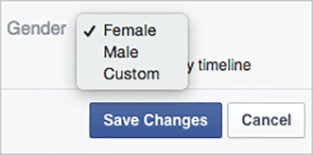
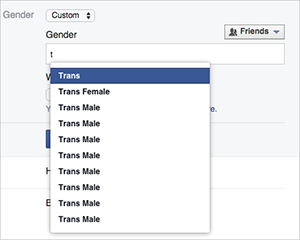
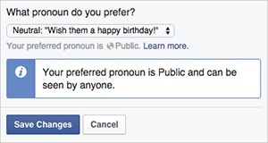
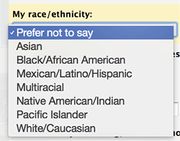
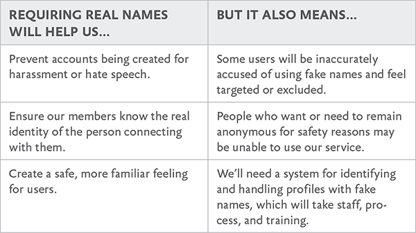
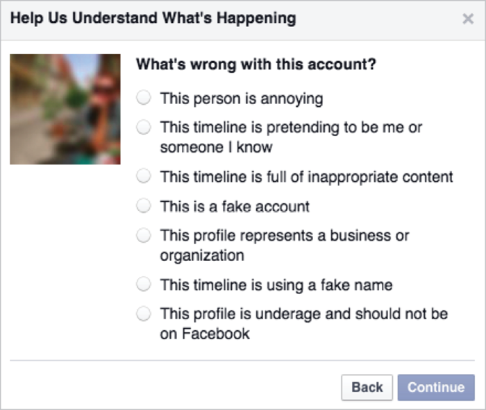
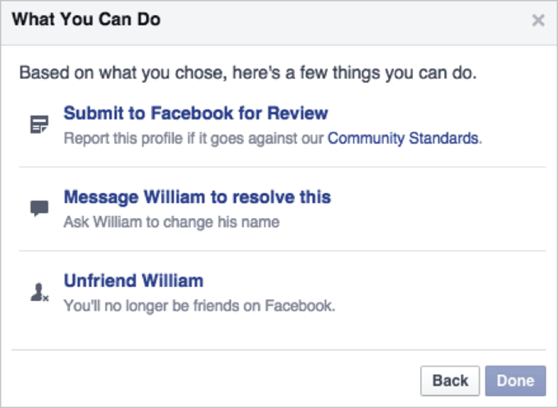
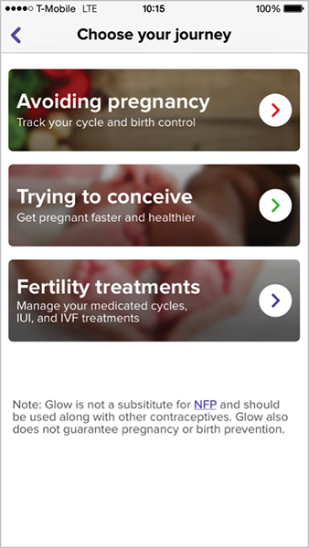
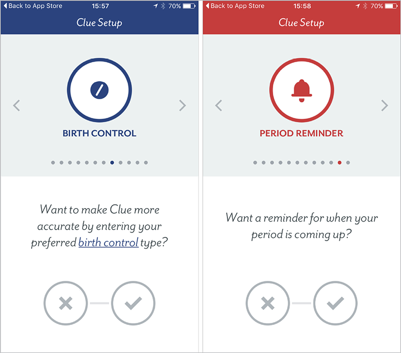

OUR USERS AREN’T US. *Our users aren’t us*. We hear this constantly—but as we’ve seen already, we’re not always great at living it out.

It’s not only a matter of considering extreme circumstances, though. Designing for real people is also about *making space*: ensuring our interfaces and expectations don’t force users into narrow categories, prevent them from using a product in the way that best fits their lives, or make it difficult to complete tasks on their own terms.

It’s about giving people enough room within our interfaces to be themselves.

In this chapter, we’ll explore a few ways users need to be able to represent themselves and their needs online—and how we can adjust our thinking to support them, rather than exclude them or force them to adjust to us.

## UNDERSTAND YOUR BIAS

Making space for our users begins with understanding our biases—something all of us have.

Bias works like this. Our brains take cognitive shortcuts: rather than thinking through every situation, they conserve energy by developing “rules of thumb” to make decisions. Those rules are built off our necessarily limited past experiences. As a result, we routinely make assumptions about the world, and the people in it, based on a very limited amount of data.

In *Thinking, Fast and Slow,* psychologist Daniel Kahneman says these shortcuts come from our brains’ desire to do as much as possible using “System 1” thinking: quick, automatic decision-making. System 1 thinking is effortless, impulsive, and often stereotypical. In contrast, “System 2” thinking requires much more careful attention, and includes functions like focusing, comparing, counting, or reasoning—all of which take energy our brains want to conserve.

We see this at work in the *availability heuristic*: the easier it is for you to think of an example of something, the likelier you are to believe that that thing happens frequently. For example, if you know many people with impaired vision, those people are more available to your brain, and so you’re more likely to estimate this user group as being large. Conversely, if you know no one with impaired vision, examples of people who are impaired will not come to mind, and you’ll be more likely to discount this user group. What’s happening in both cases is that the brain is performing System 1 thinking: making decisions based on what’s easy to recall, rather than reasoning through the situation.

System 1 thinking isn’t bad or wrong; it’s human. But it doesn’t always serve us well. To make design and content decisions that include the most people, we need to train ourselves and adjust our processes to invoke System 2 thinking as often as possible: to slow down, step away from our shortcuts, and consider things with real people in mind.

The first step of that process is to imagine your user. Go ahead, do it right now: picture the person using your products.

What did you imagine? Did you visualize a specific age, gender, and race? Did you imagine where they live, what they do for a living, maybe even how they feel? That’s okay; most of us do.

The key, though, is not to stop there. There’s real value in taking that idealized user, and then imagining someone who breaks its mold—who is different in every single way. As soon as you do, you’ll engage System 2 thinking, which will allow you to unpack those assumptions your brain made at first, and increase the variety of users you can imagine. Doing this will also help guide your research process (a topic we’ll discuss at length in Chapter 6).

Let’s explore how doing this might change some common design decisions.

## RECONSIDER “SIMPLE”

We often assume something will be “simple” for a user: “This form field will take two seconds,” we might think. “We’ll just make it required.” But what our limited knowledge tells us is simple might be anything but for someone else. The more we identify our biases and stretch our thinking beyond them, the better our designs will work for everyone.

Take gender. We ask for it all the time: when we’re onboarding new users, signing them up for a newsletter, requesting their mailing address. Often, those interfaces offer only a binary choice between male and female (FIG 2.1)

.")

But gender isn’t so simple. There are people who were born one gender but now identify as another. People who are in the process of transitioning between genders. People who are not—or prefer not to identify as—any specific gender. People who do identify with a gender, but prefer not to share that information. These are real people.

If we want to make space for everyone’s lives and needs, we need to account for a broader range of experiences—and a whole host of complicated feelings and emotional responses that can come along with using our interfaces.

Here’s how one transgender man, who is not yet out to everyone and is just beginning to transition, explained his experience to us:

> Every time a website asks: “Male or Female?” and offers no opt-out, no “It’s complicated,” I pause. I have to think about what I want to answer and why. Do I check “female” to match the name I still give and the socialization I received? Or do I check “male” and risk someone noticing the discrepancy, because this reflects myself?

Sit with that for a moment: *every time* he’s asked this question, he pauses to think. Is an honest answer going to make him unsafe? Will he risk being outed to people he’s not ready to tell yet? Will it raise red flags? Will it result in further questions?

Every check of a box forces him to choose between his safety and his sense of self. Suddenly, the question doesn’t seem quite so simple.

And how often does his answer matter to the product or service he’s using? Be honest: probably not very often. Unless you’re talking about healthcare or official government services that, at least for now, require gender information, most digital experiences ask for gender simply because *the company wants* *to know*.

It might not be easy to convince your company to stop asking for unnecessary information, but as interface makers, we have a responsibility: to question the decisions and desires that cause harm to our users. We might not change our organizations’ minds every time, but we *can* start the conversation (something we’ll discuss more in Chapter 8).

## GO BEYOND THE BINARY

Removing gender doesn’t always make sense, though. Gender is often a big part of how people identify and represent themselves—which means that on social sites, many people will *want* to specify their gender. In these circumstances, we can take a cue from Facebook, which overhauled its gender settings in 2014 to better serve a range of identities. Now users can choose “Male,” “Female,” or “Custom” (FIG 2.2).

If a user chooses “Custom,” they can type whatever they want—but Facebook also offers a list of common choices 
(FIG 2.3).

Facebook also allows users to choose the pronoun they’d like to use for their activity: female, male, or neutral (FIG 2.4).

All this adds up to a flexible experience—one that gives users the space to define themselves, and accepts them for whatever that definition is.

## ASK ONLY FOR WHAT YOU NEED

In 1980, computer scientist Jon Postel created the early specification for the Transmission Control Protocol (the TCP in TCP/IP, the internet’s most basic communication language). In that specification, he shared what he called the Robustness Principle for transmitting data:

> Be conservative in what you do, be liberal in what you accept from others. ([http://bkaprt.com/dfrl/02-02/](http://bkaprt.com/dfrl/02-02/), section 2.10)

Postel meant that our programs should carefully follow specifications in the way they format and send data to other programs or machines, but when other programs send them non-conformant data, our programs should be robust enough to accept and parse it as is.

Lyle Mullican argues that we can apply Postel’s law to user experience design. Humans and machines parse information in fundamentally different ways, he writes. But machines can, and should, be robust enough to accept human information, make sense of it, and make it conform to their more programmatic standards:

> When you buy something over the phone, the person taking your order never has to say, “Please give me your credit card number using only digits, with no spaces or dashes.” She is not confused if you pause while speaking or include a few “umms.” She knows a number when she hears one. But such prompts commonly litter web forms, instructing users to cater to the computer’s needs. Wouldn’t it be nice if the computer could cater to the person’s needs instead? ([http://bkaprt.com/dfrl/02-03/](http://bkaprt.com/dfrl/02-03/))

We can extend Mullican’s thinking beyond phone numbers and credit cards to any time we interact with our users: we should be conservative in what we ask of them, only requesting the fields we actually need. But we should be liberal in what we accept from our users, rather than forcing them into our predefined categories.

Gender is a common way this plays out, but it’s far from the only one. We’ve seen religion selectors that list only the most popular choices, or force you to select “none” if yours isn’t listed; nationality fields that use outdated or disputed country names; and race/ethnicity dropdown menus that can’t account for people who identify with multiple backgrounds (FIG 2.5). Whatever kind of information we ask users to provide, the more rigid we are about what we accept, the more people we leave out.

## ACCEPT A BROADER RANGE OF ANSWERS

Names are another area where expectations of normal often go awry. Sara has felt this herself: some systems can’t handle last names longer than fifteen characters (“Sara Wachter-Boettch” receives a lot of mail). Others can’t seem to manage the hyphen. And still others refuse to capitalize the *B*.

But you know what has never happened to Sara? She has never been told her name isn’t real.

Shane Creepingbear has (FIG 2.6). A member of the Kiowa Tribe of Oklahoma, Creepingbear had his last name questioned by Facebook more than once in 2014 ([http://bkaprt.com/dfrl/02-04/](http://bkaprt.com/dfrl/02-04/)). He even had to send in documentation proving that Creepingbear is, indeed, his legal name, because the Facebook employee who reviewed his profile thought his name didn’t “seem real.”

What does a “real” name look like? According to Facebook’s help content as of fall 2015:

> The name you use should be your authentic identity; as your friends call you in real life and as our acceptable identification forms would show ([http://bkaprt.com/dfrl/02-06/](http://bkaprt.com/dfrl/02-06/)).

Shane Creepingbear met this standard. So did Lance Browneyes, whose name Facebook shortened to Brown, even after he sent in proof of his legal name ([http://bkaprt.com/dfrl/02-07/](http://bkaprt.com/dfrl/02-07/)). So did Robin Kills the Enemy. So did Dana Lone Hill. Yet they were denied the ability to express their real names—something fundamental to their identities.

.")

Why? Because Facebook’s perception of what’s “real” was too narrow to meet the needs of actual users. As a result, these users were left out: blocked, forced to change their names, or required—sometimes multiple times—to send in proof of identity.

To make matters worse, that marginalization doesn’t exist in a vacuum; it exists within a society that has long discriminated against Native people. As Creepingbear put it:

> There’s been a long history of Native erasure and while Facebook might not be enacting it with that intention, it’s still a part of that long history of people erasing native names. ([http://bkaprt.com/dfrl/02-04/](http://bkaprt.com/dfrl/02-04/))

## DOCUMENT THE IMPLICATIONS

How could Facebook and other sites avoid similar missteps, and better account for the diversity of its users’ lives and backgrounds? Let’s look at the Robustness Principle again:

> Be conservative in what you do, be liberal in what you accept from others.

Start with that first clause. Being conservative about the information we ask of users doesn’t mean we can’t ask for real names. It just means that we first need to make sure we need them, and understand the implications of asking for them.

But we don’t always see the implications of our decisions at first glance. In 2014, Facebook rejected the names of hundreds of drag queens and kings, leading to an outcry from many in the LGBT community who felt the real-name policy marginalized and excluded them.

As a result, Facebook changed its policy—or at least clarified it, as Chris Cox, Facebook’s chief product officer, explained:

> In the two weeks since the real-name policy issues surfaced, we’ve had the chance to hear from many of you in these communities and understand the policy more clearly as you experience it. We’ve also come to understand how painful this has been…

> Our policy has never been to require everyone on Facebook to use their legal name. The spirit of our policy is that everyone on Facebook uses the authentic name they use in real life. For Sister Roma, that’s Sister Roma. For Lil Miss Hot Mess, that’s Lil Miss Hot Mess. ([http://bkaprt.com/dfrl/02-08/](http://bkaprt.com/dfrl/02-08/))

Let’s take a step back and consider how Facebook could it have foreseen this “painful” outcome. One way would have been to simply make a list of the reasons for real names—or any personal data you’re considering requiring—and weigh those reasons against the implications of that decision (FIG 2.7).

Even with this short list, we can more clearly see both the choices in front of us and the ramifications of those choices—giving us a better foundation from which to evaluate the most compassionate decisions for our users.

We’ll leave it to you as a reader to decide whether Facebook’s real-name policy makes sense, but let’s assume we’ve decided it should stay. That brings us to the second half of Postel’s statement: “Be liberal in what we accept from others.”

Let’s break down the actions that led to the rejection of Native users’ names in 2014, and see how this refrain can help with each of them. At the time, the process looked something like this:

1. A Facebook user flags a name as a potential fake.
2. A human administrator reviews the profile and determines whether it appears to violate the policy.
3. If so, a message is sent to the user telling them their name was not approved, and what to do next.

Until December 2015, the process to report a name was straightforward: you went to the profile of the person you wanted to flag and selected “Report.” From there, you were asked to select a reason for the report (FIG 2.8).

After selecting a reason, you chose a next step: report the profile to Facebook administrators; unfriend, unfollow, or block the profile in question; or send the person a message (FIG 2.9). This ease of reporting makes sense: if Facebook’s aim is to connect people “authentically,” then giving users the power to report abuse or fakes is critical to their safety and trust.

But when anyone can report anyone else at any time, some people will abuse the process. That’s what happened to the drag queens and kings in 2014: a group intent on attacking them systematically targeted their profiles. Creepingbear has said it’s also what happens to people like him, who openly discuss racism against Native Americans on Facebook pages.

If our goal is to be liberal in what we accept from users, then we want to allow the broadest range of real names on the site—which means we need to eliminate as many of these false reports as possible.

In December 2015, Facebook announced it was rolling out updates designed to limit those false reports. The new system asks those reporting a false name to select a reason for the report, such as “This profile doesn’t represent a real person,” and then to provide additional details about the problem 
(FIG 2.10).

.")

Facebook has also been working on the communications a user receives when their profile is flagged. Here’s what it said back in 2014, when Creepingbear’s profile was targeted:

> Your name wasn’t approved.

> It looks like that name violates our name standards.

Imagine that you entered a real name, and then received this message. Would you feel included and welcome? Probably not. Instead, it feels alienating and condescending—like Facebook is telling you that your identity isn’t acceptable. Add in the word “violates,” and the overall picture feels aggressive and judgmental.

Compare that message to the one Facebook uses as of 
this writing:

> Help Us Confirm Your Name

> We ask everyone on Facebook to use the name they go by in everyday life so friends know who they’re connecting with.

> If \[Name\] is your authentic name, please choose Confirm Name to help us confirm it. If you aren’t currently using your authentic name on Facebook, please click Update Name to update the name on your account.

What we love about this change is that it removes the accusation: no one’s saying your name *is* fake. Rather than labeling your identity as the problem, it clarifies Facebook’s policy and provides clear options to resolve the issue.

If you got this message, you still might not like scanning copies of your driver’s license to have your name approved. But at least you’d feel like there’s space within Facebook’s universe for you to exist.

In December 2015, Facebook announced that it was testing a new tool for those who are confirming the authenticity of their names (FIG 2.11):

.")

> People can let us know they have a special circumstance, and then give us more information about their unique situation. This additional information will help our review teams better understand the situation so they can provide more personalized support. ([http://bkaprt.com/dfrl/02-09/](http://bkaprt.com/dfrl/02-09/))

This new process helps Facebook minimize one drawback of its real-name policy we identified earlier in this chapter: that it might turn away those who want or need to remain anonymous for safety reasons.

Paired with other changes underway at Facebook—such as giving users seven days to confirm their names before blocking account access, and improving the process for submitting documents—this new tool demonstrates critical progress toward making space for real lives.

## FIND WHAT MATTERS TO USERS, NOT TO YOU

Making space for real people also means making sure the features we build match our users’ priorities—even when those priorities are different than what we imagined.

Take period tracking. Women typically have periods, and the earth has, at last count, lots of women. Women have been tracking their periods for centuries, for all kinds of reasons. Some want to find or avoid fertile windows, while others simply want to know when to expect their next period. Some women track their moods or energy levels. Still others use it to monitor other health issues, since irregular periods can point to issues like stress or hormone imbalances.

And yet, Apple Health—the forcibly installed, impossible-to-delete iOS app that claims to be the place to track your “health data”—didn’t track periods when it launched in 2014. You could track your sleep quality, blood pressure, resting heart rate, steps walked, body measurements, chromium intake, and dozens of other data points. As Craig Federighi, the senior vice president of software engineering who announced the app, put it: “All of your metrics that you’re most interested in” ([http://bkaprt.com/dfrl/02-10/](http://bkaprt.com/dfrl/02-10/)).

Unless, of course, you’re interested in your menstrual cycle.

It wasn’t until June 2015, a year (and more than a few critical articles) after Health’s debut, that Apple added a period-tracking feature ([http://bkaprt.com/dfrl/02-11/](http://bkaprt.com/dfrl/02-11/)).

Why was such a basic health feature—one that’s relevant to half of all users between puberty and menopause—left out of such an otherwise comprehensive list? We can’t say for sure, but we suspect it’s because Apple didn’t challenge its vision of what “health data” included for real people. Either period tracking never came up during product-development discussions, or it did come up, but the team decided it wasn’t important enough to pursue.

## DESIGN TO INCLUDE

Of course, Apple’s not the only app-maker around. Many menstrual cycle-tracking apps do exist—for some users, at least.

Take Glow, an app that calls itself “your best friend through multiple phases of your life.” But it didn’t live up to that claim for Maggie Delano, a doctoral student in electrical engineering at MIT. She wrote about her experience “as a queer woman not interested in having children” attempting to use Glow and other period-tracking apps on Medium ([http://bkaprt.com/dfrl/02-12/](http://bkaprt.com/dfrl/02-12/)).

First, during onboarding, she was asked to select her “journey” from three options, none of which applied to her: “avoiding pregnancy,” “trying to conceive,” or “fertility treatments” (FIG 2.12).

Then, the options for cycle length started at twenty-two days. Because Delano’s cycle is shorter than that, the app became essentially unusable. Finally, once she set up the app anyway, she was chided for not using birth control—even though, with a female partner, her odds of getting pregnant are, well, rather low. Her assessment: “In three screens and fifteen seconds, the app has made numerous assumptions about my identity and health.”

All said, Delano’s attempt to track her period was alienating: a series of heteronormative questions that didn’t account for her reality. She writes:

> These assumptions aren’t just a matter of having a few extra annoying boxes on the in-app calendar that one can easily ignore: they are yet another example of technology telling queer, unpartnered, infertile, and/or women uninterested in procreating that they aren’t even women. It’s telling women that the only women worth designing technology for are those women who are capable of conceiving and who are not only in a relationship, but in a sexual relationship, and in a sexual relationship with someone who can potentially get them pregnant.

## ACCEPT NUANCE

Glow could have skipped the assumptions about why women would track their periods and simply asked users what they wanted to track instead—something period-tracking app Clue does right during onboarding (FIG 2.13).

Rather than force-fit users into one set “journey,” Clue bills itself specifically as a period tracker that’s “made for you.” One headline even reads, “It's your fertility.” What Clue understands—and we could all stand to remember—is that whatever its users want to track, that’s their choice, not Clue’s. After all, for each person, only one use case matters: *theirs*.

## REVISITING OUR BIASES

Glow clearly imagined its users as straight, sexually active, partnered women—and so the app fails immediately when used by someone who doesn’t fit that mold. A gay woman, or a woman who’s not sexually active, would find the assumptions about pregnancy risk irrelevant at best, and hurtful at worst. A single, sexually active woman might feel judged by assumptions that she has a partner to share her data with. The list could go on.

Think about your ideal user again, the person you envisioned earlier in this chapter. What would be alienating to someone different from them? Which features would break?

This process of identifying and subverting assumptions is difficult at first, because it requires not just thinking differently, but being honest about where you fall short. But it’s a habit your whole team can learn. And, like any habit, it gets easier the more you try.

## EVERYONE NEEDS SPACE

We’ve talked a lot about social networks and health apps in this chapter, but don’t let that fool you. Making space for your users’ real selves matters, even for sites and products that aren’t as obviously personal. Any time we’re asking a user to define themselves, our design choices can either make them feel welcome or push them away. It takes time and practice to get it right, and we’ll all screw it up sometimes. But if you can embrace these concepts in your work, you’ll be on your way.
