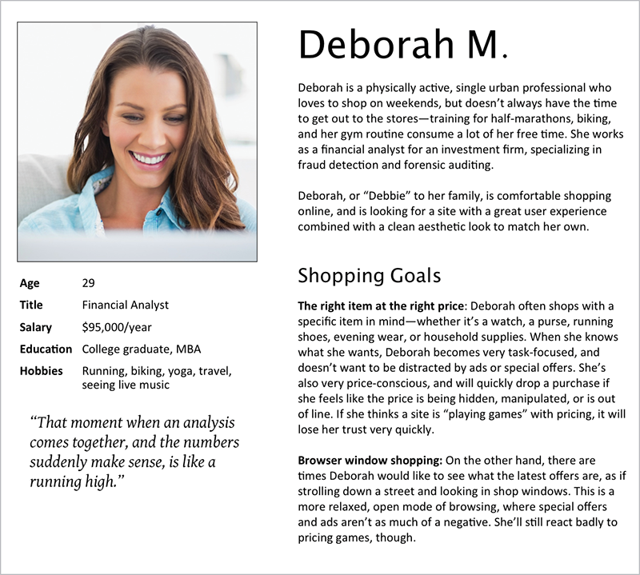
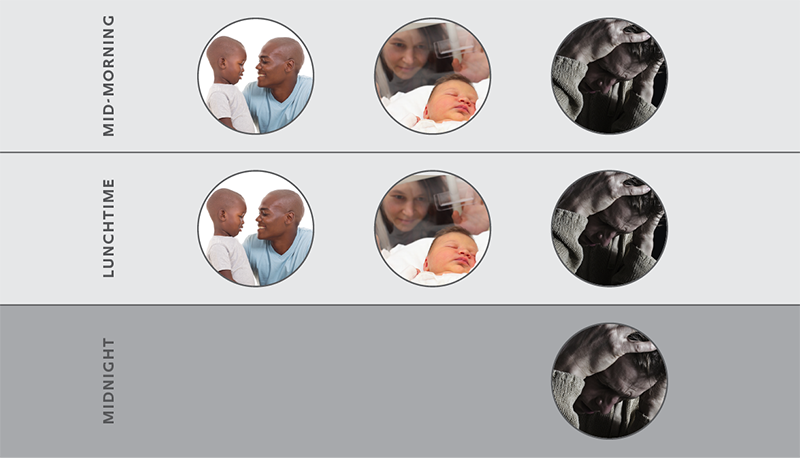

*My wife, Kat, and I sat stunned and frightened in the back of a stranger’s car, barreling up the Garden State Parkway at 11 p.m., racing to reach the hospital where our daughter Rebecca was being life-flighted. All we knew was that a mass in the center of her brain had very nearly killed her that evening, and it might still.*

*We didn’t know where we were supposed to go once we reached the hospital, so I pulled up its website on my iPhone. Not only was the site not mobile-friendly, I couldn’t find anything explaining what to do in an emergency. I kept looking for a box or banner or something that would tell me what to do, where to go, who to ask once we got there. I never found it because, as I discovered later, there was no such resource. There was no page to help. Our literal life-or-death situation was completely* *ignored.*

**—Eric**

THIS WAS A HOSPITAL, a place where frantic people rush through the doors every day, wanting to reach their children as soon as possible. An organization that has a department with “urgent” in its title—and yet, it had nothing saying, “If you’re coming here unexpectedly, this is what you need to know.”

Perhaps the hospital thought that wasn’t necessary: that anyone in a crisis would have gone to the lobby or emergency entrance, and then asked where to go. But Eric and Kat were frantic—they needed reassurance about what to do. They needed a path for people in crisis.

In situations like these, we often hear, “We’re designing for the 90%, not the 10%.” That’s classic edge-case thinking: a shorter way of saying, “That’s a difficult use case that I don’t want to think about.” That’s why we think the concept of *stress cases* is so valuable.

To see what we mean, consider how these sound:

> “Someone trying to shut down their account in a hurry is an edge case.”
>
> “Someone trying to shut down their account in a hurry is a stress case.”

The first feels like we can ignore it for now—and we all know how often “for now” becomes “forever” on a busy web team. The second, by contrast, feels urgent: it implies that the user has an important reason to act fast. That triggers our empathy and makes us want to help them, not ignore them.

## STRESS EATS RESOURCES

Steve Krug famously said, “Don’t make me think!” But when users are under stress, in a sense they literally *can’t* think.

Research has consistently found that cognitive resources are finite: if you expend them on one thing, you have fewer left for other things. One experiment, which Kathy Sierra talks about in her book *Badass: Making Users Awesome*, presented testers with one of two tasks: to memorize a sequence of either two numbers or seven numbers. Afterward, the testers were offered a choice of snack: cake or fruit.

The subjects who had the harder task were far more likely to pick the cake, because they’d expended their cognitive resources, and had fewer resources left to exert willpower or evaluate nutritional choices. (See more on this study in Baba Shiv and Alexander Fedorikhin’s “Heart and Mind in Conflict: The Interplay of Affect and Cognition in Consumer Decision Making” [<https://web.archive.org/web/20190428130649/https://www.jstor.org/stable/10.1086/209563>, PDF].)

When a user is in crisis, nearly all their cognitive resources are consumed by that crisis. Worrying over a loved one, or what the future holds, or any number of other things severely reduces the processing power they can devote to your site (or to anything else).

For example, we talked with a woman who was assaulted by an acquaintance. Afterward, she says, “I wasn't thinking quite right, so I was looking at websites to help me understand if I had in fact been sexually assaulted.” She went to the Rape, Abuse, & Incest National Network (RAINN) website (<https://rainn.org/>), where she found a link that said, “Was I Sexually Assaulted?” It seemed like exactly what she needed—until the page loaded (FIG 3.1).

All those headings left her overwhelmed—and even worse, as she skimmed, she couldn’t quite see herself in any of them. She hadn’t been raped, she thought. It wasn’t stalking, or abuse, or any of the other categories she saw. She says:

> I must have reread that page ten times. And in that moment, I felt like…well maybe this doesn’t fit. Maybe this isn’t really assault and it’s my fault.
>
> I know that seems crazy. Looking back, it was very clearly assault. But I was not in the right state of mind. I realize now that the page says sexual assault comes in different forms, but the way it’s designed, you kind of skim over that, and there’s nothing after the “types” to help people who don’t identify with the listed situations know what to do next.

Even though this woman knew to go to the RAINN website, she couldn’t think critically about what she read. Her cognitive resources were so depleted by her experience and its aftermath that she “was not in the right state of mind” to realize that her assault *counted*. She felt ashamed and even more alone.

.")

The good news is that RAINN has since clarified and shortened this page. As of September 2015, rather than listing a huge number of very specific types of assault, it displays a few broad, inclusive categories—so a user can immediately map almost any situation to one of them. Topics covering more specific types of abuse, such as military sexual assault, appear lower on the page, with less visual priority. The result is a page that’s easier for any user to skim, understand, and see oneself in (FIG 3.2).

.")

## EVERYDAY STRESS CASES

To paraphrase Karen McGrane, *you don’t get to decide when a user wants to access your site; they do*. If someone comes to a site or app in a moment of crisis, we bet they have a genuine need to be there—and that is the exact moment we don’t want to let them down.

The truth is, stress cases exist for all kinds of products and services—even ones you likely never associate with crisis. Here are just a few scenarios that are more common than we’d like to imagine:

* A person who has received a threat from a previously unknown stalker, and needs to delete or make private every public account as quickly as possible.
* A university student whose roommate has declared they intend to commit suicide, and needs information on what to do.
* Someone who has discovered their mortgage’s auto-pay has failed two months in a row, and is afraid they’ll be foreclosed on.
* A person working two jobs whose only car was damaged in an accident, and is trying to submit incident information to their insurance company late at night, after they’ve finally gotten off work.

Stress cases aren’t only about crisis—they apply when something mundane goes wrong, too. For example, imagine you and your whole team have been planning for months to attend a professional conference. Now the conference is a week away, the travel arrangements have all been booked, and nobody can find any confirmation that anyone ever registered for the conference. Now what? A lot of nonrefundable flights and hotel reservations are at stake, not to mention the expected benefit of attending.

Nobody on the team is in danger of injury or death—though in some work environments someone’s job might be on the line. Regardless, the immediate question is: Does the conference’s site help in this situation, or does it make things harder? Is it clear how to get in touch with the *right* person, as quickly as possible, to figure out whether the registrations ever happened? Or, if there’s a better and faster way to confirm that online, does the site make it obvious to find and easy to use?

Contextual crises come in all shapes: a parent who realizes their child’s birthday is a couple days away, and the very special present they ordered hasn’t arrived yet. A woman whose sister gave birth a week earlier than expected, and needs to book flights right away to meet her brand-new baby nephew. An incoming university student who realizes the financial aid application deadline is sooner than they thought, and is trying to find out what they need to do next.

Another form of contextual crisis is one we’re all too familiar with: a technical failure. This can be anything from a missing or disabled plugin to severely limited bandwidth—things that frequently prevent JavaScript from loading, for example. (See Stuart Langridge’s “Everyone has JavaScript, right?” for more [<https://kryogenix.org/code/browser/everyonehasjs.html>].)

Maybe the user is in a public library with archaic PCs running Internet Explorer 6. Maybe they’re one of the almost 60% of mobile web users around the world who are on EDGE networks. (That was the network speed before 3G, you may recall.) Maybe the battery on their device is almost drained, so their time is extremely limited. Maybe the CDN provider had an interruption of service, causing half the page’s external resources not to load.

We can’t predict every possible scenario, but bringing these sorts of contexts into your process is a necessary and incredibly useful step.

## PERSONIFYING URGENCY

Before we can address these scenarios, however, we need to imagine users who are capable of being under crisis. *Personas* enable us to do just that—if we create them with real people in mind.

Personas—fictional, archetypal characters that represent the users of a site or product—help us see a design from new perspectives, make decisions, and uncover blind spots. But personas often have their own blind spots, obscured by the bright light of a thousand happy stock photos (FIG 3.3).

For all our efforts to concoct diverse background stories and reasons for using our designs, we frequently only create idealized personas: attractive people happily interacting with our products and completing tasks. We feel better just by looking at them.

If we’re honest with ourselves, most of our users are probably just as distracted and short on time as we are. They have a million things to get done today, and coming to our site or using our service is just one of them. Bills have to get paid, dinner has to get made, the house needs straightening, the kids are fighting again, and on and on. The personas we create often don’t leave the door open for these imperfections—and so we never imagine them in crisis scenarios.

## A STUDY IN STRESS

Sara recently worked with one organization that *did* start imagining its users under stress: a big-box home-improvement retailer—the kind of place where helpful staff members advise do-it-yourselfers on everything from flower beds to faucet installation to major renovations.

The company extends its brand online by publishing hundreds of highly detailed how-to guides, each providing step-by-step advice for planning, shopping for, and completing home-improvement projects. Written in an upbeat, you-can-do-it tone, and filled with demos and images, the guides are designed to make readers feel prepared and empowered to complete their projects, and excited about what the results will look like.

In early 2015, the chain decided to improve these guides and started researching ways to make them more valuable. They tested layouts with users. They built more video demos to provide better hands-on guidance. They adapted for mobile. And they started looking at how products and calls to action were incorporated into the page.

While working on this content, they realized something: all those how-to and buying guides were written from the same peppy perspective of someone who’s looking forward to their project: *a shiny new stove! A cute new patio!* That’s useful for some customers, but many people end up at the retailer in panic: a water heater dies unexpectedly and the customer needs to replace it *today*. The fridge gives out and they’re dumping spoiled milk down the drain. The toilet breaks and…well, you get the picture.

These purchases aren’t the stuff of DIY dreams. They’re the stuff of stress, frustration, and anxiety. Plus, a sudden major purchase is a financial hardship for many customers—as is taking time off work to deal with the issue.

## STRESS FIRST!

You’re probably familiar with “mobile first,” where you start by considering what you need for a good mobile experience, and then enrich that baseline for desktop browsers. The team at the home-improvement retailer took a similar approach, rethinking content through the lens of “stress first.”

They did this using a *journey-mapping* activity, a technique we’ll talk about more in Chapter 7. Journey mapping made the team walk through a task, end to end, from the perspective of a user—noting their questions, feelings, and content needs along the way. This helped them consider the different triggers that could make a customer seek project or product-selection help. In the process, the team realized they could cluster their use cases into two general categories: “urgent” or “upgrade.”

Some projects are always upgrades—no one has a sudden, critical need to build a three-season flowerbed. Others are most often urgent, like replacing a water heater or fixing a toilet. And then plenty others could go either way, like a new fridge: you might have been looking forward to redoing your kitchen for years, or you might be mopping up a puddle of water while frantically checking to see how much room you have on your credit cards.

The retailer can’t always know which group you fall into. But by challenging its vision of what a customer looks and acts like, the store was able to really think through its design and content, and incorporate stress cases into its strategic plan for these guides:

> We will be the go-to resource that DIYers of every skill level and budget rely on to complete their projects and purchases. We’ll do this by publishing clear, dependable content that takes the guesswork and stress out of home improvements and upgrades, and makes users feel prepared for their projects, confident in their choices, and proud of their results.

In addition to this high-level strategy, Sara and her client’s team created specific guidelines to help writers and designers put these principles into action, connecting the dots between vision and execution. Here are a couple:

> To serve every skill level and budget, and make users feel prepared and confident, we will...

* Prioritize helpful, realistic estimates of time, skills needed, and budget ranges.
* Provide at-a-glance help like shopping lists and quick reference tools.

> To increase clarity and remove guesswork and stress, we will…

* Use plain language: short sentences and paragraphs, simple words, and straightforward directions. Our customers come with all backgrounds, and our content shouldn’t alienate or confuse any of them.
* Write for the urgent case. Many customers come to us in a panic: a critical appliance breaks, plumbing clogs, the roof springs a leak. These customers might be suddenly anxious about finances, stressed over missed work, or any number of challenging circumstances. When we write to the user who’s experiencing an emergency, we’ll be more honest, more direct, and clearer for everyone.

This led to a series of changes that would better serve these urgent cases, and also improve the guides for anyone:

* Calling out installation availability and time frames at the top of relevant articles.
* Setting financial expectations up front by providing estimated cost ranges.
* Writing specific, contextually helpful subheads for easy skimming.
* Creating one-sentence summaries of what each section of copy covers, and keeping them exposed even when that section is contracted.
* Rewriting the tone of guides that might apply to urgent cases to be reassuring, not just excited.

As we’re writing this, the retailer has started revising its most-visited guides, and tweaking its templates to reprioritize information. They don’t have all the answers yet, but with this new vision guiding them, they’re eager to keep incorporating more use cases in their work.

## CRISIS IN CONTEXT

Just like the home-improvement chain realized that some projects are never urgent, some are nearly always urgent, and some fall in between, every organization needs to consider all the contexts its personas’ scenarios might happen in.

Consider the children’s hospital again. For a twenty-four-hour public facility like this, you might imagine a handful of time-based contexts: morning, lunchtime, afternoon, and late at night. As you place each persona’s scenario in each of these contexts, you start to see that a person might react very differently in one context than in another.

Some personas may not even appear in some contexts. At the children’s hospital, for example, things will feel very different at midday, with staff headed to and from lunch and a lot of outpatient visitors, than at midnight, when most of the lights are off and public spaces are empty.

Let’s play this out. Take three personas and their scenarios: a patient coming for a routine checkup, someone visiting a sick relative, and the parent of a child brought in by life-flight helicopter. Now look at three times of day—morning, late afternoon, and midnight. By slotting each persona into each context, we have nine potential combinations, but only seven realistic scenarios (FIG 3.4).

What we can see is that two of the three personas won’t even be in the hospital at midnight: there are no routine appointments, and visiting hours are long over. The only persona who might experience that context is the one in crisis.

Now, suppose you’re designing the UI for the hospital’s elevators. You have the option to play recorded announcements when the doors close, so you decide to use cheerful kids’ voices. It tests out great; everyone thinks it’s a cute, heartwarming touch. But let’s think about that decision from the viewpoint of each persona in each context. From a glance, we can see that this decision will fail at midnight.

This literally happened to Eric and his wife when they arrived at the Children’s Hospital of Philadelphia. Imagine: they were in a dimly lit, mostly deserted hospital, in shock and terrified. Suddenly, a chorus of chirping kids’ voices broke the silence. It was like a moment from *The Shining*, and came across as user-*hostile*.

What all this points to is not to eliminate the kids’ voices, which work for most use cases and contexts, but to consider *when* to turn them off. In the middle of the night, there are really two likely personas present: people in crisis, and the staff. The people in crisis are more likely to find the cheery voices jarring than soothing and friendly. And we’re pretty confident the staff would be happy to have the kids pipe down for a while.

As we’ve seen, identifying and mapping out stress cases shows fractures in our work that we might miss, leaving them open for someone in crisis to stumble into. By thinking through these scenarios, we get better at prioritizing information, removing fluff, and staying focused on our users.
