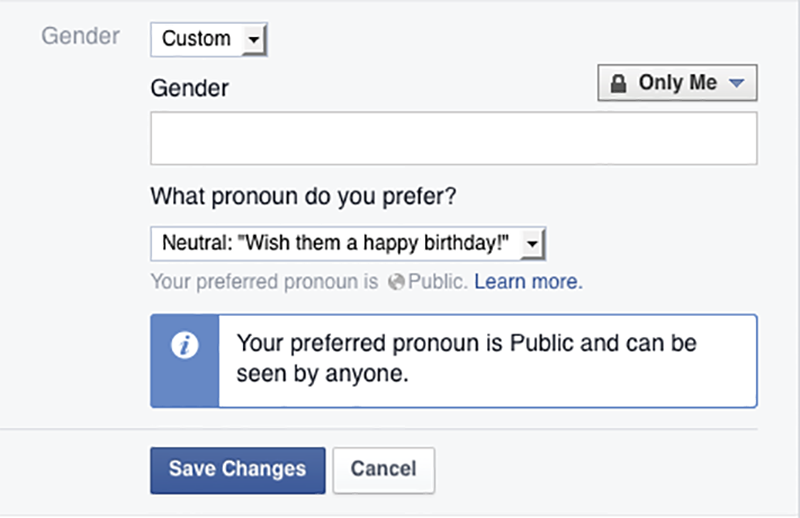

*I was filling out a new-patient form online for* *my doctor’s office when I saw it, sandwiched somewhere* *between “Do you smoke? and “Has anyone in your family* *had a stroke?”:*

*Have you ever been sexually abused or assaulted?*

*Yes __ No* *__*

*That was it: no context, no explanation,* *no box to tick for, “Well, yes, actually, but it’\*\*s a long story from a long time ago, and* *it’s not why I’m here.” Just a tidy* *little binary for something that didn’t feel tidy at all.*

*“So, you were sexually assaulted,” my doctor said partway* *through our appointment. It wasn’t a question, but she* *paused* *expectantly.*

*“Yes.”*

*I waited, uninterested in trotting out my* *story for a stranger. “I’m sorry that happened to* *you,” she said finally, moving on with her checkup. I* *stared at the ceiling, thinking about that checkbox. So simple,* *so* *impossible:*

*Yes __ No* *__*

*I don’t know why that* *question existed. I don’t know who asked for that* *information, where it was going, or how they intended to* *use it. Was it collected for statistical purposes only? Were* *they trying to identify victims who needed help and care?* *Was I going to be asked about it every time* *I had the flu or needed a prescription filled?*

**—Sara**

WHEN WE ASK USERS to share information, we’re asking for their trust. But it’s hard to trust a site when you’re not sure about the intentions of the people behind it. Why do they need your data? How will they use it? What will happen once you provide it?

In Sara’s case, someone probably had good intentions when they added that question to the intake screener: they may have wanted to provide better medical care, statistics, or support. But they didn’t communicate what those intentions were. The result was a form that left her feeling uneasy and exposed—her history in a database and out of her control.

That loss of control can have major emotional consequences for users, particularly when personal information is unexpectedly made public. That’s what happened in 2012 to University of Texas college students Bobbi Duncan and Taylor McCormick. The students, both gay, had used Facebook’s privacy settings to conceal their orientation from their parents, but it didn’t matter: Facebook posted an update to their profiles saying they’d joined the Queer Chorus, without them or the choir director who invited them intending it to appear. Duncan’s father was furious, and threatened to sever ties with her (<http://www.wsj.com/articles/SB10000872396390444165804578008740578200224>).

We can’t know precisely which information is sensitive for any given user. What we *can* do is be honest about our intentions. We can ask users only for what we truly need, and be clear about what we’ll do with what they give us. And we can provide context, explaining why we want information and disclosing when and how a user’s actions affect what happens next.

## BE INTENTIONAL

Income level, real name, mailing address, salutation, level of education: as we saw with gender, digital products demand these things and more from users all the time—whether that information is necessary or not. Often, the reasons we ask are frustratingly simple:

* “That’s what everyone asks.”
* “That’s what we’ve always done.”
* “We didn’t really think much about it.”

What’s missing is *intention*: making a specific, purposeful choice about what we’re requesting and why. That lack of intention creates real damage for our users, because every bit of personal information we request:

* Makes tasks seem more daunting, especially for users experiencing stress or crisis. This makes them more likely to abandon the process or have a negative experience.
* Creates more space for the user to start asking *why* we want that information. This erodes trust, which can also lead to them abandoning the process.
* Increases the chance of things going wrong, because every new bit of information we request creates new opportunities for error.

Let’s examine one common form field: salutation. Typically, this is handled via a dropdown of “Mr.,” “Mrs.,” “Dr.,” and so on. In early 2015, a pediatrician in Cambridge, England, discovered that the security system at her gym refused to let her into the women’s locker room—because the third-party system was programmed to treat anyone with a title of “Doctor” as male (<https://web.archive.org/web/20150502125153/http://www.cambridge-news.co.uk/Cambridge-paediatrician-8217-s-outrage-Pure-Gym/story-26188693-detail/story.html>).

Of course this is ridiculous. The firm that created the system should have caught the error before it shipped—in fact, it should have recognized the bias in that spec before a line of code was written. And of course nobody who worked at the gym meant to create even the appearance of insult; they had no idea the flaw was in the system until their customer ran into it.

The problem is that the salutation this doctor provided on her membership form was fed into a system where it served as a proxy for something else: gender. But why did her gym ask for her salutation in the first place? Odds are good no one ever called her “Doctor” while handing her a towel. If the membership form had skipped salutation entirely, the bug in the security system and the resulting offense and bad press might have been avoided. That piece of data, which seemed so trivial, was a much bigger risk than anyone at the gym imagined.

How many of us have set up a form without really thinking about what’s on it, or what will be done with the data once it has been captured? Being as intentional as possible is the best tool we have to prevent errors and biases.

Form and survey specialist Caroline Jarrett, coauthor of *Forms that Work:* *Designing Web Forms for Usability,* recommends building intentionality into our work through a *question protocol* (<http://www.uxmatters.com/mt/archives/2010/06/the-question-protocol-how-to-make-sure-every-form-field-is-necessary.php#sthash.GGxLSg84.dpuf>). The protocol is a tool for systematically evaluating each question you want to include, asking:

* Who within your organization uses the answer
* What they use them for
* Whether an answer is required or optional
* If an answer is required, what happens if a user enters any old thing just to get through the form

As Jarrett says, this process will reveal the real cost of a form field:

> A question protocol can help to create a discussion about 
> the true business value of each question a web form asks. If you know exactly what decision your organization will make based on the data a web form collects, you can quantify the value of that decision and weigh it against the cost of collecting the data.

The protocol makes your decisions intentional, because it forces everyone involved to ask: What’s the intent? Why are we making users take this step? What will be done with the information? Do we need this information, or are we asking because “it might be nice to have”? Being intentional in what we ask and how we ask it also values the user’s time, by not making them spend any more than necessary.

## BE TRANSPARENT

Every piece of information we request is a tiny window into a person’s life—and windows function best when they’re transparent.

Consider the University of Texas story from the beginning of this chapter. The base problem was that back in 2012, Facebook wasn’t explicit about the consequences of certain actions. If a group administrator added a member, Facebook would automatically notify the new member’s network that they’d joined the group—without warning either party, or asking whether they wanted to make it public.

More recently, however, Facebook has done an excellent job communicating context when it comes to gender. After users select “Male,” “Female,” or a “Custom” gender, they can also choose who may see their gender: “Only Me,” friends, friends of friends, or everyone.

If they choose “Custom,” an additional option also lets them select a pronoun to go by: feminine, masculine, or neutral. If a user changes their preferred pronoun, a callout box tells them their pronoun choice will be visible to the world, even though their custom gender identification may be private (FIG 4.1).

That copy provides crucial context for people who are changing their gender identification, but aren’t ready for the whole world, or even their friends and family, to know. It gives them a clear warning before making the change, so they can either back out or move ahead fully informed.

Another example of communicating the implications of a user’s action is on the card-blocking screen of the Simple mobile banking app. This is where a user goes to deactivate a lost or stolen bank card (FIG 4.2).

.")

Notice the text at the top of the screen: “This is a reversible process.” More information follows, but that simple sentence makes it instantly clear that if you’re not sure where your card went, you can block it without worrying that you’re about to lock yourself out of your account until a new one arrives.

The benefits are twofold. Most obvious, if a Simple customer realizes their card isn’t with them, they can block out of caution while they retrace their steps. If it turns out the card just fell to the floor of their car, they can simply unblock it and move on.

This translates into a benefit for Simple, too. The more people feel comfortable blocking card access in cases they aren’t sure about, the less likely Simple is to suffer fraudulent withdrawals in cases where a card has been stolen. All that, from just five words in the right place!

## BE PRECISE

Whenever you’re asking someone to give you information or complete an action, you can never go wrong by telling them what you plan to do with their information, as well as how their actions may affect them later.

Eric experienced this while working on the *A List Apart* Survey, which, from 2007 to 2011, asked web practitioners detailed questions about their demographic information, salary, specialty, and other professional data. A few years into the survey, the team added an optional question: “What’s your postcode?”

The intent was to use the information to create a high-level visualization of where respondents lived and worked. But a lot of respondents filled in bogus information, and a few weren’t kind about it. (“Sod off” was one of the gentler responses.) The reaction made total sense: even though the question was optional, it created a feeling of distrust for many survey-takers, especially those whose postcodes defined their location to within a few blocks, as is the case in many countries.

The next year, the question stayed, but with a short explanation:

> This data is for statistical purposes only. It is completely optional.

That cut down on the aggrieved replies, but it still wasn’t enough. By the last survey, the message read:

> This data is for statistical purposes only and will never be shared in conjunction with your other responses. If it makes you uncomfortable for any reason, simply skip it.

That’s better, though if we were to rewrite this today using the lessons from this chapter, we’d say something like:

> We ask this so people can create geographic visualizations of where respondents are located. When we publish the raw data from the survey after its completion, postcodes (like IP addresses) will NOT be included in that data set. It’s possible we might publish very limited data sets that pair postcodes with a single other response, such as job titles. If the question makes you uncomfortable for any reason, please skip it. If you have questions or concerns, please contact us.

That’s…quite a lot. It fulfills the need to be transparent, but even with all these extra words, it’s still not precise, and the length of the explanation is already a red flag. Would it survive Jarrett’s question protocol? Is this a case where the value of keeping the question is lower than the benefit of the answers? Had we written this book a decade earlier, Eric would likely have dropped the question from the survey.

## WHEN IT MATTERS MOST

Being intentional is always important, but as we’ve seen, there are times when a lack of sensitivity and transparency has particularly emotional effects on our users. How we walk matters a lot more on a high wire than a sidewalk.

Kate Kiefer Lee, MailChimp’s communications director and coauthor of *Nicely Said: Writing for the Web* *With Style and Purpose,* has talked about “touchy subjects”—things that are likely to cause stress or make a reader uncomfortable. In her article “Don’t Poke the Bear,” she writes that touchy subjects “aren’t limited to the obvious offenders like money, religion, and politics. They’re not limited to highly visible crisis-management messages crafted by professional writers, either” (<http://alistapart.com/article/dont-poke-the-bear-creating-content-for-sensitive-situations>). Instead, she has found that common touchy subjects include:

* Error messages
* Warnings
* System alerts
* Financial and privacy-related updates
* Legal agreements

For example, if a customer's transaction fails, it’s not the time to say something like, “Hey, your credit card was declined. Too many big nights out, eh?” It’s a moment of frustration, and though we might think humor will ease the stress, it’s more likely to come off as mocking.

In addition to these subjects, here are some other settings where it makes sense to keep things very simple, clear, and neutral:

* When asking for information people often treat as matters essential to identity, such as gender, race, ethnicity, or sexual orientation.
* When asking about relationship status or family situations (parents, siblings, children, etc.).
* When a request might make someone feel judged or shamed, such as asking their weight.
* When actions can limit access to money or services.
* When a user is struggling with a login process, particularly if they’ve experienced repeated failures.

All these scenarios are, or could easily become, stress cases—moments of frustration or even fear. Asking about sexual orientation could become instantly irritating if none of the options reflect the user’s actual orientation. An action that cuts off a bank account could leave a user without any financial access; if they didn’t realize that was a likely outcome, it will almost certainly induce a great deal of stress.

That’s one of the reasons Simple’s card-block feature works so well. There are no distractions or attempts at humor or branding. Instead, its sole focus is on explaining what’s happening in a straightforward, reassuring tone.

## OUR KNOWLEDGE IS LIMITED

We’d love to know our users’ contexts: what they’re doing, what they’re thinking, what they’re feeling. It’s the dream that launched a million budget-busting personalization projects. But the truth is that no research in the world will tell us everything about our users’ contexts. We can’t know which things will strike a nerve for which people, when.

As author Roxane Gay has written about the trend in “trigger warnings”—editorial notes that warn readers of sensitive content to come—it’s impossible to prepare for every trigger your users might have. Hers include:

> When I see men who look like him or his friends. When I smell beer on a man’s breath. When I smell Polo cologne...
>
> This is the uncomfortable truth—everything is a trigger for someone. (<http://therumpus.net/2012/08/the-illusion-of-safetythe-safety-of-illusion/>)

Gay was sexually assaulted as a teen, but it’s not necessarily, or only, images of assault that she finds triggering. It’s a nuanced, hyper-specific set of experiences: smells, sounds, facial features.

That’s true for all of us, in all kinds of circumstances: we all have history, and that history is personal in the strongest sense of the word. Perhaps it’s being asked for your marital status while you’re going through a divorce. The number of children you have if one of them died. Where you grew up if you were raised in the foster care system. Or casual copy that assumes your family is a certain way, as one woman pointed out to us:

> One of the things I struggle with is the mythology of motherhood. “Just like mom used to make!” “Have you called your mom lately?”...There is always this assumption of warmth and closeness. I grew up with a mom who routinely hit me and called me names… I can forgive her now and have compassion for her, but I still get triggered when I hear cavalier references to what moms and motherly relationships are like.

If we tried to avoid every possible trigger for every possible person, we’d never build anything at all. But by being intentional about what we ask of our users in the first place, and communicating the context for every interaction as clearly and transparently as possible, we’ll greatly limit the ways we can harm or traumatize them, and also make it easier for them to forgive us when we do.

After all, users don’t expect us to be perfect. They just need us to understand that they’re not either, and to help them get things done anyway.
