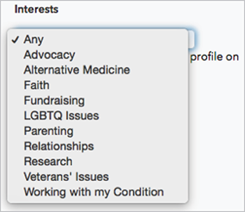
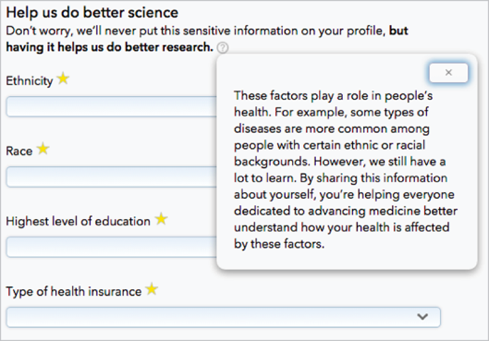

WE’VE SPENT the last four chapters sharing story after story of organizations struggling—and sometimes succeeding—in their efforts to support real people. Along the way, we’ve learned some things: how to reflect on our biases, find the fractures in our work, be intentional in what we ask, avoid alienating or traumatizing, and, ultimately, meet the needs of more users, more often.

In this chapter, we’ll see what happens when an organization brings all those principles together, and creates a space where users can define themselves on their own terms. We’ll also explore what it means to connect our principles into an ethos of compassion, and how that can change the way we approach our work, our colleagues, and our users.

## PUTTING PRINCIPLES INTO PRACTICE

PatientsLikeMe ([https://www.patientslikeme.com](http://bkaprt.com/dfrl/05-01/)) is a social network centered on something many people never thought they’d be social about: their health. Users can meet others with similar medical issues, compare symptoms and treatments, discuss how their conditions affect their lives, and track their health over time. Founded by MIT engineers in 2004, the site now serves more than 380,000 members with 2,500 different conditions, using a unique business model: instead of selling advertising, PatientsLikeMe explicitly, and transparently, partners with researchers, pharmaceutical companies, regulators, providers, and nonprofits, giving them access to real-world data that clinical trials can’t provide.

PatientsLikeMe began when the brother of two of its founders was diagnosed with amyotrophic lateral sclerosis (ALS), and they wanted to find ways to help him live a better life. At first, the site focused on connecting people who were clinically similar: users with the same condition, in the same stage of illness, experiencing the same symptoms, and undergoing similar treatment plans. The goal was to help users connect around not just illness type, but specific issues like shopping for assistive devices or managing side effects of medication—creating space for conversations like, How did you pick a wheelchair? or, How are you modifying your home so you can keep living there?

In 2013, PatientsLikeMe undertook a large research project to better understand how its audience used the site, and what they wanted from it. Through ethnographic research—talking with users in their real-world environments—and site analytics assessments, the design team, led by vice president of product and user experience Kim Goodwin and design director Kate Brigham, realized something was missing.

“We had focused too much on clinical similarities,” says Brigham. The team learned that users weren’t just looking for *medical records* like them. They wanted to find *humans* like them. Clinical history mattered, but it was only one part of each member’s story.

Veterans with post-traumatic stress disorder said they wanted to connect with other veterans. Patients who were interested in alternative treatments tended to clash with those who were focused on traditional medicine. Across the board, people sought connections that went beyond the clinical and into the personal.

Once the team realized that clinical vectors didn’t tell the whole story, they took action.

## CHALLENGE YOUR VISION

First, the design team acknowledged that a person’s health goes beyond symptoms and medications to include their identity and feelings, too. “We explicitly asked people to describe, ‘What would a patient like *you* be?’” Brigham says. Many responded that they wanted to meet people of their same age and gender—because they felt like those users would best understand their lives. The team also found that users were connecting around shared interests and values, like religion or children. PatientsLikeMe then made these interests part of users’ profiles—both in what you can tell people about yourself, and in the filters you can use to find other patients, well, like you (FIG 5.1).

## MAKE SPACE FOR REAL PEOPLE

Then, PatientsLikeMe made sure its systems and forms made space for their users’ real lives—and in real life, people don’t always have precise answers to every question about their health. While the company would like to have complete and accurate data sets, forcing people to enter data fields, such as when a treatment or symptom started, won’t work, says Brigham:

> People get incredibly frustrated if they feel like they have to lie. If you have a required set of questions, users have to give an answer, and it makes them feel uncomfortable when they don’t know and have to make something up. We also don’t want people to feel like they have to tell us information they’re not comfortable sharing. Everyone has different limits.

## INCORPORATE STRESS CASES

The team also researched users in crisis, such as those who’ve recently been diagnosed. They found that major diagnoses, like cancer, tend to overwhelm people, making it hard for them to process the information they receive. (In fact, some hospitals have note-takers in the room to make sure patients go home with all the details straight.) This led PatientsLikeMe to seek ways to “trickle” information to new users, rather than pushing everything at once.

For example, as of this writing, PatientsLikeMe is working on ways to connect new users with people who’ve had the same condition for a while, so they can answer questions and calm nerves. However, it doesn’t connect them to people who are extremely sick, because the intensity of those patients’ experiences can add to a new user’s stress.

## COMMUNICATE CONTEXT AND INTENT

PatientsLikeMe’s business model is based entirely on data: it de-identifies and shares users’ health data with partners that are studying illnesses and the populations they affect. This means PatientsLikeMe needs to be extremely up-front about three things: why it asks for the data it does, why the format of that data matters, and which pieces of data will be shared with partner companies.

Unlike many other sites, PatientsLikeMe first asks users their sex: which reproductive system they were born with. Then, as an additional option, users may select a gender: the social label they identify with. Sex has only two options, while gender gets a range of choices. Here’s how the site explains it:  

> We offer more options for gender identity because male and female labels don’t feel right to everyone. We ask for sex assigned at birth because that’s a key piece of information used by medical researchers to inform new discoveries.
>
> The impact of gender identity on specific health conditions is still poorly understood; collecting information about it will help us look for patterns by gender as well as sex in the future.

Other questions that have proven tricky include ethnicity, race, and education level. Users initially weren’t sure why the site wanted this information, and weren’t always keen to provide it. But by explaining these factors’ connection to disease and research, PatientsLikeMe provides users with context about why this information is relevant, and how it might be used (FIG 5.2).

As we mentioned earlier, PatientsLikeMe never pushes users to fill out more fields than they’re comfortable with. Instead, it allows people to leave almost all fields incomplete, even if it means the resulting data doesn’t meet the requirements of partner companies.

But PatientsLikeMe still needs to gather the information its partners need, so when it identifies an information gap, it hosts a targeted data drive to fill it. These drives reach out to members who have a specific condition, asking them to add desired information to their profiles; the request also explains which partner is asking for the data and how they will use it. “We want people to understand the questions we are trying to answer, and the data we need from them to be able to do that,” Brigham says.

User data doesn’t just benefit partner companies; it also helps the PatientsLikeMe community. “We have an internal saying: ‘Give something, get something,’” says Brigham. “Whenever a member shares data, they should be able to learn something in return.” As PatientsLikeMe establishes findings, it shares them with members, so everyone knows what has been learned.

## COMPASSION IS THE CORE

When we look at PatientsLikeMe—and everything we’ve covered so far—we start to see a single concept emerge, one worth exploring further: *compassion*.

Our industry talks a lot about empathy, but when we say compassion, we’re talking about something deeper. Perhaps content and user-experience expert Karen McGrane said it best in her 2013 Information Architecture Summit closing plenary:

> We’re pretty good at being able to kind of get inside somebody else’s head and sort of model their task, model how they are thinking about a problem. But that cognitive empathy, that’s actually just one level of empathy.
>
> There’s actually a much deeper level of it that you would call compassion. What that means is that you have genuine emotional feeling for the struggles that someone is going through and you are spontaneously moved to help them because you feel them. ([https://web.archive.org/web/20160328073936/http://library.iasummit.org/podcasts/closing-plenary-2/](http://bkaprt.com/dfrl/05-02/))

Compassion is more than being nice. It’s accepting people as they come—in all their pain, with all their challenges—and not just feeling empathy toward them, but doing something with that empathy. It’s recognizing that users facing stress and crisis need more than our sympathy. They need our help.

We can see this concept at work throughout PatientsLikeMe’s ten design principles, an internal document the team uses to guide its work:

> Every member wants us to:

1. See me as a whole person. My doctors often don’t. That’s part of the problem.
2. Come with me on my journey. In different times and places, I need different things.
3. Help me capture my truth. It bugs me if I can’t accurately reflect my own experience.
4. Let me define who is like me. They share my experiences and values.
5. Help me feel in control. Life feels out of control; I need to know I’m in charge.
6. Put my needs first. Address my needs before demanding I address yours.
7. Inspire confidence. Show me that PatientsLikeMe is worthy of my effort and trust.
8. Build on what I already want to do. I already spend time on my health, so take advantage of it.
9. Prioritize. I have limited energy; show me where to put it.
10. Minimize my work. I may have dexterity, fatigue, cognitive, or memory challenges.

These principles codify everything PatientsLikeMe has found out about its members and their needs, transforming those insights into a framework that puts compassion at the heart of every decision. Such guidelines humanize users, describing their challenges and making it easy to empathize with their feelings and frustrations. But rather than simply helping designers get into the user’s shoes, like a persona might do, these principles go further. They empower the design team to *do something* to help, even when it limits PatientsLikeMe’s own options.

That’s why we like to think of compassion as a spirit of generosity: assuming that our users have it tough, and being not only willing but happy to let go of our own desires to make things easier for them.

## EVERY PRODUCT NEEDS COMPASSION

Many people associate “compassion” with industries like healthcare or social services—the “caring” professions. But every company can benefit from compassionate design. As MailChimp’s Kate Kiefer Lee says, “We don’t know what our readers and customers are going through. And our readers and customers are people. They could be in an emergency and they still have to use the internet.”

For an example of compassion at work, let’s revisit *A List Apart* ([alistapart.com](http://alistapart.com)), where Sara was the editor in chief from 2012 to 2015. The magazine has always worked hard to attract new writers—it’s tough to find people prepared to invest time in crafting thoughtful, deeply edited essays. Editors reach out to people who give talks at conferences or post smart stuff on their blogs. They eye Twitter conversations that cover the magazine’s topics. They email past authors encouraging future submissions.

And yet, submissions were always slower than anyone would have liked.

Finally, Sara started looking closely at the message *ALA* was sending. Here’s what she found on the About page:

> MAYBE YOU CAN BE ONE OF US...
>
> ...the few, the proud, the *ALA* contributing authors.

And on the Contribute page:

> So you want to write for *A List Apart* Magazine.
>
> What we’re looking for
>
> We want to change the way our readers work, whether that means introducing a revolutionary CSS technique with dozens of potential applications, challenging the design community to ditch bad practices, or refuting common wisdom about, say, screen readers.
>
> If your article can do that, we want to see it.

*ALA* wanted to elevate its authors—to make them feel special, to know that writing for *ALA* mattered to the web industry and the world. It told potential writers their writing would *challenge*, *refute*, and *revolutionize*. That seemed like a nice idea...until the people Sara hoped would submit their work told her another story about *ALA:*

*Intimidating.*

*A big* *deal.*

*Scary.*

Oof.

The truth is, submitting an article makes most people feel vulnerable. Drafts are read and discussed by a team of experienced practitioners and authors. Many get rejected. All of them get critical feedback.

That process is scary for anyone, but it’s scariest for exactly the kinds of authors *ALA* was hoping to attract: people with fresh, interesting voices who were passionate about their ideas and invested in their work. People whose writing was personal—which can make the writing more powerful, but also even more difficult to share.

These writers didn’t need an ego stroke, and they didn’t need any more messages about how elite *ALA* was. Just like PatientsLikeMe’s users, what they needed was compassion.

## GET UNCOMFORTABLE  

Approaching our work with a spirit of generosity is difficult, because we have to give something up along the way: our own egos, agendas, and time. We have to be confident enough in what we are doing to be honest about what we’re asking for, and why. We must leave our own comfort zone, rather than ask our users to leave theirs.

*A List Apart* didn’t want to be unwelcoming, but it was—because it wanted to look like it had *plenty* of amazing authors, thank you. Publicly stating that *ALA* needed submissions felt a little like admitting to sitting by the phone waiting for someone to ask you to the prom.

But to reach more prospective authors, *ALA* had to set that fear aside, and communicate from a compassionate place instead. As of this writing, here’s the revised Contribute copy:

> Write for Us
>
> Yes, you. We’re always looking for new authors. If you’ve got an idea that will challenge our readers and move our industry forward, we want to hear about it. But you don’t need to wait for an idea that will redefine web design. Just aim to bring readers a fresh perspective on a topic that’s keeping you up at night.

*Yes, you*. It’s almost nothing—two tiny words. Yet they speak directly to that doubter, that person who’s thinking, *Maybe I’m not good enough*. The words reach out and give them a hand up, right when they need it.

It’s not just a copy change that happened at *ALA*. As the magazine cultivated compassion in its work, it opened the door for a steady stream of conversations—about topics like more inclusive editing practices, such as moving to the singular *they* instead of *he* or *she*. In short, compassion is something we all need to *practice*, not something we *are*.

## BE COURAGEOUS

When you look at compassion through this lens, it’s really an act of courage: the courage to be clear about your intentions rather than to obfuscate; to accept users as they come, even when you have to work a little harder to make them comfortable; to acknowledge your own weaknesses as an organization, rather than pretend you’ve got it all together. It takes confidence in what you are, and what you do, to set aside your ego long enough to help your users succeed. It’s a confidence many organizations don’t have.

One that does is MailChimp. The email marketing company has always prided itself on having a lighthearted, playful brand. What the company slowly realized, says Kiefer Lee, is that the humorous approach “works in a lot of situations, but in others it’s a disaster.” Those potential disasters were frequent: error messages, spam-compliance warnings, even a tongue-in-cheek comment about unsubscribes—“Who needs ’em, anyway?” All said, as MailChimp customers included more and more different types of people, its humor seemed like more and more of a problem.

No one at MailChimp wanted to stop being funny. But what the team realized is that humor often has a cost: it can hurt feelings, cause confusion, or get in a user’s way. So instead of having a knee-jerk response when people weren’t laughing along with them—instead of telling users to “lighten up”—MailChimp had the courage to reevaluate its own brand. When it did, it realized that *funny* mattered a lot less than *helpful*. It was time to change the way it communicated.

“Over the years we’ve moved to a more neutral voice, where we are much more straightforward,” Kiefer Lee says. “We lean on design more now to add playfulness. For example, when we were redesigning our site, we started using more bright colors and photography.” Sure, everyone would love to crack more jokes. It takes confidence to instead say that we care about our users more than our own desires.

## COMPASSION ISN’T CODDLING

People often mistake compassion for “being nice,” but it’s not. At *A List Apart,* the editorial team still says no when a submission isn’t a good fit. At MailChimp, Kiefer Lee’s colleagues are still quick to tell spammers, even the unintentional ones, that they can’t send more email.

The point of compassion isn’t to soften bad news or stressful situations with niceties. It’s to come from a place of kindness and understanding, rather than a place of judgment. It’s to tell the truth in such a way that you’re allowing others to tell their truths, too.

## PRACTICING COMPASSION

As we’ve seen, compassion is a tricky thing to get right, and we’ll sometimes miss the mark, no matter how hard we try. But we can do plenty to make our organizations, and the digital experiences they produce, more compassionate.

In the rest of this book, we’ll show you how to take these principles of compassion and use them to influence every stage of your work. By the end, you’ll be prepared to plant the seed for compassion wherever you are.
