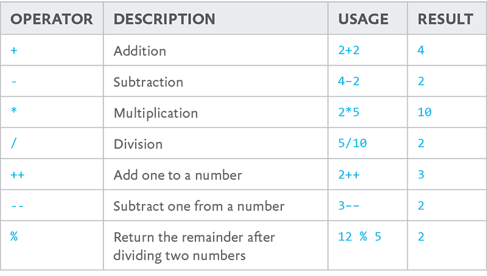

# Chapter 2. Understanding Data Types

THINGS ARE ABOUT TO GET REAL.

By the end of this chapter, you’ll have a sense for the types of data you’ll encounter during your JavaScript-writing travels. Some types of data will seem self-explanatory, at least on the surface: numbers are numbers, strings of text are strings of text. Some types of data will veer a little more toward the philosophical-sounding: `true`, as a keyword in JavaScript, represents the very essence of trueness.

Things go a bit deeper than that, however, and sometimes in particularly confusing ways. Numbers can be *truthy* or *falsy*, while text will always be truthy. `NaN`—a JavaScript keyword meaning “not a number”—is itself something JavaScript considers to be a number. `({}+[])[!+[]+!+[]+!+[]]+(![]+[])[!+[]+!+[]+!+[]]` is perfectly valid JavaScript. Really.

It’s not hard to see where JavaScript gets a reputation for being difficult to understand intuitively—the statements above read more like a riddle than the rules of a scripting language. There are methods to the madness, however, and getting the hang of JavaScript’s data types is how we start learning to think like JavaScript.

JavaScript is a “weakly typed” language, meaning that we don’t have to be explicit about whether something should be treated as a number or a string of text. Unlike a “strongly typed” language—which requires us to define data as a certain type—JavaScript infers the meaning from context. This makes sense, considering that more often than not, we’ll want `7` to be treated as a number and not a string of text.

In the event that we *do* want something handled as a specific type, there are a number of ways to perform *type coercion*, which changes the way JavaScript interprets data. Fortunately, we don’t need to worry about that yet, so let's take a look at the data types themselves.

## PRIMITIVE TYPES

We hold some data types to be self-evident, and *primitive* data types are exactly that. Primitive types can’t be reduced any further than what they already are: a number is a number, `true` is true. Primitives are the simplest form of data in JavaScript: numbers, strings, `undefined`, `null`, and `true` and `false`.

### Numbers

The number type is a set of all possible number values. JavaScript is pretty good at numbers, up to a point. If you punch `7` into your console and hit return, the result shouldn’t be too surprising: the output is 7. JavaScript has acknowledged that this is the number seven. You and I, we have done strong work with the JavaScript console today.

There are a few special cases under the number umbrella: the “not a number” value (`NaN`), and a value representing infinity, which can be either positive (`Infinity`) or negative (`-Infinity`). If you type either of these into your console and press return, you’ll get them echoed back to you just like the 7—which is really just JavaScript saying, “I am aware of this concept.” If you try entering `infinity` or `Nan`, however, both of those will come back as undefined—remember, JavaScript is case-sensitive.

Likewise, it shouldn’t come as too much of a surprise that we can use mathematical operators in JavaScript, which play out just the way you might expect. If you enter `2+2` in your console, JavaScript will return 4.

A lot of these operators will be familiar, even to those of us that just *barely* scraped by in high school algebra classes (ahem); a few operators are more unique to programming (FIG 2.1).

The mathematical Order of Operations applies here: any expressions wrapped in parentheses are evaluated first, followed by exponents, multiplication, division, addition, and subtraction. I bet you never thought you’d be hearing the phrase “Please Excuse My Dear Aunt Sally” again, but time and math make fools of us all.

    2\*2-2
    2
    2\*(2-2)
    0

You’re not apt to run into `Infinity` or `NaN` too often during the course of your JavaScript career—at least, not on purpose. If you try out `2/0` in the console, assuming your computer doesn't collapse into a singularity, JavaScript will return Infinity.

`NaN` is a special case we’ll see a bit more frequently. Any time we try to treat non-numbers as numbers, JavaScript will return NaN—for example, if we take the phrase `"Hello, World."` that we tried out in `console.log` earlier and multiply it by two (`"Hello, World." * 2`), we’ll get NaN as a result. JavaScript doesn’t know what you’re supposed to get when you multiply a word by a number, but it knows for sure that whatever you’d end up with wouldn’t be a number.

### Strings

Strings of text are quite possibly the simplest data type to understand. Any set of characters—letters, numbers, symbols, and so on—between a set of double or single quotes is a “string.”

As a matter of fact, we’ve already been introduced to strings—when we wrote `console.log("Hello,` `World.");` in the console in the previous chapter, `"Hello,` `World."` was a string. We would see the same result with single quotes, as in `console.log('Hello, World.');` (FIG 2.2).

Single and double quotes are functionally identical as long as you pair them properly, and a string using double quotes can contain single quotes, or vice-versa (FIG 2.3).

If we *omit* the quotes, however, the results are very different. Without quotation marks, JavaScript attempts to read `Hello, World.` as part of the script rather than as a string of text, and throws a syntax error (FIG 2.4).

Strings are refreshingly uncomplicated: just some letters and/or numbers inside of a set of quotes. There’s one other important facet to strings, though: we can create new ones by joining them together, or joining them with a number.

Combining multiple sources into a single string is called *string concatenation*. You can join two or more strings by using a plus sign, which pulls double-duty for both mathematical addition and string concatenation, depending on its surrounding context (FIG 2.5).

When dealing with strings instead of numbers, `+` doesn’t attempt to perform mathematical addition. Instead, it concatenates two data types into a single string. Even though the above example contains a number, involving a string at all means JavaScript treats `2` as a string as well.

### undefined

`undefined`, as you might expect, is the type for anything that isn’t predefined by JavaScript, or defined by us as part of our script. You’ve seen examples of this data type already: when we were playing around with case-sensitivity in our dev consoles, we entered a few things that JavaScript didn’t recognize, and got an error back (FIG 2.6).

If we use `typeof`—an operator that returns a string indicating the type of unevaluated operand—to determine the type of `sup`, we’ll see that it has a type of undefined. `sup` has no meaning or value, so far as JavaScript knows—we never gave it one.

### null

`null` represents a non-value: something that has been *defined*, but has no inherent value. For example: we might define a variable as `null` with the expectation that it gets assigned a value at some point in a script, or assign the `null` value to an existing reference to zero out a previous value.

### Booleans

Boolean values—the keywords `true` and `false`—represent inherent trueness and falseness. They’re concepts you’ll come across in any programming language. If we ask JavaScript to compare any two values and they come up equal, the entire statement evaluates to true—if not, false.

Let’s take a look at our console again, and in doing so g*aze into the very face of absolute universal* *truth*:

    2 + 2 == 4
    true

And while we’re at it, let’s use our developer console to put some Orwellian newspeak to the test:

    2 + 2 == 5
    false

Okay, it may not seem quite as dramatic as I wanted it to sound, but these kinds of comparisons are the basis for a tremendous amount of scripting logic.

Note that we’re using `==` to perform a comparison here, rather than the `=` you might have expected: JavaScript sees a single equals sign as an attempt to *assign* something a value, rather than performing a comparison between one value and another. More on this in a bit—and we’ll discuss comparison operators further in the next chapter.

## OBJECT TYPES

The concept of “an object” in JavaScript maps nicely to the concept of an object here in the real world. In both cases, an object is a collection of *properties* and *methods*—that is, traits belonging to an object, and functions that the object can perform. In the real world, for example, “hammer” is an abstraction of properties (“handle,” “a weighted striking surface”) and purposes (“hitting things”). But the concept of “hammer” is mutable: if we were to change the properties (“MC,” “unusual pants,” “cannot be touched”) and purposes (“breaking it down”), “hammer” comes to mean something altogether different.

An object in JavaScript is the same idea: a named, mutable collection of properties and methods. Outside of the primitive types listed above, every bit of JavaScript we write is an “object,” from the strings and numbers we define, up to the entire document itself.

That sounds a little overwhelming, but the specific types of objects we’re apt to run into day-to-day are clearly differentiated.

### Variables

A variable is a symbolic name for a value. Like so many *x*’s in so many eighth-grade algebra classes, variables in JavaScript act as containers for a value that can be any kind of data: strings, numbers, elements we’ve retrieved via the DOM, even entire functions. They give us a single point of reference for that value, to be used in all or part of our script. We can modify the value of that variable at any time and in whatever ways we want.

There are two ways to declare a variable, both of which use the single equals sign, which performs an *assignment* rather than making a comparison. The simplest way to declare a variable doesn’t use much else, really: we specify the identifier, and use a single `=` to assign it a value.

    foo = 5;
    5

When we first create a variable, our console acknowledges us by parroting back the new variable’s value.

If we now punch in `foo` and hit enter, we get the same result—we’ve made JavaScript aware of a variable named `foo`, and defined its value as the number five. Once defined, the behavior of a variable is identical to the data it contains. Checking the type of variable `foo` using `typeof` is revealing:

    foo = 5;
    5
    foo;
    5
    typeof foo;
    "number"

`foo`’s type is now “number,” not “variable.” As far as JavaScript is concerned, the variable `foo` is functionally identical to the number five. That’s not a permanent condition, however: we can reuse a variable by assigning it a new value.

    foo = 5;
    5
    foo = 10;
    10

We can even reassign a value to a variable using the variable itself:

    foo = 100;
    100
    foo = foo \* foo;
    10000

Of course, we won’t always know upfront what value our variable should contain. The whole idea, after all, is that variables can represent any number of values in a predictable, easy-to-reference package. In the event that we don’t need or want our variable to have a starting value, we can still make JavaScript aware of it. Using `var foo;`, we declare a new variable (`foo`) as `undefined`, as confusing as that might sound. So “foo” is now a word that JavaScript identifies as a variable, but without any assigned value. Try this out in your JavaScript console and you’ll see what I mean.

    var bar;
    undefined
    bar;
    undefined
    whatever;
    Uncaught ReferenceError: whatever is not defined

We defined `bar` as a variable, so when we enter it into our console, the REPL dutifully parrots its value back to us. That value, since we didn’t give it one, is undefined. If we try the same thing with a variable we haven’t defined—`whatever`, in this case—JavaScript throws an error.

Note that `var` up there? It's not required that you use the `var` keyword to declare a variable if you're assigning it a value immediately, but for reasons I’ll explain soon, it’s a good idea to always declare your variables with the `var` keyword even when it's not required. Similarly, though it isn’t always required by the rules of JavaScript, it’s best to always end variable assignments with a semicolon.


    var foo = 5;
    undefined

Don’t sweat your console’s undefined response after assigning a value to an identifier—the JavaScript engine doesn’t actually have anything to output in response to tasks like declaring a variable, so we get undefined in return.

We can also declare more than one variable at once. As with so many things in JavaScript, we have a couple of options for defining multiple variables, using two different but equivalent syntaxes. The first uses a single `var` keyword and splits the sets of variable names and assigned data with commas (ending with a semicolon, of course):

    var foo = "hello",
    bar = "world",
    baz = 3;

The second method uses individual `var` keywords:

    var foo = "hello";
    var bar = "world";
    var baz = 3;

There are no catches, in this case. These two syntaxes work the exact same way, and choosing one over the other is entirely a matter of personal preference. This, of course, means that it is a *hotly contested* subject in JavaScript developer circles.

Now, it would be irresponsible of me to foist my personal opinion on you here, reader, so I’ll leave it at this: always adhere to the existing code conventions of a project, rather than mixing and matching. On a brand-new project, use whichever syntax you find the most comfortable, but keep an open mind—we have trickier problems to solve than fighting over personal preferences. And when in doubt: do the thing that I like best, because I am right.

No, really, use whichever one you find more comfortable.

Pretty sure I’m right, though.

#### Identifiers

The name we give a variable is called an *identifier*.

Like everything in JavaScript, identifiers are case-sensitive, and come with a few special rules, as well:

* They must start with a letter, underscore, or dollar sign—not a number.
* They can’t contain spaces.
* They can’t contain special characters (`! . , / \ + - * =`).

There are a set of words in JavaScript that can’t be used as identifiers, like null, for example. These are called *keywords*—words that already have an immutable meaning to JavaScript, or are set aside just in case they get added to JavaScript one day:

    abstract boolean break byte case catch char class const continue debugger default delete do double else enum export extends false final finally float for function goto if implements import in instanceof int interface long native new null package private protected public return short static super switch synchronized this throw throws transient true try typeof var void volatile while with

That’s a scary block of words, but this isn’t something you need to have committed to memory—I certainly don’t. It does make a good case for an editor with syntax highlighting, though, which can help you avoid mysterious-seeming errors when assigning an identifier to a variable (FIG 2.7).

Outside of these rules, an identifier can contain any combination of letters, digits, and underscores. It’s a good idea to use identifiers that are brief (`totalCost` vs. `valueOfAllItemsIncTaxAndShipping`) and easy to understand at a glance (`selectedValue` vs. `v1`). The “foo,” “bar,” and “baz” that I’ve been using in my examples are lousy identifiers—the words have no meaning whatsoever, so coming across them in a script would give you no clues as to the nature of the data they contain. At the same time, we should avoid identifiers that describe their potential values in t*oo much* detail, since we may not always be able to immediately predict the values a variable will contain. A variable originally named `miles` may need to contain a value in kilometers one day—confusing for the developers who end up maintaining that code, ourselves included. `distance` works much better.

#### Variable scope

We’ll get into this more when we look at functions, but we can’t talk about variables without discussing something called *variable* *scope*.

Think of variable scope as the section of your source code where you’ve assigned something an identifier. Outside of that section, that variable is not defined, and the identifier may be reused for something else. JavaScript applications can be huge, with tens of thousands of lines of code being parsed and executed. Because variables have their own scope, we can elect to make them available to the entire application *or* constrained to individual sections of our code, so we don’t have hundreds of variables potentially tripping us up throughout an application. If we had to keep a mental inventory of what identifiers were already in use so we didn’t run the risk of accidentally reusing or redefining a variable, we *would* need those special programmer robot-brains we talked about at the outset.

There are two kinds of variable scope: *local* and *global*. A variable defined outside of a function is global. And because global variables are, well, *global*, they can be accessed anywhere in the entire application.

A variable defined *inside* a function can be either local or global, depending on how we define it—which really comes down to whether we declare it by using the keyword `var`. Inside a function, `var` declares a variable in that function’s local scope, but omitting `var` means that variable should be global—in other words, exposed to the entire application.

    (function() {
      var foo = 5;
    }());
    undefined
    console.log( foo );
    Uncaught ReferenceError: foo is not defined

Variable scope is a complicated topic, and we’ll get into the gritty details when we start learning about functions. For now, just know that it’s a good idea to always define your variables using `var`. Always using `var` means local variables stay local and global variables stay global—which means we don’t spend hours of debugging time trying to track down the function that unexpectedly changed a global variable’s value. And when the time comes to expose a local variable to the global scope, we’ll talk through better ways of doing it than omitting `var`.

### Arrays

Arrays aren’t all that different from variables, with one major exception: while a variable contains a single value, an array can contain multiple values, like a list. The syntax is similar to variables’ syntax, too:

    var myFirstArray = \[ "item1", "item2" \];
    undefined

This should look pretty familiar: a `var` keyword, followed by an identifier that we think up, and then a single equals sign to perform an assignment. All the same identifier rules apply here, too—in fact, all the rules of variables apply to arrays, including scope.

Things differ a little beyond that, though: instead of 
pointing the identifier at a single data type, we create a 
list—in this example, a pair of strings—inside a set of 
square brackets and separated by a comma. Remember that spaces inside the array don’t matter—they’re just a matter of personal preference. `var` `myFirstArray = [ "item1", "item2" ];` is 100% identical, so far as JavaScript cares, to 
`var myFirstArray=["item1","item2"];`. I just find the former a little easier to read.

Just as with variables, arrays can be made up of any data types:

    var myFirstArray = \[ "item1", 2, 3, true, "last item" \];
    undefined

When we punch that identifier into our developer console, the console parrots back the value, just like a variable:

    var myFirstArray = \[ "item1", 2, 3, true, "last item" \];
    undefined
    myFirstArray
    \["item1", 2, 3, true, "last item"\]

We likely won’t need to access the entire array all at once, though. We’re much more likely to use an array to package up several items of related data, with intent to access them individually. We access them using *indexes*: numbers that correspond with the positions within the array.

    var mySecondArray = \[ "first", "second", "third" \];
    undefined
    mySecondArray;
    \["first", "second", "third"\]
    mySecondArray\[ 0 \];
    "first"
    mySecondArray\[ 1 \];
    "second"
    mySecondArray\[ 2 \];
    "third"

You may note that JavaScript breaks with an easy assumption here: while you might expect the first item in the array to correspond with the index `1`, JavaScript is *zero-indexed*, which means that JavaScript starts indexing at `0` and counts up from there.

When we reference a position within an array using an index, it isn’t much different from working with variables: any reference to an array position takes on the data type of the data it contains—and just like a variable, we can reassign data to a given array position using a single equals sign.

    var mySecondArray = \[ "first", "second", "third" \];
    mySecondArray\[ 2 \];
    "third"
    typeof mySecondArray\[ 2 \];
    "string"
    mySecondArray\[ 2 \] = 3;
    3
    mySecondArray;
    \["first", "second", 3\]
    typeof mySecondArray\[ 2 \];
    "number"
    mySecondArray\[ 3 \] = "numero cuatro";
    "numero quattro"
    mySecondArray;
    \["first", "second", 3, "numero cuatro"\]

So far, we’ve only used brackets when initializing an array—and we’ll always want to use brackets when *accessing* information in an array—but there’s an alternative method for initializing an array:

    var myFirstArray = new Array( "item1", "item2" );
    undefined
    myFirstArray;
    \["item1", "item2"\]

As we’ve used them here, with strings, there’s really no difference between using brackets and using the `new Array()` syntax.

Likewise, we can use either the bracket syntax or the 
`new Array()` syntax to initialize an array with no defined items, just like we can initialize a variable but leave it undefined. To do this, we use either an empty set of brackets or the `new` `Array()` syntax with nothing in the parentheses:

    var arrayThree = \[\];
    undefined
    var arrayFour = new Array();
    undefined

Again, these are functionally identical: both syntaxes initialize an empty array.

There *is* one thing that the `new Array()` syntax can do that brackets can’t, and that’s initialize an array with a set number of items—even when those items are undefined:

    var threeItemArray = new Array( 3 );
    undefined
    threeItemArray
    \[undefined × 3\]

All this means is that a new array has been created, with three as-yet-undefined items. Beyond that, the behavior is the same as the arrays we’ve seen so far: you’re not limited to those three items, and you can set and access information the exact same way.

This syntax can get a little confusing, however: you’re passing the `new Array()` syntax the number of items you want in the array the same way you’d pass it the data you wanted *in* the array. That means you can end up with very different results from the bracket syntax when you’re storing number data types. JavaScript is smart enough to know that *multiple* numbers in the `new Array()` parentheses mean you’re creating an array of numbers:

    var numberArray = \[ 777, 42, 13, 289 \];
    undefined
    numberArray;
    \[777, 42, 13, 289\]
    var otherNumberArray = new Array( 777, 42, 13, 289 );
    undefined
    otherNumberArray;
    \[777, 42, 13, 289\]

But if you’re looking to initialize an array containing a single item—and that item is a number type—we get very different results with the two different syntaxes. Bracket notation works as we might expect—an array containing a single item with the value we assigned it:

    var numberArray = \[ 777 \];
    undefined
    numberArray;
    \[777\]
    numberArray\[ 0 \];
    777

With the `new Array()` syntax, things get weird. We end up with an array containing seven hundred seventy-seven *undefined* items.

    var otherNumberArray = new Array( 777 );
    undefined
    otherNumberArray;
    Array\[777\]
    otherNumberArray\[ 0 \];
    undefined

Now, I’ll be perfectly honest: I’ve never needed to initialize an array with a given number of `undefined` items right off the bat—your mileage may vary, of course, but I get by just fine with bracket notation.

Once defined, arrays come with a number of associated methods for navigating and changing their data. For example, the `.length` property on an array describes the number of items in that array:

    var theFinalArray = \[ "first item", "second item", "third item" \];
    undefined
    theFinalArray.length;
    3

And since the index itself is a plain ol’ number data type, we can get a little creative with how we access information in an array:

    var theFinalArray = \[ "first item", "second item", "third item" \];
    undefined
    // Get the last item in the array:
    theFinalArray\[ theFinalArray.length - 1 \];
    "third item"

Here we’re using the `.length` of the array to find the index of the last item. Since an array can be any length, we can’t just use a number to get to the last item. We can use the `.length` property to get a count of all the items in the array, so we know how many items it contains. JavaScript is zero-indexed, though, so we can’t *just* use the array’s length—there are three items in the array, but the indexes start counting at zero. Easy enough to deal with: we just subtract one from the array’s length—a number data type—to get the index of the last item.

### Objects and Properties

An object can contain multiple values as *properties*. Unlike an array that accepts a set of data types and assigns each item a numbered index, an object’s properties are named using strings.

    var myDog = {
      "name" : "Zero",
      "color" : "orange",
      "ageInYears" : 3.5,
      "wellBehaved" : false
    };
    undefined

Each property is made of up a *key/value* *pair*. The “key” in “key/value” is a string we define that points to a value—as with naming a variable, we want our keys to have names that are predictable, flexible, and easy to understand. In the above example, the keys for each property of the `myDog` object are `name`, `color`, `ageInYears`, and `wellBehaved`, and the respective values are the strings `Zero` and `orange`, the number `3.5`, and the Boolean `false`.

The properties of an object can themselves be treated as objects with properties of their own, allowing us to bundle up a tremendous amount of information in a highly portable package.

    var myDog = {
      "name" : {
        "first" :"Zero",
        "middle" : "Baskerville",
        "last" : "Marquis"
      },
      "color" : "orange",
      "ageInYears" : 3,
      "wellBehaved": false
    };
    undefined

Remember that the whitespace in these examples—the indentation, line breaks, and spaces around the colons—won’t matter to JavaScript. Those are just there to keep things human-readable.

#### Defining an object

There are two ways to define a new object. One is with the `new` keyword, whose syntax shouldn’t be entirely unfamiliar at this point:

    var myDog = new Object();
    undefined

The second way is with *object literal* notation:

    var myDog = {};
    undefined

Both of these work a lot like declaring a variable: we use the `var` keyword, followed by an identifier and a single equals sign.

These two methods of defining an object work the same way, except for one major difference. The `new` keyword requires us to first define an object, *then* start filling it with data:

    var myDog = new Object();
    undefined
    myDog.nickname = "Falsy";
    "Falsy"

Object literal notation allows us to define *and assign data to* an object all at once:

    var myDog = {
      "nickname": "Falsy"
    };
    undefined

You’ll find that a lot of developers favor object literal notation for the sake of simplicity, and we’ll be doing the same in this and future chapters.

#### Accessing and changing properties

Once we’ve defined an object using either of the above methods, there are two ways to access and change the information inside an object: *dot notation* and *bracket* *notation*.

To access information in an object’s property using dot notation, you use a period between the object identifier and the property key.

    var myDog = {
      "name": "Zero"
    };
    undefined
    myDog.name;
    Zero

Bracket notation uses a set of brackets and a string that points to the key we’re looking to access, just like the way we’d use an index in an array. Unlike dot notation, we use a string data type to point to our keys—so, we need to wrap `name` in quotes.

    var myDog = {
      "name": "Zero"
    };
    undefined
    myDog\[ "name" \];
    Zero

The reason bracket notation requires a string is the reason bracket notation exists at all: in complex scripts, we might need to programmatically access certain keys based on custom logic that we’ve coded. In order to do that, we may need to put together a custom string from strings, numbers, variables, and so on. Say we had a script that randomly selected one of the keys in the following object:

    var cars = {
      "car1" : "red",
      "car2" : "blue",
      "car3" : "green"
    }
    undefined

We might have a variable that contains a number between one and three, and use that to create a string that points to one of those three keys. There are plenty of ways to generate a random number with JavaScript, but for the sake of keeping things uncomplicated: we’ll just use the number two, and create a concatenated string that reads `car2`.

    var cars = {
      "car1" : "red",
      "car2" : "blue",
      "car3" : "green"
    }
    undefined
    var carKey = "car" + 2;
    undefined
    carKey
    "car2"
    cars.carKey
    undefined

We won’t be able to use dot notation in a situation like this, since JavaScript isn’t going to treat `carKey` like a variable. Given how dot notation syntax works, JavaScript thinks `carKey` is the *identifier* of the key that we’re looking for, not the string it contains.

Bracket notation, however, *expects* a string—and since 
`carKey` contains a string, the following works just fine:

    var cars = {
      "car1" : "red",
      "car2" : "blue",
      "car3" : "green"
    }
    undefined
    var carKey = "car" + 2;
    undefined
    carKey
    "car2"
    cars\[ carKey \];
    "blue"

You’ll find a lot of ways to get clever with bracket notation during the course of your JavaScripting career. Unless you *need* to get clever, though, dot notation is the simpler of the two syntaxes, and I find it much easier to read at a glance.

### Functions

A *function* is a block of reusable code that allows us to perform repetitive tasks without repeating the same code throughout a script. Instead, we use an identifier to reference a function containing that code, and pass the function any information it needs to perform a task for us.

In fewer words, a function is an object that *does* something, rather than just holding a value.

Defining a function involves a little more code than we’re used to, though the first few parts shouldn’t be too surprising. As usual, `var` defines the scope, then we define an identifier of our choosing, and use a single equals sign to assign that identifier a value. Instead of a simple string, number, Boolean, etc., we follow the equals sign with the keyword `function` and a set of parentheses. Then, between two *curly braces*, we put all the code we want that function to execute whenever we call it. As usual, we end the statement with a semicolon.

    var whatup = function() {
      console.log( "Hello again, world." );
    };
    undefined

If we paste this code into our console: nothing happens. No Hello again, world.—at least, not yet. So far, all we’ve done is define a function with the identifier `whatup` that, when called, will output the sentence, “Hello again, world.”

If we type `whatup` into our console, your dev console will either respond with function whatup() or the entirety of the function’s code, depending on the browser—in either case, this is just the browser acknowledging that it knows about a function with that identifier. In order to actually *execute* the function, we have to call it using the identifier and a pair of parentheses:

    var whatup = function() {
      console.log( "Hello again, world." );
    };
    undefined
    whatup;
    function whatup()
    whatup();
    Hello again, world.

In their simplest form, functions might not seem all that useful, since we’ll rarely want to execute the *exact same* lines of code—leading to the exact same output—over and over again. The real power of functions lies in passing them information for that code to act upon, leading to different results. The parentheses that follow the function’s identifier can do more than just tell the browser to execute the function we’ve assigned to the identifier `whatup`: they can be used pass information along to the code inside the function, in the form of *arguments*.

    var greet = function( username ) {
      console.log( "Hello again, " + username + "." );
    };
    undefined

By adding `username` between the parentheses when defining a function, we’re saying the function should create a variable named `username`, and that variable should contain whatever value we pass along between the parentheses when we execute the function. In this case, the function is expecting us to pass along a string that gets concatenated into our “hello again” greeting:

    var greet = function( username ) {
      console.log( "Hello again, " + username + "." );
    };
    undefined
    greet( "Wilto" );
    Hello again, Wilto.

Of course, we’re not doing much to validate the data being passed to the function—and we’ll get into that later on—but for now, string concatenation is pretty resilient thanks to JavaScript’s type coercion. Even if we pass along another data type, things generally work as expected.

    var greet = function( username ) {
      console.log( "Hello again, " + username + "." );
    };
    undefined
    greet( 8 );
    Hello again, 8.
    greet( true );
    Hello again, true.

Things *do* get a little weird if we omit the argument altogether, though:

    var greet = function( username ) {
      console.log( "Hello again, " + username + "." );
    };
    undefined
    greet();
    Hello again, undefined.

Since we didn’t populate `username` with any information—but JavaScript was aware of the identifier—`username` was an undefined data type. Thanks to type coercion, the undefined data type became the *string* "undefined" Not the most elegant way to phrase things, but not inaccurate either—the function is greeting someone whose name we never defined, after all.

One of the more common—and powerful—uses of functions is to provide you with a packaged, reusable method of *calculating* something. I don’t mean that in a strictly mathematical sense, though you can certainly do that as well. By setting a function up to “return” a value, we allow a function to be treated the same way as we would treat a variable: as a container for data that behaves just like the data it contains.

Functions can potentially return—and behave like—the final result of infinitely complex logic rather than data that we’ve hand-defined. We don’t cover *infinitely complex logic* until next chapter, so for now we’ll have our function return something relatively simple: the sum of two values.

    function addTwoNumbers( num1, num2 ) {
      return num1 + num2;
    }
    undefined
    addTwoNumbers( 4, 9 );
    13
    typeof addTwoNumbers( 2, 2 );
    "number"

To go one step further, we can even assign a function with a return value to a variable:

    function addTwoNumbers( num1, num2 ) {
      return num1 + num2;
    }
    undefined
    var sum = addTwoNumbers( 2, 3 );
    undefined
    sum
    5
    typeof sum
    "number"

It’s important to keep in mind that using the `return` keyword means that the final purpose of a function is to return a value. If we include any code inside a function *after* a `return` statement, that code is never executed.

    function combineStrings( firstString, secondString ) {
      return firstString + secondString;
      console.log( "Hello? Can anyone hear me?" );
    }
    undefined
    combineStrings( "Test", " strings" );
    "Test strings"

Since a `return` statement comes before `console.log`, the `console.log` is never executed. In fact, your editor might even highlight it as an error.

### Pretty much everything is an object

These are the common object types you’ll run into during your adventures in JavaScripting. While we haven't used them in terribly complex ways yet, they combine to make up the entirety of JavaScript itself. From top to bottom, JavaScript is made of predefined objects that behave just like the custom ones we’ve been defining here.

Under certain conditions, everything but `null` and `undefined` can be considered objects—even strings, which are arguably the simplest data type of them all. A new string comes with methods and properties *built in*—just like arrays—even though all we did was define a snippet of text:

    "test".length
    4

Technically this string itself isn’t an object—it doesn’t have any methods or properties of its own. When we ask for the value of the `length` property, though, JavaScript knows what we mean—it has a list of predefined methods and properties that it applies to all strings.

It that a necessary distinction? Not at this point, no; in fact, it’s a little confusing. But the further you dig into the makings of JavaScript itself, the more sense that distinction will start to make. Until then, you’re likely to see this behavior described much more succinctly whenever the subject of what is and isn’t a JavaScript object comes up: “everything is an object...kinda.”

Now that we’ve got a feel for some of the building blocks that will make up our scripts, we can start writing some logic around them. In other words: now that we understand the basics, we can start writing scripts that *do things*—things apart from blindly chucking text into our developer console, that is.

By default, a browser “reads” a script the same way you would read this page in English: from left to right and from top to bottom. *Control flow* statements are used to control what portions of our code are run at a given time, and whether they’re executed at all.

It sounds complicated at first, but it breaks down to a handful of very simple statements that allow us to do amazingly complex things in concert. For our purposes, control flow statements fit pretty neatly into two categories: conditional statements and loops. That's what we'll be digging into in the next two chapters.
