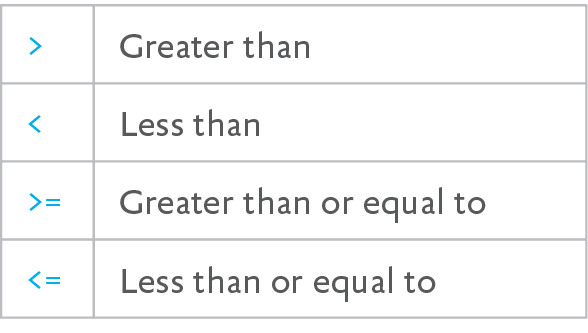

# Chapter 3. Conditional Statements

CONDITIONAL STATEMENTS are a type of control flow concerned with logic: they determine when and where to execute code, based on conditions you specify.

## if/else STATEMENTS

Conditional statements are almost entirely some variation on “given *X*, do *Y*.” The most common example of this—and one nearly ubiquitous in terms of any programming language—is the `if`/`else` statement. Saying “if this, do that” is about as uncomplicated as a logical statement gets, but by the end of this chapter you’ll see how something so simple on the surface can make up the lion’s share of logic in our scripts.

### if

In its most simple form, an `if` statement will execute whatever code you specify between a set of curly braces, but only if the contents of the parentheses that follow the `if` keyword evaluate to `true`.

From the previous chapter we know that JavaScript returns true for `2 + 2 == 4`, if we punch it into our developer console. Instead of putting that alone in our console, let’s try it out in our very first `if` statement. Remember that a single equals sign (`=`) is used to *assign* values, while two (`==`) equals signs are used to perform a basic comparison.

    if( 2 + 2 == 4 ) {
      console.log( "Hi there." );
    }
    Hi there.

Nothing too surprising here: “Hi there.” appears in our developer console. If we enter a statement that we know to be false, the line containing `console.log`—and *any* code we put between those curly braces—will be skipped.

    if( 2 + 2 == 5 ) {
      console.log( "Hi there." );
    }
    undefined

Now, this doesn’t seem terribly useful when we’re entering statements that we already know to be true or false, but the purpose of an `if` statement isn’t just to periodically make sure the rules of mathematics still apply. Considering that JavaScript objects can contain all manner of complex data that we’ll need to act on in different ways throughout a script—and remembering that objects are treated exactly the same as the data they contain—we can make some incredibly complex decisions about the flow of a script using simple `if` statements. For now, let’s just initialize a single variable containing a number data type, so we can experiment a little.

    var maths = 5;
    if( maths == 5 ) {
      console.log( "This number is five." );
    }
    This number is five.

Since `if` blindly evaluates the contents of the two parentheses that follow it for truth, we don’t always have to make a specific assertion there—we can use it to check a Boolean value the same way.

    var foo = false;
    if( foo ) {
      /\* Any code placed here will never execute, unless you change \`foo\` to \`true\` \*/
    }

### else

`else` is used to run alternate lines of code, in the event that the contents of an `if` evaluate to `false`. The `else` keyword follows the closing curly brace for the `if` statement, and is followed by a set of curly braces that contain whatever code should run in the event that the `if` code doesn't run. We don’t need a set of parentheses here, since we’re not evaluating any new data—we're just taking a different action, depending on the conditions of the `if`.

    var maths = 2;
    if( maths > 5 ) {
      console.log( "Greater than five." );
    } else {
      console.log( "Less than or equal to five." );
    }Less than or equal to five.

### else if

There’s a shorthand for stringing together a number of `if` statements: `else if`. While it isn’t necessarily the neatest way of performing complex comparisons, it’s definitely worth knowing.

    if( lunch == "gravel" ) {
      console.log( "That isn’t food.");
    } else if ( lunch == "burrito" ) {
      console.log( "A burrito is an excellent choice." );
    } else {
      console.log( "It might not have been a burrito,   but at least it wasn’t gravel." );
    }

This script performs a series of tests against the variable `lunch`: the first `if` checks to make sure lunch does not, in fact, have a value of `"gravel"`—and having passed this critical lunchtime test, we can now see whether it has a value of `"burrito"`, or—with the final `else`—none of the above.

`else if` isn’t a JavaScript keyword in the same way that `if` and `else` are individually—`else` `if` is more of a syntactical workaround, a shorthand for multiple nested `if`/`else` statements. The code above is structurally identical to the following:

    if( lunch == "gravel" ) {
      console.log( "That isn’t food.”);
    } else {
      if ( lunch == "burrito" ) {
        console.log( "A burrito is an excellent choice." );
      } else {
        console.log( "It might not have been a burrito,     but at least it wasn’t gravel.” );
      }
    }

Whether using `else if` or nesting multiple `if`/`else` statements, this isn’t the easiest code to read and understand. There are much better ways of performing multiple comparisons in a single go, and we’ll discuss some of those a little later.

## COMPARISON OPERATORS

We wouldn’t get a lot of use out of conditional statements if all we could do with them is test whether two values are equal. Fortunately—and perhaps expectedly, at this point—there’s a lot more we can do with a few simple conditional statements. You saw a little of this earlier when we used an `if` to determine whether an identifier had a `number` value greater than five: conditional statements can be used to compare all kinds of values in all kinds of ways, all by replacing the `==` we’ve been using in our comparisons so far.

### Equality

I’ve mentioned a couple of times that we should use `==` for comparisons, but that isn’t—and this awful pun will only make sense in a little while—*strictly* true.

JavaScript provides us with two different approaches to comparison: the `==` we’ve been using so far, and `===`, which is the “strict equals.” Two equals signs together perform a "loose" comparison between two values, which means that typing `2 == "2"` into our developer console will give us true, even though we’re comparing a number to a string. JavaScript is smart enough to coerce two dissimilar data types to matching ones when a comparison is performed with `==`, and make a guess at what we meant to compare.

`2 === "2"`, on the other hand, gives us back false—no type coercion is performed behind the scenes when a comparison is made using `===`. The two values being compared have to be not only equal, but also of the same type—they have to be identical.

If you think that makes `==` feel a little too magical for its own good, you’re right—developers have a strong preference for using `===` whenever possible, as it does away with any ambiguity that might result from auto-coercion.

#### Truthy and falsy

There’s one potentially useful thing `==` gets us that `===` doesn’t: the ability to divine “truthy” and “falsy” values.

Those aren’t strangely consistent typos: everything in JavaScript can be coerced to a `true` or `false` Boolean value when using the non-strict comparison operator.

This sounds a little confusing, but you won’t have to maintain a spreadsheet of which values are truthy and which are falsy—they follow a clear line of reasoning: “If something, truthy; if nothing, falsy.” For example, `0` is a falsy value—likewise `null`, `undefined`, `NaN`, and an empty string (`""`). Everything else is truthy—a string, a number, and so on.

The uses for this might not be immediately obvious, but imagine a situation where you’re writing a function that outputs a string—like the ones we used when we were first covering string concatenation:

    function greetUser( name ) {
      console.log( "Welcome, " + name + "!" );
    }
    greetUser( "Muscles McTouchdown" );
    Welcome, Muscles McTouchdown!

If you remember, omitting the argument containing the user’s name didn’t result in an error since JavaScript is aware that the `name` variable *exists*, but the `undefined` value gets coerced to a string.

    greetUser();
    Welcome, undefined!

That isn’t particularly desirable behavior; I personally wouldn’t be too keen on being called “undefined.” Fortunately, we can use an `if`/`else` statement to tailor the output a little:

    function greetUser( name ) {
      if( name ) {
        console.log( "Welcome, " + name + "!" );
      } else {
        console.log( "Welcome, whoever you are!" );
      }
    }

By default, JavaScript evaluates the contents of those parentheses in a way that coerces to a Boolean value—it looks for truthy and falsy values, and a string is a truthy value. *Now* if we try out this new function without passing along a name as an argument:

    greetUser( "Mat" );
    Welcome, Mat!
    greetUser();
    Welcome, whoever you are!

It works!

This function is a little clunky, though. Instead of having two places where this function writes to the console (or later to the page, to another part of our script, etc.), our code would be better organized if we could reduce these two mostly redundant `console.log` calls to a single one. For whoever ends up maintaining our code after us—and for our own sanity—it’s a good idea to keep your scripts as terse as possible. You’ll frequently see this concept referred to as DRY, which stands for *don’t* *repeat yourself*. If you have to change something in your code later, you’re better off only needing to do so in one place. In our example, it might be as simple as changing “Welcome” to “Hi,” but, in a sufficiently complex script, it would be impossible to keep a mental inventory of all the places you’d need to make redundant changes. Keeping our code DRY means we’re closer to following a single path through our code.

So in our function, instead of two lines outputting different strings to the console, we’ll conditionally tailor the string itself and output the final result at the end.

    function greetUser( name ) {
      if( name === undefined ) {
        name = "whomever you are";
      }
      console.log( "Welcome, " + name + "!" );
    }

Much more succinct. If `name` doesn’t have a value, we give it one—rather than relying on truthy/falsy coercion when we already know we’re dealing with a potentially `undefined` variable, we check for that specifically. Then, by the time we reach the `console.``log` statement, we know `name` is defined.

One of the ways I keep the complexity of my own code in check is stepping through it in plain English. Previously, our function did the following:

If `name` has a truthy value, output a string containing `name` to the console, but if `name` has a falsy value, output an alternate string to the console.

That’s as awkward to say out loud as it is to read in the code itself. Compare that to the way we’d walk through our new function:

If `name` is undefined, define it. Output a string containing `name` to the console.

Much better—and congratulations on your first JavaScript refactor.

### Inequality

`!` is called a *logical NOT operator*, which means that it negates whatever immediately follows it:

    true
    true
    false
    false
    !true
    false

When we use the logical NOT operator (`!`) in front of another data type—like a number or a string—it reverses the truthy/falsy value of that data.

    "string"
    "string"
    !"string"
    false
    0
    0
    !0
    true

The same way `==` and `===` return a `true` value if the two values being compared are loosely or strictly equal, the `!=` and `!==` operators return a `true` value if the two values being compared *aren’t* equal. That’s a little hard to picture in text, but makes a lot more sense in the context of an `if` statement.

    var foo = 2;
    if( foo != 5 ) {
      console.log( "\`foo\` is not equal to five" ); 
    }

Just like with `==`, `!=` attempts to coerce the data types being compared so they match. If we use `!=` to compare the number `2` to the string `"2"`, JavaScript considers the two to be equal—so the result is `false`.

    2 != "3"
    true
    2 != "2"
    false

### Relational operators

Relational operators are a little more intuitive than the equality operators (FIG 3.1).

These work just the way you might expect—no catches, no crazy negation operators to mull over. You’ll use these to compare one number value to another:

    3 > 1
    true
    3 < 1
    false
    10 >= 5
    true
    5 >= 5
    true
    var bikeName = "Bonneville";
    if( bikeName.length <= 10 ) {
      console.log( "There are at least ten characters in   this bike’s name." );
    }

## LOGICAL OPERATORS

`if`/`else` statements can do a lot of work using only what we know so far, but logical operators allow us to form even more complex logic by chaining comparisons together in a single expression. You’ve already met one of the logical operators, the logical NOT (`!`) that negates any value that follows it, but `!` is the odd operator out when compared to the other two: logical OR (`||`) and logical AND (`&&`).

`||` and `&&` allow you to evaluate multiple values within the same expression: multiple comparisons separated by `||` mean the entire expression will return true if *any* of the expressions evaluate to true, while comparisons separated by `&&` mean that the expression will only return true if *all* the expressions evaluate to true. This is another tough one to visualize without seeing it in action, so back to the dev console we go:

    5 < 2 || 10 > 2
    true

Five obviously isn’t less than two—that statement alone would never evaluate to `true`. Ten *is* greater than two, however—and since we’re using a logical OR between the two comparisons, this entire statement evaluates to true.

    10 > 5 && "toast" === 2
    false

Ten is greater than five, sure—that part of the expression is true. But the string `toast` clearly has nothing to do with the number two; they’re not equal, and certainly not *strictly* equal. Since we’re using the logical AND between these two expressions and one of them returned false, this entire statement evaluates to false.

### Grouping expressions

Multiple expressions separated by `&&` and/or `||` (get it? “and/or?”) will be evaluated from left to right. In the following statement, JavaScript never gets as far as evaluating the number of characters in `myString`.

    2 + 2 === 9 && "myString".length > 2
    false

Since JavaScript saw an expression that returned false followed by a logical AND, the entire statement couldn’t possibly be true. The same goes for a logical OR:

    2 + 2 !== 9 || "myString".length > 2
    true

Since the first expression evaluates to true and is then followed by a logical OR, there’s no need for JavaScript to continue evaluating the statement—the whole thing evaluates to true right away.

We can change the way this evaluation behaves using parentheses, and thus do we creep back toward algebra, in a way. We’ll start with a set of three statements that evaluates to true all together, and we’ll use Booleans so we can see it all the way JavaScript does:

    false && true || true  
    true

The first thing JavaScript looks at here is whether `false && true` evaluates to true, which it doesn’t. `true && true` would, sure, but “false AND” means that the statement is certain to return false. But following that is a logical OR—so having evaluated the first half of the statement to false, JavaScript is now evaluating the second half of the statement as 
`false || true`. Since we’re using a logical OR and one of the values is `true`, this entire statement—read left to right—is true.

If we add a set of parentheses around the second part of the statement, however, we change the way they’re evaluated:

    false && ( true || true )
    false

Now the first thing JavaScript evaluates is still `false &&`, but the parentheses mean everything afterwards is a single expression to be evaluated—not three things to evaluate, but two. Since the left-hand side of the logical AND is false, evaluation stops there. “false AND” can never possibly return true, so with a single pair of parenthesis, we’ve changed this statement to false.

Got a headache yet? I’m not far behind you, and I do this stuff all day. That’s why I’m in the habit of using parentheses to *clarify* how JavaScript evaluates these complex statements as much as I use them to *alter* it. Now that we know JavaScript evaluates expressions wrapped in parentheses as a single expression, that first statement—the one that evaluated to true—might be a little easier to read when written like this:

    ( false && true ) || true
    true

Think back to that convoluted `else if` example earlier on. Now that we can perform more advanced comparisons within the span of a single `if` statement, we can do away with a lot of the complexity, even when we add more functionality—for example, tacos:

    var lunch = "tacos";
    if( lunch !== "gravel" && ( lunch === "burrito" || lunch === "tacos" ) ) {
      console.log( "Delicious." );
    }

And, for good measure, let’s turn that into a function:

    function mealChecker( lunch ) {
      if( lunch !== "gravel" && ( lunch === "burrito" ||   lunch === "tacos" ) ) {
        console.log( "Delicious." );
      }
    }
    mealChecker( "Tacos" );
    undefined

Something has gone horribly wrong! We passed the function a string the way it might expect, but we made one little mistake: we capitalized the *T*. Since JavaScript is case-sensitive, `Tacos` isn’t equal to `tacos`—and our script was expecting the latter.

Now, we could make a rule for ourselves that this function should only ever receive an all-lowercase value, but that’s one more thing we have to document—or worse, “just keep in mind from now on.” A better approach would be to plan for both upper- and lowercase values by getting JavaScript to normalize things for us.

If you recall from the previous chapter, even though we don’t define them with methods or properties the way we might define an object from scratch, any string we define will come with a set of built-in properties: `.length` gives you the number of characters in the string, for example. Here, we’ll use one of the native methods for transforming a string to make sure we’re comparing apples to apples and tacos to tacos: `.toLowerCase()`. Just like the name implies, it returns the all-lowercase value of a string:

    "THIS IS A STRING".toLowerCase();
    this is a string

While it returns the lowercase value of a string, it’s important to keep in mind that this—and methods like it—don’t *change* a string to lowercase. If we have a string stored in a variable and call `.``toLowerCase()` on it, the variable remains unchanged.

    var foo = "A String";
    undefined
    foo
    "A String"
    foo.toLowerCase();
    "a string"
    foo
    "A String"

That means there are a couple of ways to handle the comparisons in our function. The first way is to call `.toLowerCase()` on every instance of the `lunch` variable throughout the function:

    function mealChecker( lunch ) {
      if( lunch.toLowerCase() !== "gravel" && (   lunch.toLowerCase() === "burrito" ||   lunch.toLowerCase() === "tacos" ) ) {
        console.log( "Delicious." );
      }
    }
    mealChecker( "Tacos" );
    Delicious.

That *does* work, but it isn’t very DRY code. I think we can do better. Instead, we’ll only use `.toLowerCase()` once—at the top of our function, before we do any string comparison—and use it to change the value of the `lunch` variable to the lowercased version of itself that `.toLowerCase()` returns.

    function mealChecker( lunch ) {
      lunch = lunch.toLowerCase();
      if( lunch !== "gravel" && ( lunch === "burrito" ||   lunch === "tacos" ) ) {
        console.log( "Delicious." );
      }
    }
    mealChecker( "TACOS" );
    Delicious.

We don’t need `var` when we assign a value to `lunch`, since using `lunch` as an argument means we’ve already defined it as a variable local to the function.

## switch

A `switch` statement works a lot like that unwieldy series of `else if` statements we tried out, but performs the same sort of comparisons in a more compact, sensible way. The syntax is a little different from the `if` syntaxes we’re used to, however:

    var theNumber = 5
    switch( theNumber ) {
      case 1:
        console.log( "This is the number one." );
        break;
      case 2:
        console.log( "This is the number two." );
        break;
      case 3:
      case 4:
        console.log( "This is either three or four." );
        break;
      case 5:
        console.log( "This is the number five." );
    }

There’s a lot going on in there, so let’s go through this one line by line. Before we do, remember that JavaScript doesn’t care what we use for whitespace—all that indentation is something we’re doing for the sake of readability, but it isn’t *required*.

The first line is old hat by this point: we’re defining a variable with the identifier `theNumber` and giving it a value of the number data type `5`—and since we’re just tinkering, we won’t worry about how `theNumber` isn’t a very descriptive identifier, accurate though it may be.

The second line looks a little bit like the `if` statements we now know and hopefully love: the keyword `switch` followed by a set of parentheses and a pair of curly braces. `switch` differs from `if` in that we’re not performing a comparison between the parentheses, though—instead, we’re just passing along the information we want to compare, the same way we were passing a string to our function a few minutes ago. `switch( theNumber ) {}` only says that the variable `theNumber` is the value we want to compare within the `switch` statement—and that’ll make sense in just a moment.

The third line—`case 1:`—is where we perform the actual comparison. The `case` keyword is followed by a value that gets compared to the value we passed along in the parentheses after the `switch` keyword, followed by a colon. So, the line 
`case 1:` is really saying, “If `theNumber` is equal to the number one, do the following.” All the comparisons in a `switch` are strict—`case "1":` wouldn’t match, since "`1`" would be a string type, not a number type.

    switch( "1" ) {
      case 1:
        console.log( "This is the number one." );
        break;
      case "1":
        console.log( "This is the string '1'" );}This is the string '1'

The break statement then says, “We’ve found our match, so stop comparing.” It isn’t always the case that you’d want to stop the comparison right away; if you skip ahead a few lines, you’ll see that we’re checking against `case 3` and `case` `4`, and if *either* of those comparisons match, we’re going on to `console.log` that the value is either three or four, then breaking after that. The reason this works is that a matching `case` inside `switch`, strictly speaking, tells JavaScript, “Run every line of code that follows the matching `case` *until you hit a* `break` *keyword* (or the end of the `switch`’s curly braces).”

To illustrate that behavior, let’s say we wanted to put together a function—for whatever reason—that accepts the current numeric day of the week (1–7), and spits out the names of all the days we’ve seen so far this week.

    function daysPassedThisWeek( numericDay ) {
      console.log( "The following days have already   happened this week:" );
      switch( numericDay ) {
        case 7:
          console.log( "Saturday" );
        case 6:
          console.log( "Friday" );
        case 5:
          console.log( "Thursday" );
        case 4:
          console.log( "Wednesday" );
        case 3:
          console.log( "Tuesday" );
        case 2:
          console.log( "Monday" );
        case 1:
          console.log( "Sunday" );
          break;
        default:
          console.log( "Wait, that isn’t a numbered day       of the week." );
      }
    }
    daysPassedThisWeek( 3 ); /\* Today is the third day of the week. \*/
    The following days have already happened this week:
    Tuesday
    Monday
    Sunday

Not the most useful function around, but you get the idea: when `case 3:` matches, all the `console.log` statements between there and the next `break` statement are executed, and we get a list of days.

You’ll also notice something new in this `switch` statement: a `default` keyword.

The `default` keyword is the `else` of a `switch`, if that phrase could possibly make sense: in the event that none of the `case` values above it return `true`, the code that follows `default` will be executed.

    daysPassedThisWeek( 75 );
    The following days have already happened this week:
    Wait, that isn’t a numbered day of the week.

Since we’re putting the `default` code last, we don’t need a `break` afterwards—but we do need one *before* the `default`, or else that error will appear with the rest of our list. Though, if you’d prefer, the function above could be written with the `default` case coming first, followed by a `break`.

    function daysPassedThisWeek( numericDay ) {
      console.log( "The following days have already   happened this week:" );
      switch( numericDay ) {
        default: 
          console.log( "Wait, that isn’t a numbered day       of the week." );
          break;
        case 7:
          console.log( "Saturday" );
        case 6:
          console.log( "Friday" );
        case 5:
          console.log( "Thursday" );
        case 4:
          console.log( "Wednesday" );
        case 3:
          console.log( "Tuesday" );
        case 2:
          console.log( "Monday" );
        case 1:
          console.log( "Sunday" );
      }
    }
    daysPassedThisWeek( 5 ); /\* Today is the fifth day of the week. \*/
    The following days have already happened this week:
    Thursday
    Wednesday
    Tuesday
    Monday
    Sunday

`switch` is a weird one, for sure, but there are a few situations where performing a series of comparisons against a single object will make a lot of sense. For instance, imagine a script that accepts keyboard input and uses it to move a sprite—many games ask you to use either the arrow keys or the *A* and *D* keys to move left and right. In JavaScript, key presses are represented by an event object—which we’ll discuss a little later on—with a property containing a numeric value that corresponds to the key that was pressed.

    function movePlayer( keyCode ) {
      switch( keyCode ) {
        case 65: // Keycode for the A key
        case 37: // Keycode for the left arrow
          moveLeft();
          break;
        case 68: // Keycode for the D key
        case 39: // Keycode for the right arrow
          moveRight();
      }
    }

You could write this as a series of `if` statements as well, but adding new controls over time would mean chaining one `if` after another, all performing comparisons against the same 
`keyCode` object. `switch` ends up being a much more flexible—and DRY—way to go about it.

## THAT ESCALATED QUICKLY

From “if this, do that” to methods of expressing incredibly complex logic, all wrapped up in the humble `if` and `switch` keywords. It’s a lot to keep in your head, but again: we don’t have to. Instead, we can walk away from this chapter knowing that there’s *some* way to express whatever conditional logic we might need—and if you can’t remember the exact syntax off the top of your head, well, this chapter isn’t going anywhere.

Conditional statements allow us to selectively execute code, but there’s more to control flow than that. Programming frequently involves performing a set of tasks over and over again—for example, iterating over all elements of a certain type within a page and checking a common attribute against an expected value, or iterating over all the items in an array and checking their values against a conditional statement. In order to do those kinds of things, we’ll need to learn about loops.
