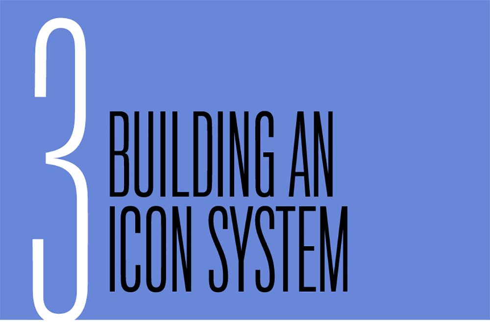
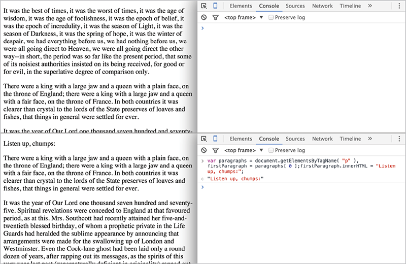
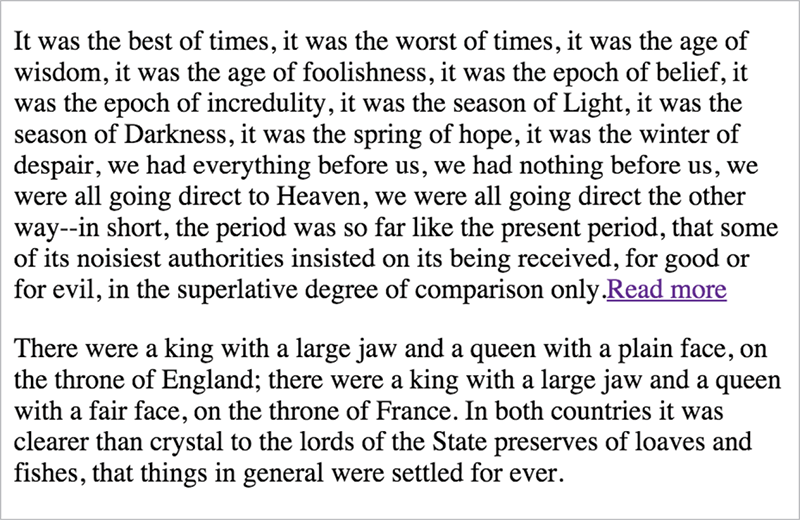
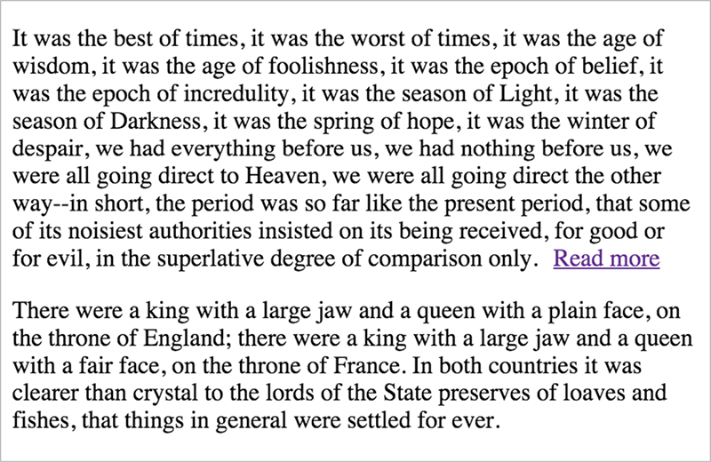
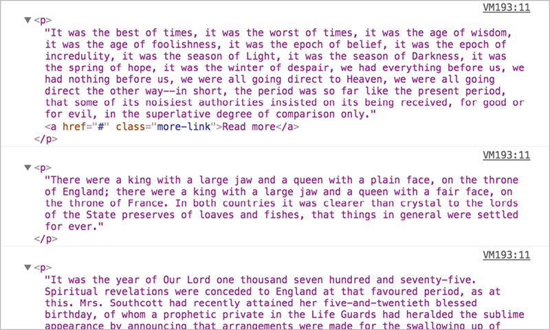

# Chapter 5. DOM Scripting

BEFORE WE CAN DO ANYTHING with a page, we have to first revisit something we touched on near the start: the Document Object Model. There are two purposes to the DOM: providing JavaScript with a map of all the elements on our page, and providing us with a set of methods for accessing those elements, their attributes, and their contents.

The “object” part of Document Object Model should make a lot more sense now than it did the first time the DOM came up, though: the DOM is a representation of a web page in the form of an object, made up of properties that represent each of the document’s child elements and subproperties representing each of those elements’ child elements, and so on. It’s objects all the way down.

## window: THE GLOBAL CONTEXT

Everything we do with JavaScript falls within the scope of a single object: `window`. The `window` object represents, predictably enough, the entire browser window. It contains the entire DOM, as well as—and this is the tricky part—the whole of JavaScript.

When we first talked about variable scope, we touched on the concept of there being “global” and “local” scopes, meaning that a variable could be made available either to every part of our scripts or to their enclosing function alone.

The `window` object *is* that global scope. All of the functions and methods built into JavaScript are built off of the `window` object. We don’t have to reference `window` constantly, of course, or you would’ve seen a lot of it before now—since `window` is the global scope, JavaScript checks `window` for any variables we haven’t defined ourselves. In fact, the `console` object that you’ve hopefully come to know and love is a method of the `window` object:

    window.console.log
    function log() { \[native code\] }

It’s hard to visualize globally vs. locally scoped variables before knowing about `window`, but much easier after: when we introduce a variable to the global scope, we’re making it a property of `window`—and since we don’t explicitly have to reference `window` whenever we’re accessing one of its properties or methods, we can call that variable anywhere in our scripts by just using its identifier. When we access an identifier, what we’re really doing is this:

    function ourFunction() {
      var localVar = "I’m local.";
      globalVar = "I’m global.";
      return "I’m global too!";
    };
    undefined
    window.ourFunction();
    I’m global too!
    window.localVar;
    undefined
    window.globalVar;
    I’m global.

The DOM’s entire representation of the page is a property of `window`: specifically, `window.document`. Just entering 
`window.document` in your developer console will return all of the markup on the current page in one enormous string, which isn’t particularly useful—but everything on the page can be accessed as subproperties of `window.document` the exact same way. Remember that we don’t need to specify `window` in order to access its `document` property—`window` is the only game in town, after all.

    document.head
    <head>...</head>
    document.body
    <body>...</body>

Those two properties are themselves objects that contain properties that are objects, and so on down the chain. (“Everything is an object, kinda.”)

## USING THE DOM

The objects in `window.document` make up JavaScript’s map of the document, but it isn’t terribly useful for us—at least, not when we’re trying to access DOM nodes the way we’d access any other object. Winding our way through the 
`document` object manually would be a huge headache for us, and that means our scripts would completely fall apart as soon as any markup changed.

But `window.document` isn't just a representation of the page; it also provides us with a smarter API for accessing that information. For instance, if we want to find every `p` element on a page, we don’t have to write out a string of property keys—we use a helper method built into `document` that gathers them all into an array-like list for us. Open up any site you want—so long as it likely has a paragraph element or two in it—and try this out in your console:

    document.getElementsByTagName( "p" );
    \[
...
, <p\>...
, 
...
, 
...
\]

Since we’re dealing with such familiar data types, we already have some idea how to work with them:

    var paragraphs = document.getElementsByTagName( "p" );
    undefined
    paragraphs.length
    4
    paragraphs\[ 0 \];
    
...

But DOM methods don’t give us arrays, strictly speaking. Methods like `getElementsByTagName` return “node lists,” which behave a lot like arrays. Each item in a `nodeList` refers to an individual node in the DOM—like a `p` or a `div`—and will come with a number of DOM-specific methods built in. For example, the `innerHTML` method will return any markup a node contains—elements, text, and so on—as a string:

    var paragraphs = document.getElementsByTagName( "p" ),lastIndex = paragraphs.length - 1, /\* Use the length of the \`paragraphs\` node list minus 1 (because of zero-indexing) to get the last paragraph on the page \*/
      lastParagraph = paragraphs\[ lastIndex \]; 
    lastParagraph.innerHTML;
    And that’s how I spent my summer vacation.

The same way these methods give us access to information on the rendered page, they allow us to *alter* that information, as well. For example, the `innerHTML` method does this the same way we’d change the value of any other object: a single equals sign, followed by the new value.

    var paragraphs = document.getElementsByTagName( "p" ),
      firstParagraph = paragraphs\[ 0 \];
    firstParagraph.innerHTML = "Listen up, chumps:";
    "Listen up, chumps:"

JavaScript’s map of the DOM works both ways: `document` is updated whenever any markup changes, and our markup is updated whenever anything within `document` changes (FIG 5.1).

Likewise, the DOM API gives us a number of methods for creating, adding, and removing elements. They’re all more or less spelled out in plain English, so even though things can seem a little verbose, it isn’t too hard to break down.

## DOM SCRIPTING

Before we get started, let’s abandon our developer console for a bit. Ages ago now, we walked through setting up a bare-bones HTML template that pulls in a remote script, and we’re going to revisit that setup now. Between the knowledge you’ve gained about JavaScript so far and an introduction to the DOM, we’re done with just telling our console to parrot things back to us—it’s time to build something.

We’re going to add a “cut” to an index page full of text—a teaser paragraph followed by a link to reveal the full text. We’re not going to make the user navigate to another page, though. Instead, we’ll use JavaScript to show the full text on the same page.

Let’s start by setting up an HTML document that links out to an external stylesheet and external script file—nothing fancy. Both our stylesheet and script files are empty with .css and .js extensions, for now—I like to keep my CSS in a /css subdirectory and my JavaScript in a /js subdirectory, but do whatever makes you most comfortable.

    <!DOCTYPE html>
    <html>
      <head>
        <meta charset="utf-8">
        <link rel="stylesheet" type="text/css"     href="css/style.css">
      </head>
      <body>
        
      </body>
    </html>

We’re going to populate that page with several paragraphs of text. Any ol’ text you can find laying around will do, including—with apologies to the content strategists in the audience—a little old-fashioned lorem ipsum. We’re just mocking up a quick article page, like a blog post.

    <!DOCTYPE html>
    <html>
      <head>
        <meta charset="utf-8">
        <link rel="stylesheet" type="text/css"     href="css/style.css">
      </head>
      <body>
        <h1>JavaScript for Web Designers</h1>
        
In all fairness, I should start this book     with an apology—not to you, reader, though I     don’t doubt that I’ll owe you at least one by     the time we get to the end. I owe JavaScript a     number of apologies for the things I’ve said     to it during the early years of my career,     some of which were strong enough to etch     glass.

        
This is my not-so-subtle way of saying that     JavaScript can be a tricky thing to learn.

        \[ … \]
        
      </body>
    </html>

Feel free to open up the stylesheet and play with the typography, but don’t get too distracted. We’ll need to write a little CSS later, but for now: we’ve got scripting to do.

We can break this script down into a few discrete tasks: we need to add a Read More link to the first paragraph, we need to hide all the `p` elements apart from the first one, and we need to reveal those hidden elements when the user interacts with the Read More link.

We’ll start by adding that Read More link to the end of the first paragraph. Open up your still-empty script.js file and enter the following:

    var newLink = document.createElement( "a" );

First, we’re intializing the variable `newLink`, which uses `document.createElement( "a" )` to—just like it says on the tin—create a new `a` element. This element doesn’t really exist anywhere yet—to get it to appear on the page we’ll need to add it manually. First, though, `` without any attributes or contents isn’t very useful. Before adding it to the page, let’s populate it with whatever information it needs.

We could do this *after* adding the link to the DOM, of course, but there’s no sense in making multiple updates to the element on the page instead of one update that adds the final result—doing all the work on that element before dropping it into the page helps keep our code predictable.

Making a single trip to the DOM whenever possible is also better for performance—but performance micro-optimization is easy to obsess over. As you’ve seen, JavaScript frequently offers us multiple ways to do the same thing, and one of those methods may *technically* outperform the other. This invariably leads to “excessively clever” code—convoluted loops that require in-person explanations to make any sense at all, just for the sake of shaving off precious picoseconds of load time. I’ve done it; I still catch myself doing it; but you should try not to. So while making as few round-trips to the DOM as possible is a good habit to be in for the sake of performance, the main reason is that it keeps our code readable and predictable. By only making trips to the DOM when we really need to, we avoid repeating ourselves and we make our interaction points with the DOM more obvious for future maintainers of our scripts.

So. Back to our empty, attribute-less `<``a></a>` floating in the JavaScript ether, totally independent of our document.

Now we can use two other DOM interfaces to make that link more useful: `setAttribute` to give it attributes, and `innerHTML` to populate it with text. These have a slightly different syntax. We can just assign a string using `innerHTML`, the way we’d assign a value to any other object. `setAttribute`, on the other hand, expects two arguments: the attribute *and* the value we want for that attribute, in that order. Since we don’t actually plan to have this link go anywhere, we’ll just set a hash as the `href`—a link to the page you’re already on.

    var newLink = document.createElement( "a" );
    *newLink.setAttribute( "href", "#" );*
    *newLink.innerHTML = "Read more";*

You’ll notice we’re using these interfaces on our stored reference to the element instead of on `document` itself. *All* the DOM’s nodes have access to methods like the ones we’re using here—we only use `document.getElementsByTagName( "p" )` because we want to get all the paragraph elements 
in the document. If we only wanted to get all the paragraph elements inside a certain `div`, we could do the same thing with a reference to that `div`—something like 
`ourSpecificDiv.getElementsByTagName( "p" );`. And since we’ll want to set the `href` attribute and the inner HTML of the link we’ve created, we reference these properties using `newLink.``setAttribute` and `newLink.innerHTML`.

Next: we want this link to come at the end of our first paragraph, so our script will need a way to reference that first paragraph. We already know that `document.getElementsByTagName( "p" )` gives us a node list of all the paragraphs in the page. Since node lists behave like arrays, we can reference the first item in the node list one by using the index `0`.

    var newLink = document.createElement( "a" );
    *var allParagraphs = document**.getElementsByTagName( "p" );*
    *var firstParagraph = allParagraphs\[ 0 \];*
    newLink.setAttribute( "href", "#" );
    newLink.innerHTML = "Read more";

For the sake of keeping our code readable, it’s a good idea to initialize our variables up at the top of a script—even if only by initializing them as `undefined` (by giving them an identifier but no value)—if we plan to assign them a value later on. This way we know all the identifiers in play.

So now we have everything we need in order to append a link to the end of the first paragraph: the element that we want to append (`newLink`) and the element we want to append it to (`firstParagraph`).

One of the built-in methods on all DOM nodes is 
`appendChild`, which—as the name implies—allows us to append a child element to that DOM node. We’ll call that `appendChild` method on our saved reference to the first paragraph in the document, passing it `newLink` as an argument.


    var newLink = document.createElement( "a" );
    var allParagraphs = document.getElementsByTagName( "p" );
    var firstParagraph = allParagraphs\[ 0 \];
    newLink.setAttribute( "href", "#" );
    newLink.innerHTML = "Read more";
    *firstParagraph.appendChild( newLink );*

Now—finally—we have something we can point at when we reload the page. If everything has gone according to plan, you’ll now have a Read More link at the end of the first paragraph on the page. If everything hasn’t gone according to plan—because of a misplaced semicolon or mismatched parentheses, for example—your developer console will give you a heads-up that something has gone wrong, so be sure to keep it open.

Pretty close, but a little janky-looking—our link is crashing into the paragraph above it, since that link is `display: inline` by default (FIG 5.2).

We have a couple of options for dealing with this: I won’t get into all the various syntaxes here, but the DOM also gives us access to *styling* information about elements—though, in its most basic form, it will only allow us to read and change styling information associated with a `style` attribute. Just to get a feel for how that works, let’s change the link to 
`display``: inline-block` and add a few pixels of margin to the left side, so it isn’t colliding with our text. Just like setting attributes, we’ll do this before we add the link to the page:

    var newLink = document.createElement( "a" );
    var allParagraphs = document.getElementsByTagName( "p" );
    var firstParagraph = allParagraphs\[ 0 \];
    newLink.setAttribute( "href", "#" );
    newLink.innerHTML = "Read more";
    *newLink.**style.display = "inline-block";*
    *newLink.style.marginLeft = "10px";*
    firstParagraph.appendChild( newLink );

Well, adding those lines *worked*, but not without a couple of catches. First, let’s talk about that syntax (FIG 5.3).

Remember that identifiers can’t contain hyphens, and since everything is an object (sort of), the DOM references styles in object format as well. Any CSS property that contains a hyphen instead gets camel-cased: `margin-left` becomes `marginLeft`, `border``-radius-top-left` becomes `borderRadiusTopLeft`, and so on. Since the *value* we set for those properties is a string, however, hyphens are just fine. A little awkward and one more thing to remember, but this is manageable enough—certainly no reason to avoid styling in JavaScript, if the situation makes it absolutely necessary.

A better reason to avoid styling in JavaScript is to maintain a separation of behavior and presentation. JavaScript is our “behavioral” layer the way CSS is our “presentational” layer, and seldom the twain should meet. Changing styles on a page shouldn’t mean rooting through line after line of functions and variables, the same way we wouldn’t want to bury styles in our markup. The people who might end up maintaining the styles for the site may not be completely comfortable editing JavaScript—and since changing styles in JavaScript means we’re indirectly adding styles via `style` attributes, whatever we write in a script is going to override the contents of a stylesheet by default.

We can maintain that separation of concerns by instead using `setAttribute` again to give our link a class. So, let’s scratch out those two styling lines and add one setting a class in their place.

    var newLink = document.createElement( "a" );
    var allParagraphs = document.getElementsByTagName( "p" );
    var firstParagraph = allParagraphs\[ 0 \];
    newLink.setAttribute( "href", "#" );
    *newLink.setAttribute( "class", "more-link" );*
    newLink.innerHTML = "Read more";
    firstParagraph.appendChild( newLink );

Now we can style `.more-link` in our stylesheets as usual:

    .more-link {
      display: inline-block;
      margin-left: 10px;
    }

Much better (FIG 5.4). It’s worth keeping in mind for the future that using `setAttribute` this way on a node in the DOM would mean overwriting any classes already on the element, but that’s not a concern where we’re putting this element together from scratch.

Now we’re ready to move on to the second item on our to-do list: hiding all the other paragraphs.

Since we’ve made changes to code we know already worked, be sure to reload the page to make sure everything is still working as expected. We don’t want to introduce a bug here and continue on writing code, or we’ll eventually get stuck digging back through all the changes we made. If everything has gone according to plan, the page should look the same when we reload it now.

Now we have a list of all the paragraphs on the page, and we need to act on each of them. We need a loop—and since we’re iterating over an array-like node list, we need a `for` loop. Just to make sure we have our loop in order, we’ll log each paragraph to the console before we go any further:

    var newLink = document.createElement( "a" );
    var allParagraphs = document.getElementsByTagName( "p" );
    var firstParagraph = allParagraphs\[ 0 \];
    newLink.setAttribute( "href", "#" );
    newLink.setAttribute( "class", "more-link" );
    newLink.innerHTML = "Read more";
    for( var i = 0; i < allParagraphs.length; i++ ) {
      console.log( allParagraphs\[ i \] );
    }
    firstParagraph.appendChild( newLink );

Your Read More link should still be kicking around in the first paragraph as usual, and your console should be rich with filler text (FIG 5.5).

Now we have to hide those paragraphs with `display: none`, and we have a couple of options: we could use a class the way we did before, but it wouldn’t be a terrible idea to use styles in JavaScript for this. We’re controlling all the hiding and showing from our script, and there’s no chance we’ll want that behavior to be overridden by something in a stylesheet. In this case, it makes sense to use the DOM’s built-in methods for applying styles:

    var newLink = document.createElement( "a" );
    var allParagraphs = document.getElementsByTagName( "p" );
    var firstParagraph = allParagraphs\[ 0 \];
    newLink.setAttribute( "href", "#" );
    newLink.setAttribute( "class", "more-link" );
    newLink.innerHTML = "Read more";
    for( var i = 0; i < allParagraphs.length; i++ ) {
      *allParagraphs\[ i \].style**.display = "none";*
    }
    firstParagraph.appendChild( newLink );

If we reload the page now, everything is gone: our JavaScript loops through the entire list of paragraphs and hides them all. We need to make an exception for the first paragraph, and that means conditional logic—an `if` statement, and the `i` variable gives us an easy value to check against:

    var newLink = document.createElement( "a" );
    var allParagraphs = document.getElementsByTagName( "p" );
    var firstParagraph = allParagraphs\[ 0 \];
    newLink.setAttribute( "href", "#" );
    newLink.setAttribute( "class", "more-link" );
    newLink.innerHTML = "Read more";
    for( var i = 0; i < allParagraphs.length; i++ ) {
      *if( i === 0 ) {*
        *continue;*
      }
      allParagraphs\[ i \].style.display = "none";
    }
    firstParagraph.appendChild( newLink );

If this is the first time through of the loop, the `continue` keyword skips the rest of the current iteration and then—unlike if we’d used `break`—the loop continues on to the next iteration.

If you reload the page now, we’ll have a single paragraph with a Read More link at the end, but all the others will be hidden. Things are looking good so far—and if things aren’t looking quite so good for you, double-check your console to make sure nothing is amiss.

## DOM EVENTS

Okay, one last thing to do: we need our Read More link to *do* something. If you click on it now, it just jumps you back to the top of the page and adds a hash to the URL.

In terms of failure-proofing, we’re in a pretty safe situation with this script. No matter what kinds of mishaps might take place down the road—an error in one of our scripts, an error in a third-party script that we can’t control, or even an error in a user’s browser—the full text will be available.

We’re inserting the View More link with JavaScript instead of hard-coding it into the markup, so if JavaScript is unavailable to a user for any reason, there won’t be a useless link floating at the end of the first paragraph. We’re also relying on JavaScript to add the class that hides the other paragraphs, rather than hard-coding a class and hiding them through our stylesheets—because then, if a script should break, the content is still available to the user.

The idea of starting with something usable and layering JavaScript enhancements over that baseline is called *progressive enhancement*, and we’ll talk more about that in a bit. Right now, we have a script to finish.

DOM events are effectively an API for the activity taking place in a browser. This includes the user’s actions, CSS animations, and internal browser events like the point where an image is completely loaded, just to name a few.

We’re squarely in user event territory—we just need to be able to write some behavior for users who click our generated link. We don’t need to make a second trip to the DOM, or root through every link on the page—we already have a reference to our link, and we’ll use a built-in DOM method to listen for events: `addEventListener`.

So, let’s start by writing our function: when the link is clicked, what do we want to happen?

Well, first we want to show all the hidden paragraphs on the page, so we’ll need to change their styles back to 
`display: block`. Once we’ve shown all those paragraphs, a Read More link won’t make sense to the user—so after we show the full text, we’ll want remove that link from the DOM.

We’ll create a new function with the identifier 
`revealCopy`, and for now we’ll just put a `console.log` in that function so we know everything is working. Then we’ll use 
`addEventListener` on `newLink` to listen for a click event. `addEventListener` accepts two arguments: a string with the event type we want to listen for—in this case `"``click"`—and the function to be executed when that event takes place.

    var newLink = document.createElement( "a" );
    var allParagraphs = document.getElementsByTagName( "p" );
    var firstParagraph = allParagraphs\[ 0 \];
    *function revealCopy() {*
      *console.**log( "Clicked!" );*
    *}*
    newLink.setAttribute( "href", "#" );
    newLink.setAttribute( "class", "more-link" );
    newLink.innerHTML = "Read more";
    *newLink.addEventListener( "click", revealCopy );*
    for( var i = 0; i < allParagraphs.length; i++ ) {
      if( i === 0 ) {
        continue;
      }
      allParagraphs\[ i \].style.display = "none";
    }
    firstParagraph.appendChild( newLink );

So far, so good! Click on our generated link and you’ll get a `Clicked!` in your console.

The browser is still following that link, though. That isn’t really a big deal now—since we’re setting that link’s `href` to a hash—but there might be times where we’re adding custom behaviors to real links, and we don’t want the browser jumping the user to a new page instead of showing any of our behavior.

Luckily, `addEventListener` gives us information about the user’s click event in the form of—you guessed it—an object. And just as you might expect, that object contains a number of properties *about* the event, and methods we can use to control the browser’s behavior. That event object is passed along as an argument, but we can’t use it until we give it an identifier—the common convention is `e`, short for “event.” Let’s add that as an argument, and change our `console.log` to show us that object:

    var newLink = document.createElement( "a" );
    var allParagraphs = document.getElementsByTagName( "p" );
    var firstParagraph = allParagraphs\[ 0 \];
    function revealCopy( e ) {
      *console.log( e );*
    }
    newLink.setAttribute( "href", "#" );
    newLink.setAttribute( "class", "more-link" );
    newLink.innerHTML = "Read more";
    newLink.addEventListener( "click", revealCopy );
    for( var i = 0; i < allParagraphs.length; i++ ) {
      if( i === 0 ) {
        continue;
      }
      allParagraphs\[ i \].style.display = "none";
    }
    firstParagraph.appendChild( newLink );

Now we’ll get a cryptic looking object in our console when we click on that generated link:

    MouseEvent {dataTransfer: null, which: 1, toElement: a.more-link, fromElement: null, y: 467…}

There’s a lot going on in there, but we’re only going to need one method from that event object: `e.preventDefault()`, which prevents the browser’s default behavior when an event takes place—in this case, following a link. That function can appear *anywhere* in the function that’s bound to an event—as long as it exists in `revealCopy` somewhere, the browser won’t attempt to follow our link.

    var newLink = document.createElement( "a" );
    var allParagraphs = document.getElementsByTagName( "p" );
    var firstParagraph = allParagraphs\[ 0 \];
    function revealCopy( e ) {
      *e.preventDefault();*
    };
    newLink.setAttribute( "href", "#" );
    newLink.setAttribute( "class", "more-link" );
    newLink.innerHTML = "Read more";
    newLink.addEventListener( "click", revealCopy );
    for( var i = 0; i < allParagraphs.length; i++ ) {
      if( i === 0 ) {
        continue;
      }
      allParagraphs\[ i \].style.display = "none";
    }
    firstParagraph.appendChild( newLink );

Now the hash in the link’s `href` will be ignored completely. Even if we were to change `newLink.setAttribute( "href", "#" )` to point to a real URL, clicking on the link wouldn’t take you anywhere. Perfect—now we just need our function to…y’know, do things.

Since we’ll need to change the `display` property of each hidden paragraph back to a visible `display` value—like `block`—we’ll need to loop through them again. For now, we can just copy and paste our `allParagraphs` variable and corresponding loop into the function, and change the `display` value to `"block"`.

    var newLink = document.createElement( "a" );
    var allParagraphs = document.getElementsByTagName( "p" );
    var firstParagraph = allParagraphs\[ 0 \];
    function revealCopy( e ) {
      *var allParagraphs = document**.getElementsByTagName(   "p" );*
      *for( var i = 0; i < allParagraphs.length; i**++ ) {*
        *if( i === 0 ) {*
          *continue;*
        *}*
        *allParagraphs\[ i \].style.display = "block";*
      *}*
      *e**.preventDefault();*
    }
    newLink.setAttribute( "href", "#" );
    newLink.setAttribute( "class", "more-link" );
    newLink.innerHTML = "Read more";
    newLink.addEventListener( "click", revealCopy );
    for( var i = 0; i < allParagraphs.length; i++ ) {
      if( i === 0 ) {
        continue;
      }
      allParagraphs\[ i \].style.display = "none";
    }
    firstParagraph.appendChild( newLink );

Copying and pasting code that way isn’t very DRY, but it does work—and we can clean things up a little once we’ve got everything working. Give this a try now, and we’re almost done: all paragraphs but the first one are hidden once the page finishes loading, and they’re all revealed again when we click on that link.

We have one more thing to do: we should remove the Read More link from the DOM once clicked, since it won’t do anything anymore. This is pretty painless: there’s a `remove` method built into to each DOM node, and it does exactly what you might expect.

First, though, we need a reference to the Read More link we’re removing. We won’t need to make another trip to the DOM for that: the `this` keyword inside a function that’s attached to an event refers to the element that initiated the event. Inside `revealCopy`, `this` refers to our Read More node, and we’ll call `remove()` on it:

    var newLink = document.createElement( "a" );
    var allParagraphs = document.getElementsByTagName( "p" );
    var firstParagraph = allParagraphs\[ 0 \];
    function revealCopy( e ) {
      var allParagraphs = document.getElementsByTagName(   "p" );
      for( var i = 0; i < allParagraphs.length; i++ ) {
        if( i === 0 ) {
          continue;
        }
        allParagraphs\[ i \].style.display = "block";
      }
      *this.remove();*
      e.preventDefault();
    }
    newLink.setAttribute( "href", "#" );
    newLink.setAttribute( "class", "more-link" );
    newLink.innerHTML = "Read more";
    newLink.addEventListener( "click", revealCopy );
    for( var i = 0; i < allParagraphs.length; i++ ) {
      if( i === 0 ) {
        continue;
      }
      allParagraphs\[ i \].style.display = "none";
    }
    firstParagraph.appendChild( newLink );

It works! We have reached *minimum viable product*, here—this isn’t the neatest code ever, but we’ve built exactly what we were aiming to build. No gold stars awarded just yet, but at least we’re all getting a participant ribbon.

*Now* we can optimize.

Remember how we copied and pasted that loop? There’s some room for improvement there: we already have a function that loops through all our paragraphs and changes the `display` property on all but the first one, and functions are all about reuse. Since there are two situations where we’ll need to change that `display` property—to `none` initially, and to `block` when our link is clicked—we’ll refactor that function to serve both cases.

First things first: we should change the name of that function. We won’t just be using it to *reveal* our paragraphs; we’ll be using it to hide them as well. Since we’re toggling those paragraphs’ visibility, we’ll change the identifier and update the reference inside `addEventListener` to match—`toggleCopy` makes sense to me. Then, let’s try calling that function in place of our original loop:

    var newLink = document.createElement( "a" );
    var allParagraphs = document.getElementsByTagName( "p" );
    var firstParagraph = allParagraphs\[ 0 \];
    function *toggleCopy*( e ) {
      var allParagraphs = document.getElementsByTagName(   "p" );
      for( var i = 0; i < allParagraphs.length; i++ ) {
        if( i === 0 ) {
          continue;
        }
        allParagraphs\[ i \].style.display = "block";
      }
      this.remove();
      e.preventDefault();
    }
    newLink.setAttribute( "href", "#" );
    newLink.setAttribute( "class", "more-link" );
    newLink.innerHTML = "Read more";
    newLink.addEventListener( "click", *toggleCopy* );
    toggleCopy();
    firstParagraph.appendChild( newLink );

Uh oh.

    Uncaught TypeError: this.remove is not a function

We’ve built a few assumptions into our function. JavaScript is expecting `this` to reference a DOM node that has a `remove()` method—that won’t apply outside of our event. Our script didn’t get as far as the line after, but that would cause an error too—again, the function assumed an `e` argument with a 
`preventDefault` method attached, which won’t exist if we’re not calling this function in response to an event. `e` has an identifier, but without `addEventListener` to give it an object, it’s just an identifier that contains `undefined`.

First we’ll deal with the error in our console. We need to make sure `this` is a reference to the link we’ve conjured up, and if so, remove it. That’s an easy one: we already have a reference to the Read More—the `newLink` identifier. We’ll just make sure `this` and `newLink` are equal.

    var newLink = document.createElement( "a" );
    var allParagraphs = document.getElementsByTagName( "p" );
    var firstParagraph = allParagraphs\[ 0 \];
    function toggleCopy( e ) {
      var allParagraphs = document.getElementsByTagName(   "p" );
      for( var i = 0; i < allParagraphs.length; i++ ) {
        if( i === 0 ) {
          continue;
        }
        allParagraphs\[ i \].style.display = "block";
        }
        *if( this === newLink ) {*
          this.remove();
        }
      e.preventDefault();
    }
    newLink.setAttribute( "href", "#" );
    newLink.setAttribute( "class", "more-link" );
    newLink.innerHTML = "Read more";
    newLink.addEventListener( "click", toggleCopy );
    toggleCopy();
    firstParagraph.appendChild( newLink );

That’s one error down, but here’s that `preventDefault` issue we’ve been expecting:

    Uncaught TypeError: Cannot read property 'preventDefault' of undefined

When we invoke `toggleCopy` without an argument, `e` gets a value of `undefined`—and `undefined` definitely doesn’t have a `preventDefault` method. That `undefined` default value means that the `e` identifier gives us just what we need to get our function back in working order: a condition we can test for. We’ll only invoke `e.preventDefault` if `e` doesn’t have a value of `undefined`:

    var newLink = document.createElement( "a" );
    var allParagraphs = document.getElementsByTagName( "p" );
    var firstParagraph = allParagraphs\[ 0 \];
    function toggleCopy( e ) {
      var allParagraphs = document.getElementsByTagName(   "p" );
      for( var i = 0; i < allParagraphs.length; i++ ) {
        if( i === 0 ) {
          continue;
        }
        allParagraphs\[ i \].style.display = "block";
      }
      if( this === newLink ) {
        this.remove();
      }
      *if( e !== undefined ) {*
        e.preventDefault();
      }
    }
    newLink.setAttribute( "href", "#" );
    newLink.setAttribute( "class", "more-link" );
    newLink.innerHTML = "Read more";
    newLink.addEventListener( "click", toggleCopy );
    toggleCopy();
    firstParagraph.appendChild( newLink );

Now we’re error-free, but we’re still making a big assumption here—if we were to pass this function an argument when invoking it outside of an event, `e` wouldn’t be `undefined`. `e` would take on the value of the argument, which very likely wouldn’t have a `preventDefault` method, and then we’d have an error on our hands. *We* know better than to chuck a stray argument into `toggleCopy` because, well, we built the thing—we know it wouldn’t do anything of value. There’s certainly no harm in doing a little error-proofing for the sake of whomever ends up maintaining our code after us.

Just to be extra safe, we’ll make our conditional a little more explicit: first, see if there’s an argument at all. If there is, see if that argument has a `preventDefault` method. Since we’re checking against two values that both need to evaluate to `true`, we’ll use `&&`.

    var newLink = document.createElement( "a" );
    var allParagraphs = document.getElementsByTagName( "p" );
    var firstParagraph = allParagraphs\[ 0 \];
    function toggleCopy( e ) {
      var allParagraphs = document.getElementsByTagName(   "p" );
      for( var i = 0; i < allParagraphs.length; i++ ) {
        if( i === 0 ) {
          continue;
        }
        allParagraphs\[ i \].style.display = "block";
      }
      if( this === newLink ) {
        this.remove();
      }
      *if( e !== undefined && e.preventDefault !==   undefined ) {*
        e.preventDefault();
      }
    }
    newLink.setAttribute( "href", "#" );
    newLink.setAttribute( "class", "more-link" );
    newLink.innerHTML = "Read more";
    newLink.addEventListener( "click", toggleCopy );
    toggleCopy();
    firstParagraph.appendChild( newLink );

Still no errors; all is well.

Nothing is hidden either, though—we’re still just setting `display` to `block`. What we need to do is set those elements to `block` *only* if they’re already hidden—we’ll need one more `if` that checks to see if the paragraph’s display property is set to `none` and, if so, set it to `block`. For any other value, we’ll set that value to `none`.

    var newLink = document.createElement( "a" );
    var allParagraphs = document.getElementsByTagName( "p" );
    var firstParagraph = allParagraphs\[ 0 \];
    function toggleCopy( e ) {
      var allParagraphs = document.getElementsByTagName(   "p" );
      for( var i = 0; i < allParagraphs.length; i++ ) {
        if( i === 0 ) {
          continue;
        }
        if( allParagraphs\[ i \].style.display === "none" ) {
          allParagraphs\[ i \].style.display = "block";
        } else {
          allParagraphs\[ i \].style.display = "none";
        }
      }
      if( this === newLink ) {
        this.remove();
      }
      if( e !== undefined && e.preventDefault !==   undefined ) {
        e.preventDefault();
      }
    }
    newLink.setAttribute( "href", "#" );
    newLink.setAttribute( "class", "more-link" );
    newLink.innerHTML = "Read more";
    newLink.addEventListener( "click", toggleCopy );
    toggleCopy();
    firstParagraph.appendChild( newLink );

Working again! One more little thing, though: we’re repeating `allParagraphs[ i ]` over and over when we could just be referencing it by a single identifier.

We’re nit-picking a little now, but what could it hurt?

    var newLink = document.createElement( "a" );
    var allParagraphs = document.getElementsByTagName( "p" );
    var firstParagraph = allParagraphs\[ 0 \];
    function toggleCopy( e ) {
      var allParagraphs = document.getElementsByTagName(   "p" );
      for( var i = 0; i < allParagraphs.length; i++ ) {
        var para = allParagraphs\[ i \];
        if( i === 0 ) {
          continue;
        }
        if( para.style.display === "none" ) {
        para.style.display = "block";
        } else {
        para.style.display = "none";
        }
      }
      if( this === newLink ) {
        this.remove();
      }
      if( e !== undefined && e.preventDefault !==   undefined ) {
        e.preventDefault();
      }
    }
    newLink.setAttribute( "href", "#" );
    newLink.setAttribute( "class", "more-link" );
    newLink.innerHTML = "Read more";
    newLink.addEventListener( "click", toggleCopy );
    toggleCopy();
    firstParagraph.appendChild( newLink );

And while we’re at it, we’re polluting the global scope a little—all of these variables are getting added to `window`, since they’re not in an enclosing function. Try it out for yourself in the console:

    window.newLink
    

We don’t want to clutter up the global scope. Let’s wrap this whole thing in a function; and since we don’t to reference it outside of the moment the page is loaded, we don’t need to give it an identifier—we’ll wrap all of our JavaScript in an anonymous function that executes it right away, called an *immediately-invoked functional expression* or IIFE. The syntax is a little strange and can be written in a couple of different ways, but the usual gist is this: by wrapping an anonymous function in parentheses, we tell JavaScript that any instance of the `function` keyword is an expression, not a declaration—*invoking* a function, not potentially *defining* one with an identifier. We then follow that up with a matched set of parentheses—`()`—to kick that newly created function off right away.

We’re into slightly academic territory here, truth be told: the IIFE pattern is important for sure, but we don’t need to know how JavaScript feels about parentheses to make use of it. For now, we can take it at face value.

    (function() {
      var newLink = document.createElement( "a" );
      var allParagraphs = document.getElementsByTagName(   "p" );
      var firstParagraph = allParagraphs\[ 0 \];
      function toggleCopy( e ) {
        var allParagraphs = document.getElementsByTagName(     "p" );
        for( var i = 0; i < allParagraphs.length; i++ ) {
          var para = allParagraphs\[ i \];
          if( i === 0 ) {
            continue;
          }
          if( para.style.display === "none" ) {
            para.style.display = "block";
          } else {
            para.style.display = "none";
          }
        }
        if( this === newLink ) {
          this.remove();
        }
        if( e !== undefined && e.preventDefault !==     undefined ) {
          e.preventDefault();
        }
      };
      newLink.setAttribute( "href", "#" );
      newLink.setAttribute( "class", "more-link" );
      newLink.innerHTML = "Read more";
      newLink.addEventListener( "click", toggleCopy );
      toggleCopy();
      firstParagraph.appendChild( newLink );
    }());

Now, if we punch `window.newLink` into our developer console, we get back undefined—we’re not polluting the global scope with identifiers we’ll never need to access outside the scope of our IIFE.

    window.newLink
    undefined

Perfect.

Well, okay. Not *perfect*—in fact, probably never *perfect*. There are always more tweaks we can make to a script, tiny optimization after tiny optimization and so on unto infinity. But this is pretty damn good, if I do say so myself: we’re being responsible about polluting the global scope, we’re being DRY throughout our code, and we’ve written something that will be easy to read and maintain long after we’ve moved on to bigger and better scripts.

## PROGRESSIVE ENHANCEMENT

Scripting behavior in a responsible way isn’t always easy. We’re standing in for the browser, taking over the user’s experience of something as common and predictable as clicking on a link. Done in an unobtrusive way, we’re able to create a completely fluid experience—better, in many ways, than the browser itself could.

If we don't do it responsibly, though, we’ve done something far worse than simply presenting the user with a misaligned `div`—we’ve built something they might not be able to use at all. The web is an unpredictable medium, and we have to plan for that—when writing JavaScript more so than HTML or CSS, by a wide margin.

We could have cut some corners in the paragraph-toggling script we built today, for example. We could have hidden those paragraphs at the outset using CSS and relied on JavaScript to show them again, or hard-coded the Read More link and assumed the functionality in our script would always be available. The latter case would be a nuisance if anything went wrong—an error elsewhere in a script causing ours to fail, for example. The user would be left with a Read More link that didn’t *do* anything. The former case would be far more dire: in the event that JavaScript failed in any way, the user would be left with no way to access the contents of the page.

A site that fully relies on JavaScript for critical functionality—a website built on the expectation that JavaScript will always run, no matter what—is a fragile one. Users’ browsing conditions can change minute to minute, and we can’t plan for—we can’t *know*—the ways that our scripts might break down.

A handful of years ago I worked on the responsive *Boston Globe* site with Ethan Marcotte, Scott Jehl, and the whole crew at Filament Group. It was built with progressive enhancement in mind, which didn’t hold us back in the least—there are some incredible features on that site, if you don’t mind my saying so ([https://www.bostonglobe.com/](https://www.bostonglobe.com/)).

We got to solve some tricky problems on that project, but made sure we were doing so with progressive enhancement squarely in mind—“If and when this feature fails, how do we ensure the user still has access to the underlying information?” On the surface, that may seem like an exercise in edge cases. The tiny decisions that go into building a website don’t necessarily feel like a big deal at the time.

The Boston Marathon bombings happened a few years later. Being able to reach up-to-date information on what was happening throughout the city was tremendously important to a huge number of people that day, and many of them looked to the *Boston Globe* for that. Due to the increased traffic, the *Boston Globe*’s CDN—the server that delivers assets like CSS and JavaScript—was overwhelmed, and went down. For a period of time that afternoon, the *Boston Globe*’s website was HTML-only.

The website *looked* broken, and none of our advanced JavaScript features were there consistently: no offline reading, no dropdown menus in the navigation. Sometimes the whole site was just black Times New Roman on a white background. Sometimes only the CSS would come through, or some part of it—likewise with the JavaScript. Rarely did any of our scripts run without errors, through no fault of our own.

But visitors to BostonGlobe.com that afternoon could still navigate the site. They could still read the news. The website *worked*. If we’d relied on CSS to hide parts of the navigation and assumed JavaScript would always be there to reveal them again, some users wouldn’t have been able to navigate that day. If we’d relied on JavaScript to fetch and render critical parts of the page, that content might never have appeared. If we’d hard-coded controls that required JavaScript in order to do anything at all, they would have been useless—confusing and frustrating for the site’s users at the worst imaginable time.

Progressive enhancement is yet another thing we’ll need to factor in when we’re writing our JavaScript. To be honest, progressive enhancement will sometimes mean doing more work—but that’s the craft. The decisions that went into writing the JavaScript for BostonGlobe.com could have seemed inconsequential in the grand scheme of things, but on that day—for tens of thousands of users—those decisions added up to something huge. For those users, progressive enhancement meant the difference between finding the information they needed right away, or being forced to keep searching for it—between knowing and not knowing.
