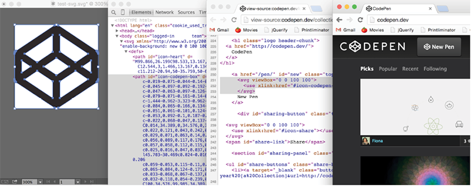
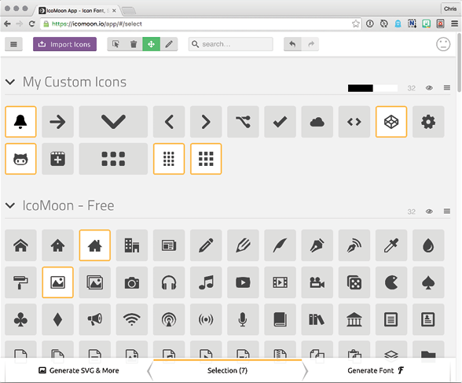
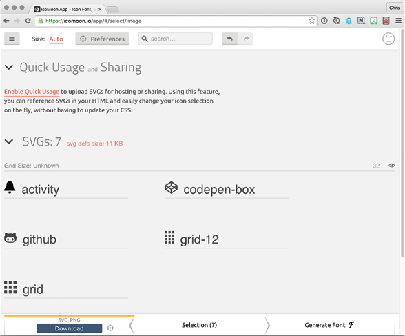
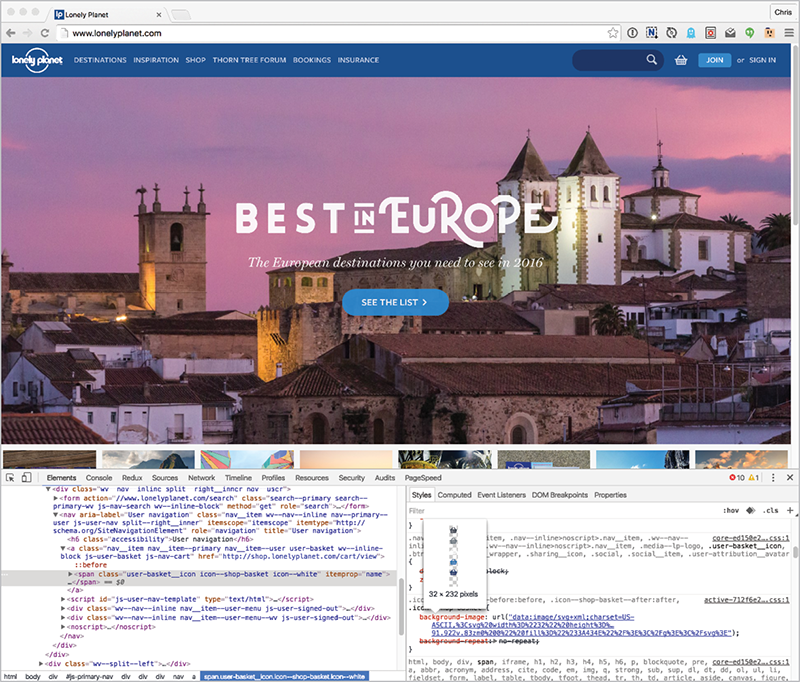

A BUILD TOOL is a name for any bit of software that facilitates tasks that help us build websites. The most common tasks for a build tool are things like compiling code with preprocessors (see Dan Cederholm’s *Sass for Web Designers*) or compressing and concatenating other assets (see Scott Jehl’s *Responsible Responsive Design*). But a task can be anything. *Computer! Move these files over here! Rename them like this! Add this comment at the top of them!* You know, things that computers are faster and better at than humans.

One thing we can have a build tool do for us is create an SVG sprite—that chunk of SVG `symbol`s I introduced in the last chapter—automatically from a folder of separate SVG images. It makes this workflow possible:

1. Create and edit an SVG file in Illustrator as needed.
2. Watch the build tool do its magic by automatically adding the SVG file we just created or edited to the SVG sprite.
3. Use the icons easily in your HTML.
4. Revel in the majesty of beautiful icons on your site.

You no longer have to do any of the tedious manual construction of SVG in the special format needed (as we did in the last chapter); that all happens almost instantly as you work. And, unlike fat-fingered humans, the build process won’t make any mistakes while doing it.

## ICOMOON

One of my favorite build tools for SVG is IcoMoon ([http://bkaprt.com/psvg/04-01/](http://bkaprt.com/psvg/04-01/)). Its website has a very simple interface: a big grid of icons. First, select the icon you want, and then hit the Generate SVG & More button (FIG 4.2).

Then click the SVG Download button (FIG 4.3). You’ll get a ZIP file that includes the SVG sprite. That’s a build tool!

The sprite, called svgdefs.svg, is in the root of that folder. It’s a production-ready sprite file, and you can use it in any of the ways covered in the last chapter.

You aren’t limited to the icons on the IcoMoon site; you can import your own. You can also create an account so that you can save your projects, making it easy to come back and add/remove/adjust icons and reexport them.

## GRUNT

IcoMoon has almost no learning curve and does a great job, but you can still level up. Let’s take a look at using Grunt. It’s a little more complex, but I promise you can handle it. I wrote an article that helped a lot of people get started with it called “Grunt For People Who Think Things Like Grunt Are Weird And Hard” ([http://bkaprt.com/psvg/04-02/](http://bkaprt.com/psvg/04-02/)), which I’d recommend as a primer.

In a nutshell: you simply configure tasks for Grunt to do, run it, and it does them. *Grunt, preprocess my CSS! Grunt, minify my JavaScript! And in our case: Grunt, turn my individual SVGs into an SVG sprite!* (Grunt likes it when you are very clear and commanding like that.)

Note that Grunt can’t run any of these tasks by itself. That’s what plugins are for. The one we’re going to use is grunt-svgstore ([http://bkaprt.com/psvg/04-03/](http://bkaprt.com/psvg/04-03/)). Its sole purpose is spriting SVG. Once we’ve installed the plugin, we can configure Grunt to do what we want. We do this with Gruntfile.js, which lives in your project’s root folder:

    module.exports = function(grunt) {
      grunt.initConfig({
        svgstore: {
          default: {
            files: {
              "includes/defs.svg": \["svg/\*.svg"\]
            }
          }
        }
      });
      grunt.loadNpmTasks("grunt-svgstore");
      grunt.registerTask("default", \["svgstore"\]);
    };

And now in plain English:

*Hey, Grunt. I’m going to keep all of my individual SVG images in a folder called “svg”. When I type “grunt” into the command line, find all of those images and process them into an SVG sprite. Name that sprite* defs.svg *and put it in a folder called “includes”.*

Leveling up a little more, we can make that happen *automatically* whenever an SVG file is added, removed, or changed. The grunt-contrib-watch plugin is just for this. It watches the files and/or directories you tell it to watch in your projects, and runs grunt tasks when the files change in any way.

We’ll tell it to watch our icons folder for SVG files and run svgstore when they change.

    module.exports = function(grunt) {
      grunt.initConfig({
        svgstore: {
          default: {
            files: {
              "includes/defs.svg": \["svg/\*.svg"\]
            }
          }
        },
        watch: {
          svg: {
            files: \["icons/\*"\],
            tasks: \["svgstore"\],
            options: {
              livereload: true
            }
          }
        }
      });
      grunt.loadNpmTasks("grunt-svgstore");
      grunt.loadNpmTasks("grunt-contrib-watch");
      grunt.registerTask("default", \["watch"\]);
    };

You’ll kick things off by typing `grunt watch` into the command line at the project’s root folder.

See the `livereload: true` option as part of the configuration for that watch task? That’s the icing on the cake here. If you have the LiveReload browser extension installed and turned on, your browser will refresh after the task is finished ([http://bkaprt.com/psvg/04-04/](http://bkaprt.com/psvg/04-04/)). That means you can pop open an SVG in Illustrator, make edits, save it, and the browser will automatically refresh, immediately showing you the changes right on your site. That’s a dang delicious design workflow if I’ve ever seen one.

## ANOTHER APPROACH: GRUNTICON

I would be remiss not to mention Grunticon as a build tool for an icon system ([grunticon.com](http://grunticon.com)). Grunticon is a Grunt plugin just like grunt-svgstore is, but it takes an entirely different approach to SVG icons. It still takes a folder full of .svg files and combines them for you, but it combines them into a stylesheet containing a bunch of class declarations that set a `background-image` for the icon. Like this:

    .icon-cloud-sync {
      background-image: url("data:image/svg+xml;charset=US-ASCII,%3Csvg%20 …");
      background-repeat: no-repeat;
    }

The SVG images are converted into a *data URL* and put directly into the stylesheet. We’ll cover data URLs momentarily, but in a nutshell: a data URL is literally the SVG itself, specially encoded and turned into a long string right inside the URL. All the drawing information is right there; no network request is required to go get anything else. In that sense, the stylesheet is your sprite, because all the icons are combined into one request and can be used on demand.

The Grunticon approach has a couple of advantages:

* It handles fallbacks for you! (That deserved an exclamation point.) Grunticon gives you everything you need, including a fancy detection script, to serve icons that work everywhere. It loads an entirely different stylesheet with PNG versions, if needed.
* It’s inherently automated, forcing you to have a system in place for icons.

It also has some drawbacks:

* You only get some of the advantages of SVG, like scalability.
* The elements aren’t in the DOM.
* You can’t style elements with other CSS, meaning you’ll need duplicates for even differently colored versions. The duplicates don’t hurt file size as much as you would think, since GZIP is great at repetitive text, but it’s still harder to maintain.

Grunticon 2 mostly takes care of that disadvantage ([http://bkaprt.com/psvg/04-05/](http://bkaprt.com/psvg/04-05/)). You can use an attribute to tell it to inject inline SVG:

    

Grunticon will work some magic and inject the inline SVG of that icon for you, as long as the browser supports it. It requires a little DOM injection that you wouldn’t need if you started with inline SVG, but it allows for variations and all the fancy powers inherent to inline SVG.

### SVG icons at Lonely Planet

Here’s a real-world example for you (FIG 4.4). When he was working for Lonely Planet, Ian Feather blogged about the virtues of switching from an icon font to SVG icons ([http://bkaprt.com/psvg/04-06/](http://bkaprt.com/psvg/04-06/)). His article covers many of the problems inherent to icon fonts and the specific strengths of SVG icons in an 
evenhanded way, including counterarguments where appropriate. Lonely Planet has a Grunticon-powered system in place as I write.

### A word on data URLs

Converting images into data URLs has long been a little performance trick that can be used on websites. The idea is that all of the information for the image is right there, so there’s no need for a network request. You can do that with SVG, too. Here’s an example of an `img`:

     ... </svg>">

You could put the whole SVG syntax right in there. That would be weird, though, since in that case you’d probably just use inline SVG. It makes more sense in CSS:

    .icon {
      url("data:image/svg+xml;charset=UTF-8,  <svg ... > ... </svg>");
    }

That will actually work in some browsers, but it’s invalid and rightfully fails in compliant browsers. It’s not the data URL that poses a problem, though—it’s the angle brackets. The trick is to URL-encode those angle brackets and spaces (as Grunticon does) and it will work just fine:

    .icon {
      background: url("data:image/svg+xml;  charset=UTF-8,%3Csvg%20 ...");
    }

The most common way you tend to encounter data URLs, though, is in the Base64 encoding:

    .icon {
      background: url("data:image/svg+xml;base64,...");
    }

Base64 is typically used as an encoding format because it’s safe. It uses only sixty-four characters, none of which are angle brackets or any other character that could be interpreted weirdly anywhere the data string could be used. The result, though, is an encoded string that is larger than the original. URL encoding does that, too, but because URL encoding ends up changing fewer characters, it retains SVG’s fairly repetitive syntax, and thus lends itself better to compression.

## GULP

Gulp is another very popular task runner ([http://bkaprt.com/psvg/04-07/](http://bkaprt.com/psvg/04-07/)). Luckily for us, the svgstore plugin has a Gulp version as well ([http://bkaprt.com/psvg/04-08/](http://bkaprt.com/psvg/04-08/)). After you’ve gone through the easy setup (follow the steps on the Gulp website), you’ll tell Gulp what to do via gulpfile.js, in your project’s root folder.

Here’s an example that does exactly what our Grunt 
example did:

    var gulp = require("gulp");
    var svgstore = require("gulp-svgstore");
    gulp.task("svgstore", function () {
      return gulp
        .src("icons/\*.svg")
        .pipe(svgstore({
          inlineSvg: true,
          fileName: "sprite.svg",
          prefix: "icon-"
         }))
        .pipe(gulp.dest("includes/"));
    });

Just type `gulp svgstore` into the command line, and 
sprite.svg will be created for you.

We can level up here as well. With Grunt, we added the watch task to help with our workflow. That’s possible with Gulp, too, but rather than repeat ourselves, let’s take the opportunity to cover some other things a build tool can be useful for.

Let’s say we’re working on a project and it comes up that we need a new icon—a downward-pointing arrow in a circle, say. We head to the Noun Project and find the perfect image. We name it arrow-down.svg. We drop it into our icons folder, and let Gulp integrate it into our sprite. Beautiful.

The icons in this project are often set next to text within buttons, like this:

    <button>
      Download
      <svg class="icon">
        <use xlink:href="#icon-arrow-down" />
      </svg>
    </button>

In our stylesheet, we set the text color for the button, and try to make sure that the SVG picks up the proper `fill` color:

    button {
      color: orange;
    }
    button svg {
      fill: currentColor;
    }

That should work great. But when we look at the site, we see that our icon is black (FIG. 4.5)! What the heck?!

We investigate our arrow-down.svg file and find this:

    <svg ... >
      <path fill="#000" d="..." />
    </svg>
.")

See the default `fill` attribute (`#000`) on the `path`? CSS can override that—quite easily, in fact. A *presentational attribute* like this isn’t like an inline style on HTML elements, which can only be overwritten by powerful `!important` values. Presentational attributes on SVG elements are overwritten by any CSS that targets the element directly. They have a CSS specificity value of zero, as it were.

If we did this in our CSS instead, it would have worked:

    path {
      fill: currentColor;
    }

But as we know, `path` is just one of many SVG elements. We don’t want to get into the mess of naming them all in CSS. It’s much easier to set the SVG element itself and let the `fill` cascade through the other elements. And the `fill` will cascade through the other elements, unless there is a `fill` attribute on them, like we just encountered.

The solution? Get rid of that dang `fill` attribute! To be fair, there normally isn’t anything wrong with `fill` attributes; in fact, they allow for multicolor icons, which is one of the strengths of using SVG for icon systems. But in this case, we want it gone. Black is also the default `fill` color, so it’s especially useless to us.

One way to strip that `fill` attribute is just to open the SVG file and remove it. Even Illustrator is smart enough to leave black-filled shapes without a `fill` attribute alone, so it won’t put it back in case you do a bit of manual editing.

But we’re talking build tools here. Let’s make our `fill`\-attribute stripping part of our Gulp setup and let it happen automatically. That makes it impossible to screw up, which is one of the things that’s so appealing about build tools.

If you’ve ever worked with jQuery, you know that removing attributes from elements is trivially easy. We could select all elements that have a `fill` attribute and then remove it.

    $("\[fill\]").removeAttr("fill");

If only we could do that with Gulp. Er, wait. We can! Cheerio is an implementation of jQuery for the server and it has a Gulp plugin ([http://bkaprt.com/psvg/04-10/](http://bkaprt.com/psvg/04-10/)). We can run that exact line of code from within Gulp, which I think is just *so* *cool.*

While we’re at it, let’s add in SVG optimization, too, so you can see how easy it is for Gulp to “pipe” from one task to the next. Here’s everything all together.

    var cheerio = require("gulp-cheerio");
    var svgmin = require("gulp-svgmin");
    var svgstore = require("gulp-svgstore");

    gulp.task("svgstore", function () {
      return gulp
        .src("icons/\*.svg")
        .pipe(svgmin())
        .pipe(svgstore({ 
          fileName: "sprite.svg", 
          prefix: "icon-" }))
        .pipe(cheerio({
          run: function ($) {
            $("\[fill\]").removeAttr("fill");
          },
          parserOptions: { xmlMode: true }
        }))
        .pipe(gulp.dest("includes/"));
    });

Group hug.

.")

## OTHER BUILD TOOLS

Grunt and Gulp aren’t the only players in the build tools market. Other projects let you do the same kind of thing but have slightly different approaches. Check out Broccoli ([http://bkaprt.com/psvg/04-12/](http://bkaprt.com/psvg/04-12/)), Brunch ([brunch.io](http://brunch.io)), or whatever else happens to be the build tool du jour. You may prefer the way one works over another. As long as it saves you time and effort: awesome.

## WHAT ELSE CAN BUILD TOOLS DO FOR US?

Another process ripe for automation with a build tool is optimization—as in reducing SVG images’ file size without compromising their quality. Imagine every vector point in an SVG file having five levels of decimal precision (e.g., `rect x="12.83734" y="28.48573" width="100.23056" height="50.42157"`). That’s likely more precision—and a larger file size—than we need. Should we go in there and manually edit those values? Heck no! A build tool can do that for us.

In fact, precision adjustments are among many things a build tool for optimization can do for us. Let’s turn to that next.
